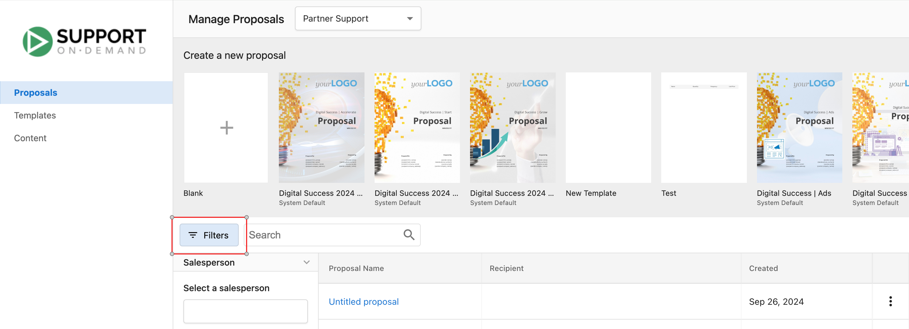
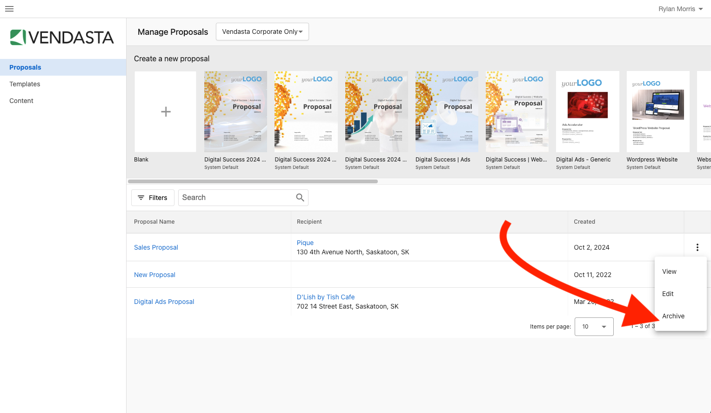

# Proposals (Legacy)

:::warning Producto heredado
Proposal Builder es un producto heredado. Esta documentación se mantiene como referencia histórica para partners que puedan seguir teniendo propuestas activas o que necesiten comprender su funcionalidad pasada.
:::

Proposal Builder te permitía crear, gestionar y hacer seguimiento de propuestas profesionales desde `Partner Center` → `Commerce` → `Proposals`. Ofrecía plantillas personalizables, PDF profesionales, seguimiento de notificaciones, precios flexibles e integración con Snapshot Report para ayudar a cerrar negocios.

## ¿Qué era Proposal Builder?

Proposal Builder era una herramienta en Commerce para crear propuestas profesionales. Te permitía crear, editar y hacer seguimiento de propuestas con plantillas personalizables, generación de PDF profesionales, seguimiento de notificaciones, visualizaciones de precios flexibles e integración con Snapshot Reports.

## Por qué se usaba

Las propuestas profesionales ayudan a ganar negocios y comunicar valor. Proposal Builder mantenía tu presentación consistente, mostraba la interacción del cliente y funcionaba con Snapshot Reports para que los prospectos vieran sus necesidades, y tú pudieras hacer seguimiento en el momento adecuado.

## Qué podías hacer

- Crear propuestas usando plantillas personalizables
- Generar PDF para compartir con clientes
- Hacer seguimiento de la interacción con notificaciones por correo electrónico y en la aplicación
- Mostrar opciones de precios flexibles, incluido el precio de venta al público
- Agregar Snapshot Reports para destacar los puntos débiles del prospecto
- Filtrar y gestionar propuestas por vendedor
- Previsualizar plantillas antes de elegir un diseño
- Archivar propuestas cuando ya no fueran necesarias
- Usar varias monedas para clientes internacionales

## Configurar y crear propuestas

### Acceder y crear una propuesta

1. Ve a `Partner Center` → `Commerce` → `Proposals`
2. Haz clic en `Create New Proposal`
3. Elige una plantilla existente o crea una desde cero

### Crear una plantilla de propuesta

1. Ve a `Partner Center` → `Commerce` → `Proposals` → `Templates`
2. Haz clic en `Create New Template`
3. Agrega tu marca y estructura de contenido, luego guarda la plantilla

### Agregar Snapshot Reports a las propuestas

Los Snapshot Reports ayudaban a destacar los puntos débiles del prospecto y las soluciones recomendadas:

1. Genera un Snapshot Report para el prospecto (se recomendaba hacerlo con anticipación)
2. Ve a `Partner Center` → `Commerce` → `Proposals` → `Manage Proposals`
3. Elige una plantilla o crea una propuesta nueva
4. Selecciona la cuenta destinataria
5. Abre el panel `Insert widget` y haz clic en `Snapshot report`
6. Selecciona las secciones que quieras

Las secciones se convertían en widgets que podías reordenar.

:::tip
Genera el Snapshot Report con anticipación. Los informes pueden tardar hasta 24 horas en generarse y funcionan bien como herramientas de prospección para primeras reuniones.
:::

## Funciones clave

### PDF profesionales

Las propuestas se podían convertir en PDF pulidos para compartir con los clientes.

### Notificaciones

- **Correo electrónico**: recibías una notificación cuando los clientes veían o interactuaban con las propuestas.
- **En la aplicación**: veías actualizaciones en tiempo real cuando los clientes realizaban una acción.

### Opciones de precios

- **Precio de venta al público**: mostraba los precios de venta al público estándar de productos y servicios.
- **Visualización flexible**: personalizaba cómo aparecían los precios en las propuestas.

## Gestionar propuestas

Desde el panel de Proposals podías ver todas las propuestas y sus estados, editar o duplicar propuestas, y archivar las que ya no fueran necesarias.

### Filtrar por vendedor

1. Ve a `Partner Center` → `Commerce` → `Proposals`
2. Haz clic en el ícono de filtro a la izquierda de la barra `Search`
3. Selecciona un `Salesperson` en el menú desplegable

### Previsualizar plantillas

1. Ve a `Partner Center` → `Commerce` → `Proposals` → `Manage Proposals` o `Templates`
2. Elige una plantilla y desplázate por la vista previa
3. Repite hasta encontrar la adecuada, luego ponle un nombre a la propuesta y selecciona un destinatario
4. Haz clic en `Create`

## Buenas prácticas (histórico)

- Mantén las propuestas concisas y enfocadas en las necesidades del cliente
- Usa una marca consistente
- Incluye llamados a la acción claros
- Haz seguimiento con prontitud después de enviarla
- Revisa las analíticas para comprender la interacción
- Genera los Snapshot Reports con anticipación para causar una mejor primera impresión
- Usa plantillas para mantener la consistencia del equipo

## Preguntas frecuentes

¿Puedo crear propuestas en varias monedas?

Sí. Si vendías en varias monedas y tenías varios mercados configurados, un vendedor en un mercado determinado podía crear propuestas usando los productos y paquetes de ese mercado con la moneda correspondiente.

¿Cómo elimino una propuesta?

Las propuestas no se podían eliminar después de creadas. Podías archivar una haciendo clic en `Archive` en el lado derecho de la página Manage Proposals.

¿Por qué agregar Snapshot Reports a las propuestas?

La integración con Snapshot Report ayudaba a iniciar la conversación con contenido que destacaba los puntos débiles del prospecto y tus soluciones recomendadas, para que los prospectos comprendieran mejor el valor de tu propuesta.

¿Por qué filtrar por vendedor?

El filtrado permitía que los vendedores vieran solo sus propias propuestas y su estado (vista, comentada, aprobada) sin tener que desplazarse por las propuestas de sus compañeros.

¿Por qué previsualizar las plantillas antes de usarlas?

El formato y el contenido influyen en qué tan bien una propuesta cierra un negocio, y el diseño adecuado depende del cliente y la oportunidad. Previsualizar te ayudaba a elegir la mejor plantilla para cada caso.

