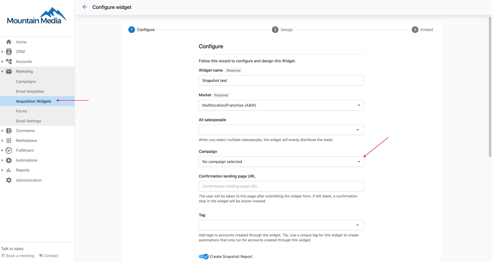
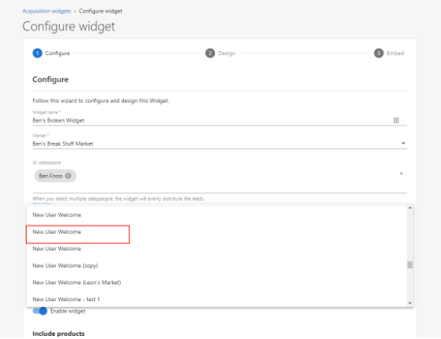

:::info Aviso de función heredada
A partir del 17 de noviembre de 2025, Acquisition Widget es ahora una función heredada de Vendasta. Recomendamos usar [CRM Forms](/marketing/forms) para captar automáticamente clientes potenciales y personalizar completamente las automatizaciones de nutrición (incluidos los flujos de trabajo de Snapshot Report). Si prefieres una configuración similar a la del Acquisition Widget original, puedes usar la plantilla de formulario "Acquisition Widget", que ofrece una configuración predeterminada comparable.
:::

Cuando un nuevo cliente se registra para obtener una cuenta a través del widget de captación, no se le enviará automáticamente el correo New User Welcome que normalmente se asocia con la creación de un nuevo usuario. Para que se envíe un correo de bienvenida, deberás agregar una campaña de Welcome Email al widget al crearlo.

## Agregar una campaña de correo de bienvenida

1. Puedes agregar una campaña al crear o editar un widget de captación seleccionando la línea de campaña.

2. En la lista desplegable, selecciona el nombre de campaña correspondiente.

3. Una vez seleccionada la campaña deseada, haz clic en `Save and Continue` para pasar al siguiente paso en la creación del widget.

