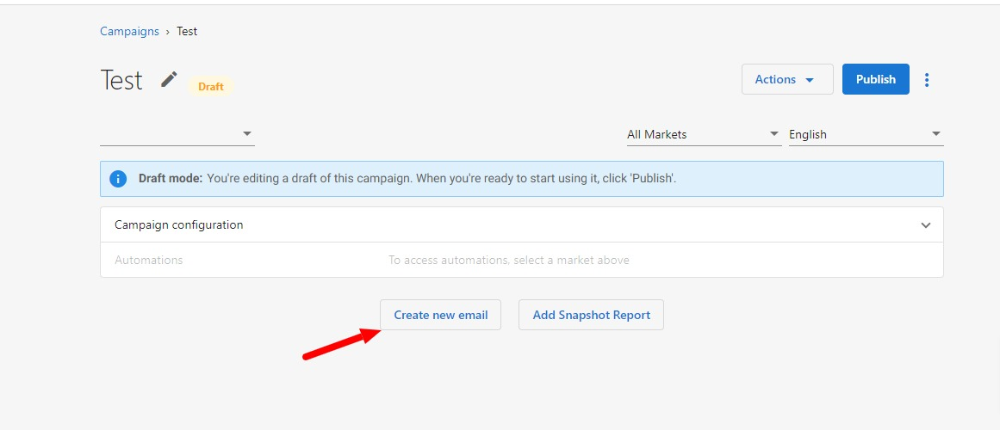
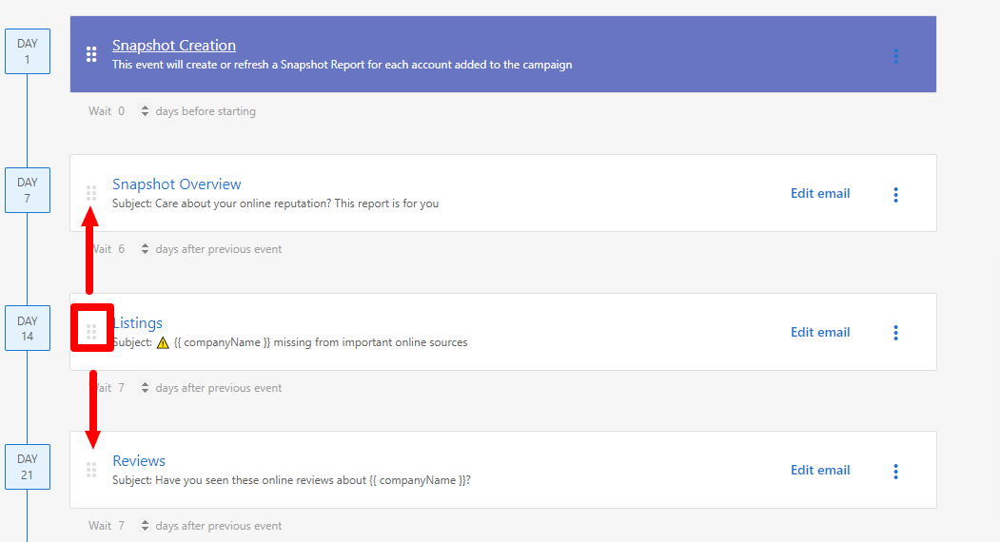

## Editar campañas de correo electrónico

Para editar una campaña específica, ve a `Partner Center` → `Marketing` → `Campaigns` y selecciona una campaña. Desde la página de detalles de la campaña, puedes editar lo siguiente:

### Editar el contenido del correo

:::note
Editar el contenido del correo de una campaña **activa** modificará el correo para todas las cuentas en la campaña. Hacerlo también restablecerá las estadísticas del correo.
:::

Para editar el contenido de un correo dentro de una campaña:

1. Haz clic en `Edit` en cualquier correo.
2. Edita el contenido, luego haz clic en `Save`.

### Editar la temporización del correo

:::note
El campo `Wait [n] days before starting` / `after previous event` en cada correo solo está disponible mientras la campaña está en `Draft`. Una vez que se publica una campaña, la temporización del correo se bloquea junto con el orden de los eventos, y el campo ya no aparece en la página de detalles de la campaña.
:::

Para cambiar la temporización de una campaña publicada:

1. Haz clic en `Actions` → `Copy` para crear una copia en borrador de la campaña.
2. Ajusta el valor de `Wait` en cada correo de la copia.
3. Archiva la campaña original y publica la copia.

### Editar la estructura de la campaña

:::note
No puedes cambiar la estructura de la campaña de correo (es decir, el orden en que se envían los correos) de una campaña publicada. Para editar este orden de correos de la campaña, haz una copia de la campaña haciendo clic en `Actions` → `Copy`.
:::

:::note
Esto creará una copia de la campaña en tu tabla de Campaigns con "(Copy)" en el título.
:::

### Agregar correo

Para agregar un correo a una campaña:

1. Haz clic en la campaña en modo `Draft`.
2. Selecciona `Create new email`.

### Quitar correo

Para quitar un correo de una campaña en modo `Draft`:

1. Haz clic en **⋮** junto a la opción Edit email.
2. Haz clic en `Delete` para confirmar la acción.

### Reordenar eventos de correo

Para reordenar los correos dentro de una campaña:

- Haz clic en las casillas del lado izquierdo de la fila del evento y luego arrastra el evento hacia arriba o hacia abajo hasta donde quieras colocarlo.

### Cambiar el orden de los eventos después de publicar

Una vez que se publica una campaña, no puedes cambiar directamente el orden de los eventos. Sin embargo, puedes:

1. Crear una copia de la campaña haciendo clic en `Actions` → `Copy`
2. Editar el orden de eventos en la campaña copiada
3. Archivar la campaña original y publicar la nueva versión con el orden correcto

Esto garantiza que la estructura de tu campaña permanezca consistente mientras te permite hacer los ajustes necesarios.
