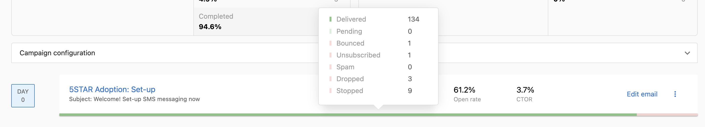
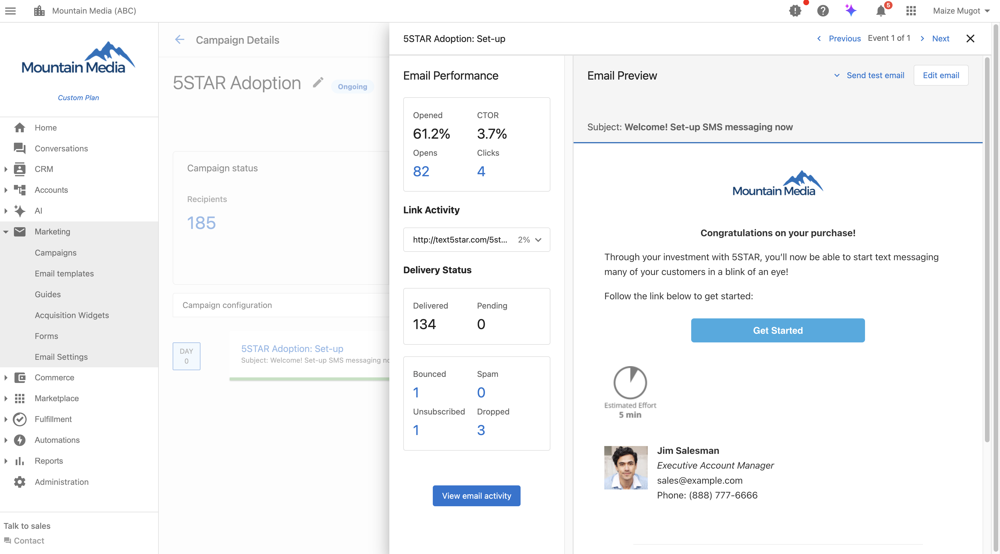

## Descripción general

Una vez que inicias una campaña de marketing por correo electrónico, Vendasta hace seguimiento de cómo interactúan los destinatarios con la campaña para ayudarte a tomar decisiones informadas. La plataforma proporciona estadísticas de campaña que te dan visibilidad sobre el rendimiento de tu correo en varios niveles:

- **Métricas a nivel de campaña**: ve el rendimiento general de todos los correos en tu campaña, incluidos el total de destinatarios, los destinatarios activos, los correos entregados, las tasas de apertura y las tasas de clic a apertura (CTOR)
- **Métricas a nivel de paso**: supervisa el rendimiento de correos individuales dentro de campañas de varios pasos, haciendo seguimiento del estado de entrega, las tasas de interacción y la progresión de los destinatarios
- **Analíticas detalladas**: accede a datos granulares, incluida la actividad de enlaces, el estado de entrega, las tasas de rebote y las métricas de cancelación de suscripción

Esta información te ayuda a optimizar futuras campañas y a entender qué resuena con tu audiencia.

### Entender la precisión de las métricas

Toda la actividad siempre se atribuye al destinatario original, aunque los procesos y sistemas externos a veces puedan iniciar la actividad. No hay indicadores claros para diferenciar si estas actividades son iniciadas por un humano o un programa automatizado, lo que resulta en que algunas tasas de apertura o tasas de clics (CTR) se registren falsamente en nombre del destinatario. Estas son algunas razones comunes por las que puede suceder esto:

- **Enlaces de cancelación de suscripción de terceros**: nuestras campañas de correo electrónico contienen un enlace de cancelación de suscripción. Cuando se hace clic en este enlace, solo se registra como una "cancelación de suscripción" y no como un clic. Sin embargo, muchos clientes de correo hoy en día tienen la opción de pedirle al destinatario que se dé de baja de correos sospechosos de spam/boletín. Si el destinatario cancela la suscripción usando estos enlaces de terceros, se registra con un clic.
- **Configuración del cliente de correo del destinatario**: la tasa de apertura de un correo se registra con un solo píxel de seguimiento incorporado en el correo. Por lo general, este píxel de seguimiento está asociado con una imagen. El cliente de correo de un destinatario puede bloquear la carga de imágenes para proteger al destinatario de los spammers. Si el cliente de correo bloquea la carga de imágenes, la tasa de apertura no se registra.
- **Escáneres de spam y virus**: algunos proveedores de servicios de internet (ISP) hacen clic en enlaces dentro de un correo para verificar riesgos de seguridad. Cuando esto sucede, los clics se registran en nombre del destinatario.

Desafortunadamente, estas iniciaciones externas están fuera de nuestro control. Para mantener métricas de correo precisas, recomendamos identificar los dominios que distorsionan las métricas de la campaña y segmentar esos dominios de tu análisis.

## Estadísticas de campaña
- Agregadas por campaña
    - [Página de Campaigns](#campaigns-page)
    - [Página de detalles de la campaña](#campaign-details-page)
- Agregadas por paso de campaña
    - [Descripción general del paso de campaña](#campaign-step-overview)
    - [Barra del paso de campaña](#campaign-step-bar)
    - [Descripción general del rendimiento de correo](#email-performance-overview)

### Página de Campaigns {#campaigns-page}

- **Total Recipients**: cuántos destinatarios se agregaron a la campaña.
- **Active Recipients**: cuántos destinatarios hicieron clic en un correo de una campaña.
- **Emails Delivered**: cuántos correos de una campaña se entregaron.
- **Open Rate**: describe qué porcentaje de tus correos han sido abiertos por tus destinatarios. Se calcula dividiendo el número de correos abiertos entre el número de correos entregados.
- **CTOR**: significa Click-to-open rate (tasa de clic a apertura), y describe qué porcentaje de tus correos abiertos han tenido enlaces en su cuerpo de contenido en los que se hizo clic. Se calcula dividiendo el número de clics capturados entre el número de correos abiertos.

### Página de detalles de la campaña {#campaign-details-page}

#### Estado de la campaña
- **Recipients**: cuántos destinatarios se agregaron a la campaña. Esta estadística coincide con la estadística Total Recipients en la página de Campaigns.
- **Rate limited**: cuántas campañas actualmente no pueden avanzar debido a un límite de tasa establecido. Consulta [Rate limit](/marketing/campaigns/create-email-campaigns#rate-limiting) para más detalles.
- **In progress**: cuántas campañas todavía están en proceso de enviar correos.
- **Stopped**: cuántas campañas se han pausado manualmente. Esto incluye campañas cuyo destinatario se ha dado de baja.
- **Completed**: cuántas campañas cuyos correos se han entregado en su totalidad. **Nota:** esto no significa que el destinatario haya recibido el correo; solo que SendGrid ha enviado con éxito el correo al servidor de correo del destinatario. Dependerá del servidor de correo del destinatario determinar si el correo se puede enviar a la bandeja de entrada del destinatario.

#### Rendimiento de correo
- **Engaged recipients**: cuántos destinatarios han hecho clic en al menos un correo de su campaña. Esto cuenta el primer clic único por dirección de correo; si la misma dirección abre varios correos, sigue contando como un destinatario interactuado.
- **Delivery rate**: describe qué porcentaje de correos se entregaron con éxito. Esta estadística se calcula dividiendo cuántos correos se entregaron con éxito entre cuántos correos se procesaron. Los eventos procesados significan que SendGrid ha recibido con éxito el correo que envió Vendasta, pero aún no se ha enviado al servidor de correo del destinatario.

:::note
La tasa de entrega y no entregable se calculan **por cuenta**, no por usuario individual. Si una cuenta tiene varios usuarios, la métrica refleja la entrega general de la cuenta, no la de cada usuario por separado. Por eso la tasa de entrega puede mostrar 100% incluso cuando solo un pequeño número de usuarios recibió el correo.
:::

- **Open rate**: describe qué porcentaje de todos los correos se han abierto. Esta estadística se calcula dividiendo cuántos correos se abrieron entre cuántos correos se entregaron. Esta estadística coincide con Open rate en la página de Campaigns.
- **Click to open rate**: describe qué porcentaje de tus correos abiertos han tenido enlaces en su cuerpo de contenido en los que se hizo clic. Se calcula dividiendo cuántos eventos de clic tienen enlaces capturados entre el número de correos abiertos. Esta estadística coincide con CTOR en la página de Campaigns.
- **Undeliverable**: cuántos correos no se pudieron entregar. Esta estadística se calcula dividiendo cuántos correos rebotaron y se descartaron entre cuántos correos se procesaron.

### Descripción general del paso de campaña {#campaign-step-overview}

- **Delivered**: cuántos correos en ese paso se entregaron con éxito al servidor de correo del destinatario.
- **Pending**: cuántos destinatarios aún no han recibido un correo para ese paso.
- **Open rate**: cuántos correos se abrieron, dividido entre cuántos correos se entregaron.
- **CTOR**: significa Click-to-open rate, y describe el porcentaje de correos cuyos enlaces se hicieron clic en el cuerpo del contenido, dividido entre cuántos correos se abrieron.

### Barra del paso de campaña {#campaign-step-bar}
Puedes encontrar estas estadísticas pasando el cursor sobre la barra debajo de cada uno de los paneles de descripción general del paso de campaña.

- **Delivered**: cuántos correos en ese paso se entregaron con éxito al servidor de correo del destinatario.
- **Pending**: cuántos destinatarios no han recibido un correo para ese paso.
- **Bounced**: cuántos correos fueron rechazados por el servidor de correo del destinatario.
- **Unsubscribed**: cuántos destinatarios hicieron clic en el enlace "Opt Out of All Emails".
- **Spam**: cuántos correos fueron marcados como spam por el destinatario.
- **Dropped**: cuántos correos fueron rechazados por SendGrid.
- **Stopped**: cuántas campañas se han pausado manualmente. Esto incluye campañas cuyo destinatario se ha dado de baja.

### Descripción general del rendimiento de correo {#email-performance-overview}
Puedes encontrar estas tarjetas haciendo clic en los tres puntos de cualquiera de los paneles de paso. Estas estadísticas también se agrupan por paso.

- **Opened**: el porcentaje de cuántos correos se abrieron, dividido entre cuántos correos se entregaron. Esto coincide con Open rate en la descripción general del paso de campaña.
- **CTOR**: significa Click-to-open rate, y describe el porcentaje de correos cuyos enlaces se hicieron clic en el cuerpo del contenido, dividido entre cuántos correos se abrieron. Esto coincide con la estadística CTOR en la descripción general del paso de campaña.
- **Opens**: cuántos correos se abrieron.
- **Clicks**: cuántos correos tuvieron enlaces en los que se hizo clic en el cuerpo del contenido.

#### Actividad de enlaces
Esta sección ofrece información sobre qué enlaces se han hecho clic, así como cuántas veces y por qué destinatarios.

- **Total Clicks**: cuántas veces se ha hecho clic en un enlace en total. Esto cuenta varios clics del mismo correo.
- **Unique Clicks**: cuántos destinatarios han hecho clic en el enlace. Esto filtra los clics múltiples del mismo correo.

#### Estado de entrega
- **Delivered**: cuántos correos en ese paso se entregaron con éxito al servidor de correo del destinatario. Esto coincide con el paso Delivered en la descripción general del paso de campaña.
- **Pending**: cuántos destinatarios no han recibido el correo para ese paso. Esto coincide con el paso Pending en la descripción general del paso de campaña.
- **Bounced**: cuántos correos fueron rechazados por el servidor de correo del destinatario.
- **Spam**: cuántos correos fueron marcados como spam por el destinatario.
- **Unsubscribed**: cuántos destinatarios hicieron clic en el enlace "Opt Out of All Emails".
- **Dropped**: cuántos correos fueron rechazados por SendGrid.

## Exportar actividad de campaña

Después de iniciar una campaña de correo electrónico, puedes exportar una lista de usuarios que interactuaron con la campaña. Luego, puedes usar esos datos exportados para crear una nueva lista de usuarios y volver a dirigirte a esos usuarios con otra campaña.

Para exportar la actividad de la campaña:

1. Ve a `Marketing` → `Campaigns`.
2. Ve a la página **Campaign Activity**.
3. Al final de una fila en la tabla de campañas, haz clic en los tres puntos junto a la campaña, luego haz clic en `View History`.
