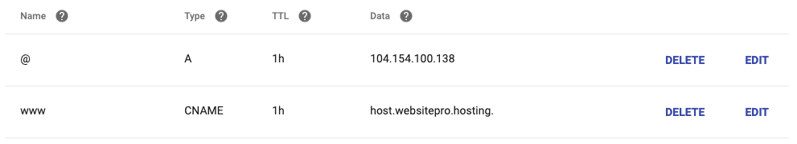
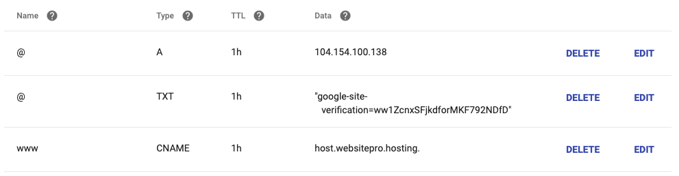
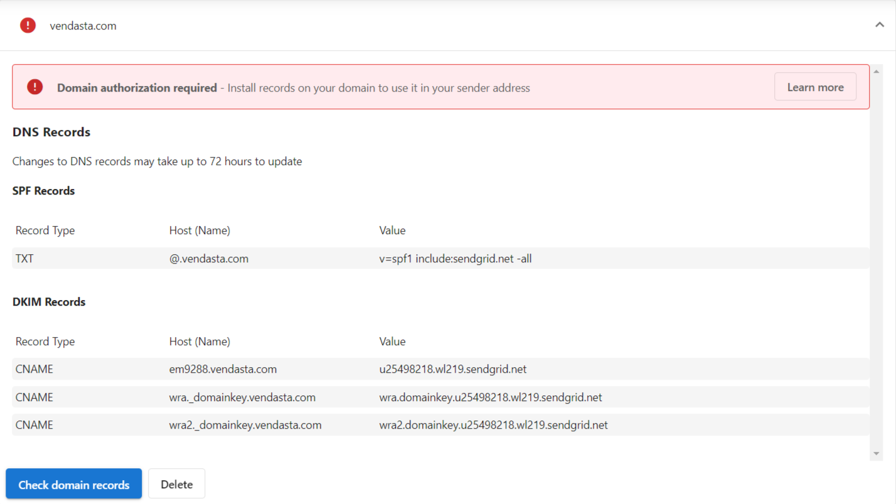
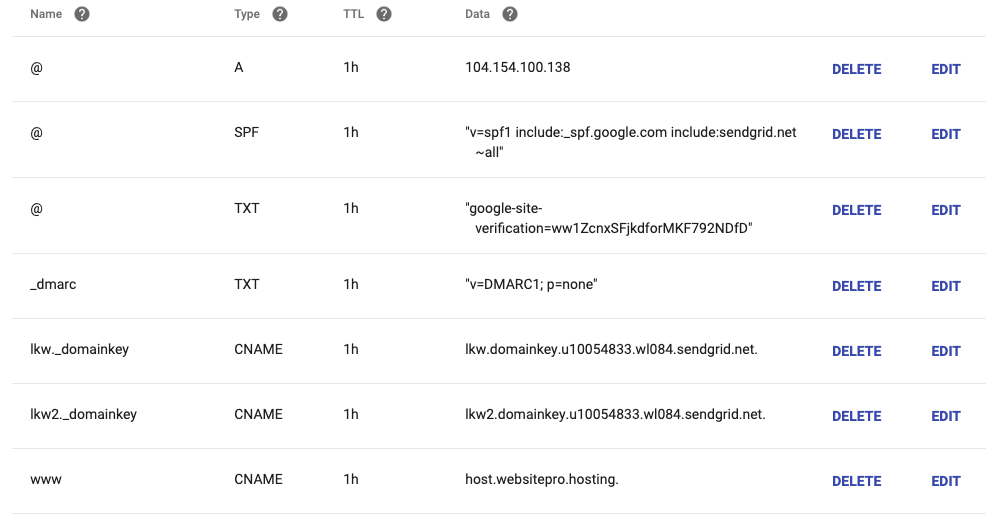

Si eres un partner que usa o revende productos de correo de marketing como Constant Contact, necesitarás configurar tus registros DNS para asegurar que las campañas de correo enviadas en nombre del dominio de tu cliente funcionen correctamente. Esta guía te llevará a través del proceso de configuración de los registros DNS necesarios.

## Conexión de dominio

Al usar servicios de correo de marketing, necesitas verificar la propiedad del dominio y garantizar una entrega de correo adecuada a través de la configuración de DNS. Los ajustes de DNS requeridos dependen del proveedor de hospedaje:

## Opciones de hospedaje de DNS

Tienes varias opciones de dónde se hospeda tu DNS:

### 1. WordPress Hosting (Pro o Premium)

Los dominios personalizados están disponibles en los planes WordPress Hosting Pro y Premium. WordPress Hosting Standard no admite dominios personalizados, por lo que esta opción no se aplica a las cuentas Standard.

#### Servidores de nombres

Si tu dominio usa los servidores de nombres de WordPress Hosting, tendrás estos ajustes:

#### Registros DNS

Puedes agregar los registros DNS requeridos en la interfaz de WordPress Hosting:

### 2. Google Workspace

Si tu dominio usa Google Workspace, necesitarás agregar los registros MX en tu configuración de DNS:

### 3. Otros proveedores de DNS

Si usas un proveedor de DNS diferente, necesitarás agregar los registros requeridos en su interfaz.

## Registros DNS requeridos

### Registro de verificación

Necesitas agregar un registro de verificación para demostrar la propiedad del dominio al servicio de correo de marketing:

### Ajustes de campaña

Después de la verificación del dominio, necesitarás configurar los ajustes de tu campaña. Ve a la pestaña `Campaign Settings` y sigue estos pasos:

1. Visita la pestaña `Campaign Settings`
2. Selecciona el dominio usado para enviar correos
3. Elige el dominio verificado
4. Configura cualquier opción adicional según sea necesario

### Registro SPF

El registro SPF (Sender Policy Framework) ayuda a prevenir la suplantación de correo al especificar qué servidores de correo están autorizados para enviar correos en nombre de tu dominio.

1. Agrega un registro SPF a la configuración de DNS de tu dominio
2. Sigue el formato proporcionado por tu servicio de correo de marketing
3. Esto ayuda a mejorar la entregabilidad del correo y evita que los correos se marquen como spam

## Solución de problemas

Si encuentras problemas con la configuración de tu correo de marketing:

- Verifica que todos los registros DNS estén ingresados correctamente
- Revisa si hay errores tipográficos o de formato
- Permite tiempo suficiente para la propagación de DNS (puede tardar hasta 24-48 horas)
- Confirma que tienes los permisos necesarios para modificar la configuración de DNS
- Contacta a tu proveedor de DNS o servicio de correo de marketing para obtener asistencia adicional

## Recursos adicionales

- Para ayuda con proveedores de DNS específicos, consulta su documentación
- Verifica con tu servicio de correo de marketing los requisitos de DNS actualizados
- Considera configurar DKIM y DMARC para seguridad adicional del correo
