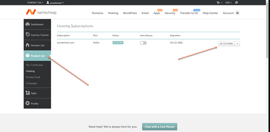
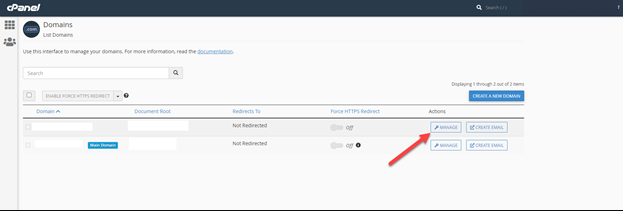
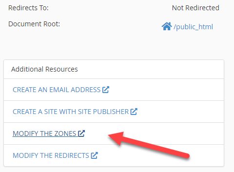
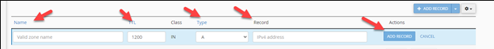

Esta guía te llevará a través del proceso de agregar registros SPF, DKIM y DMARC a tu dominio usando cPanel con Namecheap como tu host de dominio.

## Antes de comenzar

Para seguir esta guía, necesitarás:
- Un dominio comprado a través de Namecheap
- Acceso a tu cuenta de cPanel
- Los valores de los registros SPF, DKIM y DMARC proporcionados por tu proveedor de servicio de correo

## Agregar registros DNS en cPanel

### Paso 1: inicia sesión en tu cuenta de Namecheap

Comienza iniciando sesión en tu cuenta de Namecheap en [namecheap.com](https://www.namecheap.com).

### Paso 2: accede a cPanel

1. Ve a `Domain List` en tu panel
2. Encuentra el dominio que quieres modificar y haz clic en `Manage`
3. Selecciona la pestaña `Advanced DNS`

### Paso 3: agrega el registro SPF

El registro SPF (Sender Policy Framework) ayuda a prevenir la suplantación de correo al especificar qué servidores de correo están autorizados para enviar correo desde tu dominio.

1. En la sección `Host Records`, haz clic en `Add New Record`
2. Selecciona `TXT Record` en el menú desplegable
3. En el campo `Host`, ingresa @ (representando tu dominio raíz)
4. En el campo `Value`, ingresa tu registro SPF (generalmente se ve como `v=spf1 include:_spf.mailgun.org ~all`)
5. Establece TTL (Time to Live) en `Automatic`
6. Haz clic en `Save Changes`

### Paso 4: agrega ambos registros DKIM

DKIM (DomainKeys Identified Mail) agrega una firma digital a tus correos para verificar que no han sido manipulados.

La plataforma genera **dos** registros DKIM, ambos registros CNAME. Ambos son obligatorios. Repite estos pasos para cada uno:

1. Haz clic en `Add New Record`
2. Selecciona `CNAME Record` en el menú desplegable
3. En el campo `Host`, ingresa el host mostrado para ese registro DKIM en `Partner Center` → `Marketing` → `Email settings`
4. En el campo `Value`, ingresa el valor correspondiente que se muestra junto a él
5. Establece TTL en `Automatic`
6. Haz clic en `Save Changes`

### Paso 5: agrega el registro DMARC

DMARC (Domain-based Message Authentication, Reporting & Conformance) le indica a los servidores receptores qué hacer con los correos que fallan la verificación SPF o DKIM.

1. Haz clic en `Add New Record`
2. Selecciona `TXT Record` en el menú desplegable
3. En el campo `Host`, ingresa `_dmarc`
4. En el campo `Value`, ingresa tu política DMARC (por ejemplo, `v=DMARC1; p=none; rua=mailto:dmarc@yourdomain.com`)
5. Establece TTL en `Automatic`
6. Haz clic en `Save Changes`

### Paso 6: verifica tus registros

Después de agregar todos tus registros, tu página de gestión de DNS debería mostrar los cuatro registros: un SPF (TXT), dos DKIM (CNAME) y un DMARC (TXT). Si falta alguno de los CNAME de DKIM, el dominio no podrá autenticarse.

## Solución de problemas

Si encuentras problemas con tu autenticación de correo después de configurar estos registros:

1. Verifica que los registros se hayan propagado (puede tardar hasta 48 horas)
2. Verifica que no haya errores tipográficos en los valores de tus registros
3. Usa una herramienta de validación SPF/DKIM en línea para verificar tu configuración
4. Contacta a tu proveedor de servicio de correo para obtener asistencia

## Consejos adicionales

- Comienza con una política DMARC cautelosa (`p=none`) para supervisar sin afectar la entrega de correo
- Revisa regularmente tus informes DMARC para asegurarte de que todo funcione correctamente
- Considera aumentar la estrictez de tu política DMARC (`p=quarantine` o `p=reject`) después de confirmar la configuración adecuada

## Próximos pasos

Después de configurar con éxito tus registros SPF, DKIM y DMARC, deberías:

1. Probar la entrega de tu correo para asegurar que todo funcione correctamente
2. Configurar un sistema para recibir y analizar tus informes DMARC
3. Aumentar gradualmente la estrictez de tu política DMARC a medida que ganes confianza en tu configuración

Al configurar adecuadamente estos registros de autenticación, mejorarás tu entregabilidad de correo y protegerás tu dominio de ser usado para la suplantación de correo.
