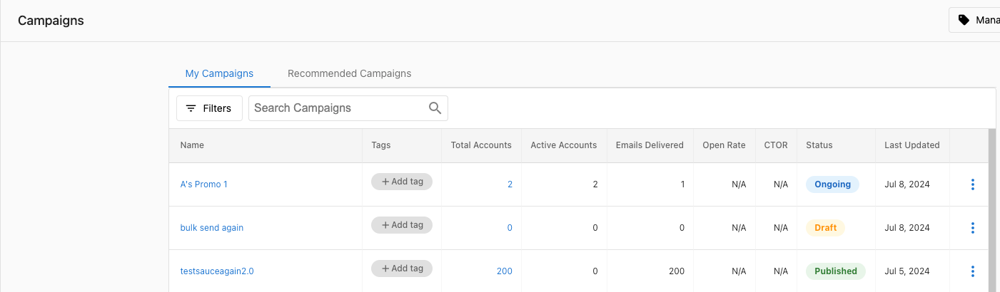

Enviar correos es una parte crucial del marketing digital. Sin embargo, garantizar que tus campañas de correo realmente lleguen a las bandejas de entrada de tus destinatarios es un desafío complejo. Este artículo cubre buenas prácticas y consejos para mejorar tu entregabilidad de correo al usar Campaigns.

## ¿Qué es la entregabilidad de correo?

La entregabilidad de correo se refiere a la capacidad de entregar correos con éxito a las bandejas de entrada de los destinatarios. Se ve afectada por numerosos factores, incluida la reputación del remitente, el contenido del correo, la configuración técnica y la interacción del destinatario.

## Cómo ayuda Vendasta a mejorar tu entregabilidad de correo

Las leyes y regulaciones de spam son cada vez más complejas, y se necesitan precauciones para evitar que los correos se marquen como spam. Para ayudar a entregar tus correos con éxito, Vendasta hace ajustes automáticos para optimizar la entrega de tu correo.

### Gestión automática de dominio

Comenzamos con el correo que usaste para registrarte en Vendasta, pero actualizamos la parte del dominio de la dirección a un dominio verificado. Por ejemplo, si te registras con john@gmail.com, enviaremos correos desde john@ en nuestro dominio predeterminado en su lugar.

**¿Por qué cambiamos el dominio?**

Cambiamos la parte del dominio de tu dirección de correo de remitente para ayudar a enviar tus correos correctamente. Si la plataforma intentara enviar correos desde john@gmail.com (por ejemplo), los correos no pasarían los filtros de spam y no se entregarían a tus clientes.

Hay restricciones asociadas con el envío de correos de marketing usando proveedores de correo gratuitos:

- **Las direcciones de correo gratuitas** (john@gmail.com) no se pueden verificar ya que no eres propietario de estos dominios
- **Los servicios de correo gratuitos** tienen políticas DMARC establecidas que pueden interrumpir tu entregabilidad de correo, aunque están destinadas a prevenir el spam

### Usar tu propio dominio

Si tienes un dominio personalizado, puedes actualizar tu dirección de remitente para usar tu dominio en lugar de nuestro dominio de marca gris. Sin embargo, hasta que actualices tus registros SPF, DKIM y DMARC en tu Domain Name System (DNS), hay una alta probabilidad de que tus correos lleguen a las carpetas de spam.

**Configurar tu dominio personalizado:**
1. Actualiza tus registros DNS con la autenticación adecuada: un SPF (TXT), **dos** DKIM (CNAME) y un DMARC (TXT)
2. Ve a `Partner Center` → `Marketing` → `Email settings`
3. En la tarjeta `Advanced email settings`, establece `Sender domain` en `Use my own email domain` e ingresa tu `Email address`, luego selecciona `Save` en esa tarjeta
4. Permite hasta 72 horas para que los cambios de DNS se propaguen

:::note
**Importante:** solo puedes usar direcciones de correo personalizadas. Las direcciones de correo gratuitas de gmail.com, outlook.com, yahoo.com no se guardarán.
:::

### Gestión de respuestas

Todas las respuestas se reenvían automáticamente a la dirección de correo que usaste para registrarte en la plataforma. Un correo puede enviarse desde nuestro dominio predeterminado, pero cuando alguien responde, se enviará a john@gmail.com.

## Buenas prácticas para mejorar la entregabilidad de correo

### 1. Evita los elementos que activan filtros de spam en tu contenido

Ciertos elementos en tus correos pueden activar los filtros de spam:

**Evita**:
- USAR MAYÚSCULAS SOSTENIDAS
- Exceso de signos de exclamación!!!
- Palabras que activan filtros de spam ("gratis", "garantizado", "sin compromiso")
- Demasiadas imágenes con poco texto
- Líneas de asunto engañosas

### 2. Revisa tu gramática y ortografía

Los errores de gramática y ortografía pueden activar los filtros de spam y reducir tu credibilidad.

Usa herramientas como Grammarly para revisar tu contenido antes de enviarlo.

### 3. Ten cuidado con el formato y los colores

Los correos muy formateados con varios colores pueden verse poco profesionales y activar los filtros de spam.

**Buenas prácticas**:
- Usa un diseño limpio y profesional
- Limita tu paleta de colores
- Asegura suficiente contraste entre el texto y el fondo
- Usa fuentes web seguras

### 4. Personaliza tus correos

Los correos personalizados tienen mejor rendimiento y es menos probable que se marquen como spam.

#### En campañas:

#### En plantillas:

Usa etiquetas de combinación para personalizar:
- Líneas de asunto
- Líneas de saludo
- Contenido según los datos del destinatario

### 5. Mantén una lista de correo saludable

- Limpia tu lista de correo regularmente
- Elimina los rebotes duros y los suscriptores sin interacción
- Usa opt-in doble cuando sea posible
- Nunca compres listas de correo

### 6. Sigue un cronograma de envío consistente

- Envía correos en un cronograma predecible
- Evita aumentos repentinos en el volumen
- Aumenta gradualmente el volumen de envío con el tiempo

### 7. Prueba antes de enviar

- Envía correos de prueba a ti mismo y a colegas
- Revisa cómo se ven los correos en diferentes dispositivos y clientes de correo
- Usa herramientas de prueba de correo para verificar los elementos que activan filtros de spam

### 8. Consideraciones específicas de Gmail

Gmail aplica un filtrado más estricto que muchos otros proveedores, particularmente para:

- **Enlaces que recopilan información de usuario**: Gmail marca los correos que contienen enlaces a páginas que recopilan datos de usuario, incluso si el contenido es legítimo. Si las campañas se filtran constantemente solo en cuentas de Gmail, revisa tus enlaces y reemplaza los que apunten a páginas de recopilación de datos con alternativas más seguras.
- **Contenido de la página vinculada**: Gmail evalúa no solo el contenido del correo, sino también el contenido de las páginas vinculadas. Las páginas con señales de spam pueden hacer que el correo se filtre incluso si el correo en sí parece limpio.

Si el filtrado exclusivo de Gmail persiste después de revisar los enlaces y el contenido, registra tu dominio en [Google Postmaster Tools](https://postmaster.google.com/) para supervisar la reputación de tu dominio y los resultados de autenticación con Gmail.

## Configuración técnica

### Autenticación de la plataforma

Vendasta gestiona automáticamente la autenticación de correo para mejorar la entregabilidad. Al usar nuestro dominio de marca gris o dominios personalizados correctamente configurados, esto incluye:

- **SPF (Sender Policy Framework)**: verifica que el servidor de envío esté autorizado para enviar correos en nombre de tu dominio
- **DKIM (DomainKeys Identified Mail)**: agrega una firma digital para verificar que los correos no han sido manipulados
- **DMARC (Domain-based Message Authentication, Reporting & Conformance)**: le indica a los servidores receptores qué hacer con los correos que fallan las verificaciones de autenticación

### Configurar tu dominio personalizado

Para autenticar tu dominio personalizado y usarlo para enviar correos:

1. **Accede a tu proveedor de DNS**: inicia sesión en tu registrador de dominio (GoDaddy, Namecheap, etc.)
2. **Configura los registros DNS**: sigue nuestras guías específicas por dominio:
   - [Add SPF, DKIM, DMARC Records (GoDaddy)](/marketing/email-settings/email-authentication/adding-spf-dkim-dmarc-records-godaddy)
   - [Add SPF, DKIM, DMARC Records (cPanel/Namecheap)](/marketing/email-settings/email-authentication/adding-spf-dkim-dmarc-records-cpanel-namecheap)
3. **Actualiza los ajustes del remitente**: ve a `Partner Center` → `Marketing` → `Email settings` y establece `Sender domain` y `Email address` en la tarjeta `Advanced email settings`, luego selecciona `Save` en esa tarjeta
4. **Verifica la configuración**: permite hasta 72 horas para que los cambios de DNS se propaguen

:::tip Acceso rápido
Puedes acceder directamente a tus ajustes de correo en [partners.vendasta.com/campaign-settings](https://partners.vendasta.com/campaign-settings)
:::

## Preguntas frecuentes

¿Necesito registrar mi dominio en Google Postmaster Tools?

Aunque no es obligatorio, se recomienda encarecidamente registrar tu dominio en Google Postmaster Tools para mejorar la entregabilidad de correo y supervisar el rendimiento con los usuarios de Gmail.

**Beneficios de Google Postmaster Tools:**
- **Entregabilidad de correo mejorada**: supervisa cómo se reciben los correos de tu dominio por los usuarios de Gmail
- **Identificar problemas**: detecta posibles problemas que afectan la entrega de tu correo
- **Hacer seguimiento de la autenticación**: ve los resultados de autenticación SPF, DKIM y DMARC
- **Supervisar la reputación**: haz seguimiento de la reputación de tu dominio con Gmail

**Cómo registrarte:**
1. Ve a [Google Postmaster Tools](https://postmaster.google.com/)
2. Inicia sesión con tu cuenta de Google
3. Haz clic en `Add a domain` e ingresa el nombre de tu dominio
4. Verifica la propiedad del dominio creando un registro TXT de DNS
5. Agrega el registro TXT proporcionado a tu configuración de DNS
6. Regresa a Google Postmaster Tools y haz clic en `Verify`

**Información disponible:**
- Reputación de dominio y de IP
- Tasas de éxito de autenticación (SPF, DKIM, DMARC)
- Tasa de spam y errores de entrega
- Estadísticas de uso de cifrado TLS

Mis correos van a spam: ¿cómo soluciono esto?

Si los registros SPF, DMARC y DKIM de tu dominio están verificados pero los correos siguen llegando a las carpetas de spam, puedes solucionar el problema examinando los encabezados de correo.

**Pasos para solucionar el problema:**

1. **Obtén los encabezados de correo**: pide al destinatario que proporcione los encabezados de correo del correo de spam
2. **Extrae los encabezados**: los encabezados de correo contienen información detallada de entrega, incluidos los resultados de autenticación
3. **Analiza los resultados**: los encabezados muestran por qué los correos pueden haberse marcado como spam

**Cómo obtener los encabezados de correo:**
- **Gmail**: abre el correo → haz clic en el ícono de tres puntos → `Show original`
- **Outlook**: haz clic derecho en el correo → `View source`
- **Apple Mail**: `View` → `Message` → `Raw Source`

**Recursos útiles:**
- [MX Toolbox Email Headers Guide](https://mxtoolbox.com/public/content/emailheaders/)

**Nota:** guarda los encabezados de correo en un archivo de texto y compártelos con el equipo de soporte de Vendasta para un análisis detallado.

**Causas comunes de entrega en spam:**
- Elementos que activan filtros de contenido (palabras de spam, exceso de mayúsculas, líneas de asunto engañosas)
- Mala reputación del remitente
- Fallos de autenticación
- Tasas altas de rebote o quejas
- Mala higiene de lista

¿Qué significan los códigos de error de entregabilidad de correo comunes?

Si encuentras errores de entrega de correo, estos son los problemas más comunes y sus significados:

**Rechazos relacionados con listas negras:**

Si tu mensaje se rechaza con alguno de estos motivos, significa que tu IP o dominio ha sido marcado:

| Motivo de rechazo | Significado |
|---|---|
| Listed on spamrl.com as a source of spam | Varios correos de spam verificados originados desde tu(s) IP(s) |
| Listed on spamrl.com as a source of viruses | Varios correos de virus clasificados automáticamente desde tu(s) IP(s) |
| Listed on spamrl.com as a source of phishing | Varios correos de phishing verificados O grandes cantidades de informes de autenticación fallida (SPF/DKIM/DMARC) |
| Listed on spamrl.com as a source of dictionary attacks | Tráfico significativo a buzones inexistentes desde tu(s) IP(s) |
| Domain IP listed on spamrl.com | Varios correos de spam/virus/phishing O inclusión en listas negras de terceros de confianza |

**Códigos de error SMTP:**

| Código de error | Mensaje de error | Significado |
|:---:|---|---|
| **550 5.1.1** | User unknown | La dirección de correo del destinatario no existe o es inválida |
| **550 5.4.1** | Recipient address rejected | El servidor receptor rechazó el correo por restricciones de política |
| **554 5.7.1** | Message rejected due to content | El contenido del correo activó filtros de spam o viola las políticas de contenido |
| **421 4.7.0** | IP address temporarily deferred | Dirección IP bloqueada temporalmente, generalmente por limitación de tasa |
| **550 5.7.1** | Authentication failed | La autenticación SPF, DKIM o DMARC falló para tu dominio |
| **552 5.2.2** | Mailbox full | El buzón del destinatario está lleno y no puede aceptar nuevos mensajes |
| **550 5.1.8** | Domain of sender address does not exist | El dominio de envío no se puede encontrar o carece de registros DNS adecuados |
| **451 4.3.0** | Temporary server error | Problema temporal con el servidor de correo receptor |
| **550 5.7.606** | Access denied, banned sending IP | Dirección IP bloqueada permanentemente por el servidor receptor |
| **550 5.7.1** | Relaying denied | El servidor de correo no permite el relay desde tu dirección IP |

**¿Qué debo hacer si encuentro estos errores?**

1. **Revisa las listas negras externas**: usa [MX Toolbox](http://mxtoolbox.com/blacklists.aspx) para verificar inclusiones en listas negras y solicitar la eliminación
2. **Solicita la eliminación de la lista**: si estás en spamrl.com, solicita la eliminación [aquí](https://spamrl.com/delist/)
3. **Revisa el contenido**: asegúrate de que el contenido de tu correo no active filtros de spam
4. **Verifica la autenticación**: revisa que tus registros SPF, DKIM y DMARC estén correctamente configurados
5. **Supervisa las prácticas de envío**: revisa tu volumen de envío, frecuencia e higiene de lista

Los enlaces en mis correos están siendo bloqueados o reescritos por Microsoft Defender Safe Links. ¿Cómo lo soluciono?

Microsoft Defender Safe Links es una función de seguridad en Microsoft 365 que reescribe las URL en los correos entrantes y las escanea antes de permitir que se abran. Esto puede causar que los enlaces de campaña, incluidos los enlaces enviados a través de `sendgrid.net`, se bloqueen o muestren una página de error.

Hay dos rutas de resolución dependiendo de si el usuario afectado está en una cuenta personal de Outlook.com o en una organización gestionada de Microsoft 365.

**Para organizaciones con Microsoft Defender Premium (se requiere administrador de TI):**

1. Inicia sesión en el [portal de Microsoft 365 Defender](https://security.microsoft.com)
2. Ve a `Email and collaboration` → `Policies and rules` → `Threat policies` → `Safe Links`
3. Edita la política de Safe Links aplicable
4. En `Do not rewrite the following URLs`, agrega:
   - `*.sendgrid.net/*`
   - `*.<tu-dominio-de-partner>.com/*`
   - `*.<tu-url-de-business-app>.com/*`
5. Guarda la política

Usa la sintaxis de comodín como se muestra. Los cambios entran en vigor para los correos nuevos después de guardar la política.

**Para usuarios individuales en Outlook.com:**

1. Inicia sesión en [Outlook.com](https://outlook.com)
2. Ve a `Settings` → `Mail` → `Junk email`
3. En `Safe Links`, deshabilita la opción de reescritura de enlaces

Ten en cuenta que esto solo se aplica a mensajes futuros. Los correos recibidos previamente con enlaces reescritos no se ven afectados.

Si el problema persiste después de actualizar la política, confirma que se editó la política de Safe Links correcta y que la sintaxis de comodín coincide exactamente con tus dominios.

¿Cómo ayudo a un destinatario a incluir en la lista blanca mi dirección de remitente para que los correos no vayan a spam?

Pide a los destinatarios que agreguen tu dirección de remitente a su lista de remitentes seguros usando los pasos para su cliente de correo.

**Outlook 365:**
1. Ve a `Settings` → `View all Outlook settings` → `Mail` → `Junk email`
2. En `Safe senders and domains`, haz clic en `Add`
3. Ingresa tu dirección de correo o dominio de remitente y guarda

**Gmail:**
1. Abre un correo anterior de tu dirección de remitente
2. Haz clic en los tres puntos en la parte superior derecha del correo
3. Selecciona `Filter messages like these`
4. Haz clic en `Create filter`
5. Marca `Never send it to Spam` y haz clic en `Create filter`

Alternativamente, el destinatario puede arrastrar el correo de Spam a su bandeja de entrada. Gmail trata esto como una señal de "No es spam" y aprende de ello con el tiempo.

Los correos de invitación de calendario van a spam en Gmail. ¿Cómo lo soluciono?

Gmail a veces enruta los correos de invitación de calendario a spam, incluso cuando el remitente es confiable. Este es un comportamiento del lado de Gmail relacionado con cómo maneja los eventos de calendario de remitentes desconocidos.

Pide al destinatario que:

1. Encuentre el correo de invitación de calendario en su carpeta de **Spam**
2. Abra el correo y haga clic en `Add to Calendar`
3. Haga clic en `Report as Not Spam` (o arrastre el correo a la bandeja de entrada)

Una vez que el destinatario marca el correo como No es spam, es más probable que las futuras invitaciones de calendario del mismo remitente lleguen a la bandeja de entrada.

## ¿Necesitas más ayuda?

Si tienes problemas de entregabilidad o preguntas sobre cómo optimizar tus campañas de correo, contacta a soporte.
