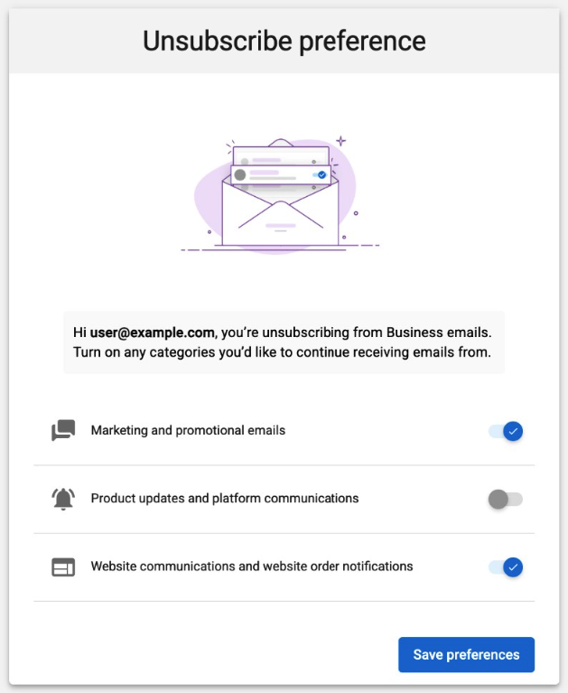

Los destinatarios pueden gestionar las preferencias de correo por categoría en lugar de cancelar la suscripción a todos los correos no transaccionales a la vez. Esto evita que las cancelaciones accidentales bloqueen comunicaciones importantes como los envíos de formularios del sitio web, las notificaciones de clientes potenciales y las actualizaciones de productos.

## Cómo funciona

Las preferencias de suscripción de correo permiten a los destinatarios elegir qué tipos de correos reciben. Cuando un destinatario cancela la suscripción a una categoría, como marketing, sigue recibiendo correos en otras categorías como notificaciones de producto y comunicaciones del sitio web. Los correos transaccionales siempre se entregan independientemente de la configuración de preferencias.

## Categorías de correo

| Categoría | Qué incluye |
|:------|:---|
| **Marketing** | Campañas, boletines y promociones |
| **Product notifications** | Actualizaciones de plataforma y producto |
| **Website communications** | Mensajes del sitio web y notificaciones de pedidos |
| **Transactional** | Cuenta, facturación, envíos de formularios de contacto y notificaciones de clientes potenciales |

Los correos transaccionales no se pueden deshabilitar. Son requeridos para la gestión de cuentas y el cumplimiento normativo.

## Cómo funciona la página de preferencias

Cuando un destinatario hace clic en `Unsubscribe` en cualquier correo elegible, se le dirige a la página de preferencias donde puede activar o desactivar categorías individuales.

Los destinatarios también pueden optar por cancelar la suscripción a todos los correos no transaccionales a la vez. Los cambios entran en vigor de inmediato.

## Resuscripción

Los destinatarios pueden volver a suscribirse usando el enlace de resuscripción en un correo de confirmación o contactando a soporte.

El estado de consentimiento se sincroniza con la sección [Consent and Privacy Management](/crm/contacts/crm-default-contact-fields#consent--privacy-management) en los campos de contacto del CRM dentro de 5 a 10 minutos después de cualquier cambio de suscripción.

## Preguntas frecuentes

¿Los destinatarios pueden cancelar la suscripción a correos de facturación, restablecimiento de contraseña o formularios de contacto del sitio web?

No. Estos son correos transaccionales y siempre se entregan. Esto incluye confirmaciones de facturación, restablecimientos de contraseña y envíos de formularios de contacto de sitios web.

¿Qué sucede si un destinatario cancela la suscripción solo a Marketing?

Dejan de recibir correos promocionales y de campaña, pero siguen recibiendo notificaciones de producto y comunicaciones del sitio web.

¿Esto evita las cancelaciones de suscripción accidentales?

Sí. Las preferencias basadas en categoría reducen el riesgo de perder comunicaciones importantes. Sin ellas, una sola cancelación de suscripción bloquea todas las categorías de correo no transaccionales.

¿Esto afecta a las cancelaciones de suscripción existentes?

No. Las cancelaciones de suscripción globales existentes continúan funcionando normalmente.

