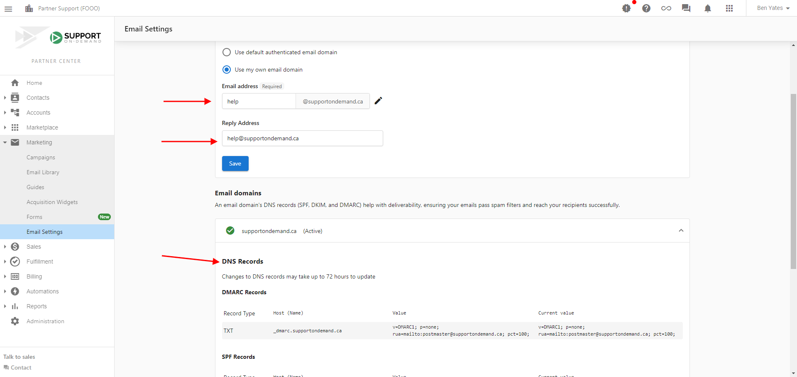

Las leyes y regulaciones de spam son cada vez más complejas, y se necesitan precauciones para evitar que los correos se marquen como spam. Actualiza los siguientes ajustes para garantizar que tus campañas de correo cumplan con las regulaciones de spam y lleguen con éxito a tus clientes potenciales.

:::note
Para evitar que se envíen correos en nombre de alguien de forma no intencional, los proveedores de servicios de correo verifican los registros digitales del correo entrante. Estos registros, incluidos Sender Policy Framework (SPF), Domain Keys Identified Mail (DKIM) y Domain-based Message Authentication, Reporting & Conformance (DMARC), actúan como acuerdos digitales que autorizan el envío de un correo en nombre de alguien. Puedes evitar que tus correos se marquen como spam actualizando el registro de tu Domain Name System (DNS) con las entradas correctas de SPF, DKIM y DMARC. Actualizar estas entradas crea un acuerdo entre Vendasta y tu dominio y nos permite enviar campañas de correo en tu nombre.
:::

  <iframe 
    style={{position: "absolute", top: 0, left: 0, width: "100%", height: "100%"}} 
    src="https://www.loom.com/embed/fc5735ac6e79472f9c3f0263d81b8a30" 
    frameBorder="0" 
    allowFullScreen
  />

Para actualizar los ajustes de campaña de correo:

1. Ve a `Partner Center` → `Marketing` → [`Email settings`](https://partners.vendasta.com/campaign-settings). La página tiene tres tarjetas apiladas: `Sender and reply settings`, `Advanced email settings` y `Email domains`.
2. En la tarjeta `Sender and reply settings`, establece `Sender name` y `Reply Address`, luego selecciona `Save` en esa tarjeta.
   :::note
   **Nota:** cuando se asigna un vendedor a una cuenta, se usa la dirección de correo y el nombre del vendedor en lugar de estos ajustes.
   :::
3. En la tarjeta `Advanced email settings`, establece `Sender domain` (elige `Use my own email domain` para enviar desde tu propio dominio) y `Email address`, luego selecciona `Save` en esa tarjeta.
   :::warning
   Cada tarjeta tiene su propio botón `Save`. Guardar una tarjeta no guarda la otra, así que presiona ambos.
   :::
4. En la tarjeta `Email domains`, revisa los cuatro registros bajo tu dominio: un SPF (TXT), dos DKIM (CNAME) y un DMARC (TXT). Cada fila tiene una columna `Current value` que muestra el valor encontrado en tu host de DNS, o `Not found` en rojo si no se ha detectado. El encabezado de fila del propio dominio lleva el estado general, y un banner `Domain authorization required` permanece en la página hasta que todos los registros se completen.
5. Para cada registro que muestre `Not found`, actualiza tu registro DNS con la entrada correcta. Para obtener ayuda, puedes contactar a tu proveedor de servicio de DNS.

:::info Alcance
Estos ajustes impulsan Campaigns y otros servicios integrados. Los correos enviados a través de Conversations no se ven afectados.
:::

<a 
  style={{
    fontSize: "16px", 
    fontWeight: "bold", 
    color: "#ffffff", 
    backgroundColor: "#33ace2", 
    textDecoration: "none", 
    borderRadius: "5px", 
    padding: "10px 30px 9px 30px", 
    border: "1px solid #33ACE2", 
    display: "inline-block", 
    textAlign: "center"
  }} 
  href="https://partners.vendasta.com/campaign-settings" 
  target="_blank" 
  rel="noopener"
>
  Update settings
</a>

## Notas importantes

Establecer a Vendasta como un proveedor de servicios de confianza no garantiza que los correos no se marquen como spam. Para asegurar que tus correos se entreguen con éxito, revisa el contenido y las líneas de asunto de tus correos. Asegúrate de evitar:

- Texto de color
- Texto en mayúsculas sostenidas
- Archivos adjuntos
- Signos de exclamación
- Palabras y frases promocionales (como "gana dinero", "ahorra dinero", "barato" y "actúa ahora")
- Groserías y contenido explícito

Estos pueden hacer que tus correos se marquen como spam.

Si no tienes un dominio personalizado, considera comprar uno a través de un registrador de dominios como GoDaddy. Puedes usar tu dominio personalizado para crear y mantener una dirección de correo profesional.
