Este tutorial te guiará a través de la creación de un formulario de generación de clientes potenciales de alta conversión basado en la plantilla Lead generation. Personalizarás los campos, opcionalmente agregarás una carga de archivos, organizarás con secciones, definirás el estilo con IA, conectarás automatizaciones y publicarás.

## Paso 1: comienza desde la plantilla Lead generation

1. Ve a `Marketing` → `Forms`
2. Haz clic en **Create form**
3. Selecciona la plantilla **Lead generation** y haz clic en **Use template**


La plantilla de generación de clientes potenciales incluye cuatro campos de forma predeterminada:
- Company Name
- Contact Name
- Business Email
- Phone Number

Estos campos se usarán para crear automáticamente un nuevo registro de contacto y empresa en el CRM con la información proporcionada por el visitante.

## Paso 2: agrega y organiza campos adicionales en tu formulario

Puedes agregar más campos a tu formulario para capturar más información de tu visitante haciendo clic en **Add Field** y seleccionando el tipo de campo que necesitas.

- Los campos **Element** te permiten agregar información al formulario que un usuario puede ver, pero no interactuar con ella. Son útiles para agregar una descripción o instrucciones a tu formulario.
- Los campos **Contact** son campos que se vincularán al registro de Contact en el CRM. Son útiles para capturar información sobre el contacto que completa el formulario.
- Los campos **Company** son campos que se vincularán al registro de Company en el CRM. Son útiles para capturar información sobre la empresa que completa el formulario.
- Los campos **Generic** son campos que no están vinculados a un registro específico en el CRM. Son útiles para capturar información que no está relacionada con un contacto o empresa.

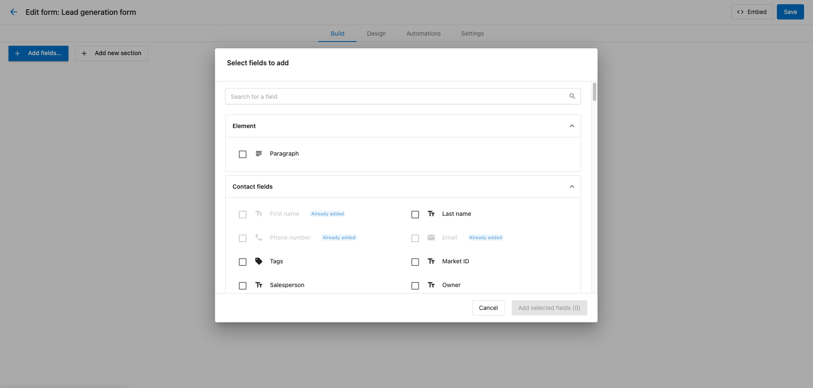

Para este formulario de generación de clientes potenciales, vamos a obtener el consentimiento del visitante para enviarle más correos agregando los campos de Contact **Marketing email consent** y **Marketing email consent source**.

Mueve los campos de consentimiento de marketing a la parte inferior del formulario haciendo clic y arrastrándolos debajo de los otros campos. Este tipo de campos de consentimiento generalmente se colocan en la parte inferior del formulario para que un usuario haya completado los otros campos y sea más probable que consienta recibir más correos.


## Paso 3: personaliza las propiedades de los campos

Una vez que tus campos estén en su lugar, puedes personalizar cómo se comportan y aparecen usando las propiedades de campo. Las propiedades de campo controlan las opciones de visualización, los valores predeterminados, los comportamientos dinámicos y la información que se captura cuando se envía el formulario.


### Crear un campo de menú desplegable en formularios

Haz clic en el campo **Marketing email consent** para abrir el panel de propiedades. Haz clic en el menú desplegable **Field type** y cambia el tipo de campo de `Text` a `Dropdown`. Esto hará que el usuario solo pueda seleccionar una de nuestras opciones predefinidas: `Yes` o `No`.

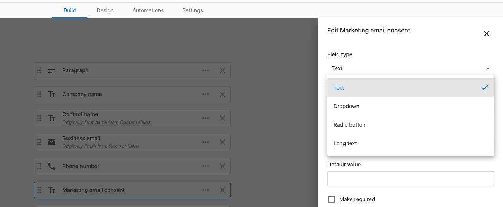
El campo **label** es lo que se mostrará arriba del menú desplegable. Para nuestro campo, tendrá sentido plantearlo como una pregunta como: "Would you like to receive more emails from us?"

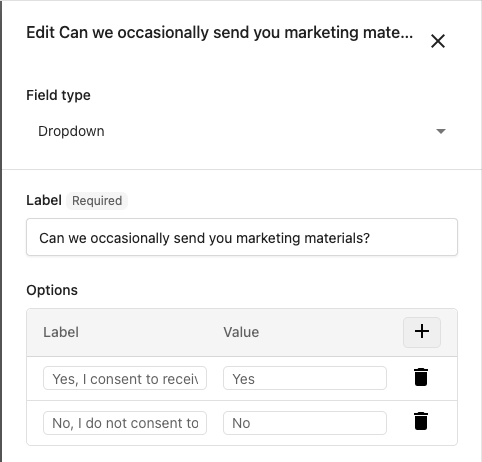

Haz clic en el botón + para agregar una nueva opción al menú desplegable. Aquí, el campo **label** es lo que se mostrará al usuario como una opción al completar el formulario, y el campo **value** es lo que se capturará cuando se envíe el formulario. Agrega las opciones `Yes` y `No`.

Finalmente, establece el valor predeterminado en la opción `Yes` que se creó. Esto nos ayuda a garantizar que el usuario esté suscrito para recibir más correos de forma predeterminada.

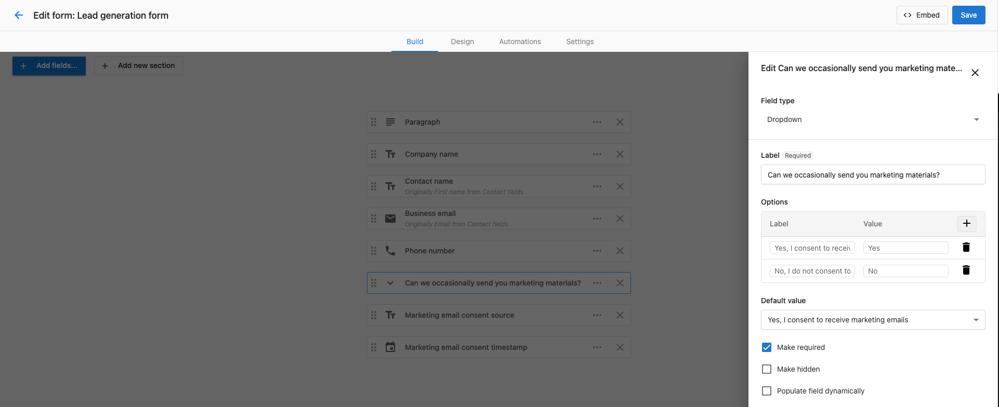

### Ocultar campos de formulario

Agregar un campo oculto a tu formulario te permite capturar información que no se muestra al usuario, pero que sigue siendo útil para tu negocio, como saber el origen del envío del formulario. En este caso, usaremos un campo oculto para establecer nuestro origen de consentimiento al nombre del formulario.

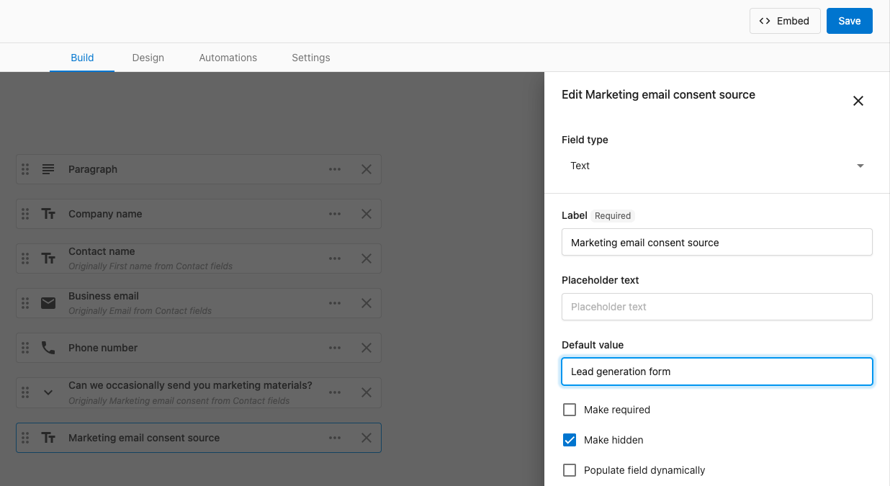

Haz clic en **Marketing email consent source** para abrir el panel de propiedades y marca la casilla **Make hidden** para ocultar este campo del usuario. Ingresa el nombre del formulario como el **Default value** del campo para que el valor se establezca automáticamente en el CRM cuando se envíe el formulario.

### Rellenar campos de formulario dinámicamente

Los campos de formulario se pueden rellenar dinámicamente con la información de la URL usando parámetros de consulta. Combinado con campos ocultos, esto se puede usar para capturar información sobre el origen del envío del formulario.

Por ejemplo, si tienes un formulario colocado en un enlace como este: ```https://www.example.com/form?campaign=spring-promotion```, el valor del parámetro de consulta `campaign` se capturará y establecerá en cualquier campo que tenga marcada la opción **Populate field dynamically** y el parámetro de consulta `campaign` seleccionado.

:::info Parámetros UTM capturados automáticamente por Forms
Forms captura automáticamente los parámetros UTM comunes como `utm_source`, `utm_medium`, `utm_campaign`, `utm_content` y `utm_term`. Si no necesitas almacenarlos en otros campos, puedes confiar en esta captura automática y omitir agregar campos ocultos adicionales para los UTM.
:::


Haz clic en el campo **Marketing email consent source** para abrir el panel de propiedades y marca la casilla **Populate field dynamically** para habilitar esta función. Escribe el parámetro de consulta `campaign` en el cuadro de entrada.

Ahora, cada vez que alguien consienta recibir más correos, el CRM se actualizará automáticamente para mostrar si provino de una campaña específica. Esto nos permite saber qué campañas están impulsando específicamente más registros a nuestra lista de correo.

Para obtener información más detallada sobre el seguimiento de envíos de formulario, consulta [Track form submissions in GA4](./tracking-form-submissions-ga4.mdx).

## Paso 4: haz coincidir el diseño de tu formulario con tu sitio web

Puedes personalizar la apariencia del formulario para que coincida con el diseño y la marca de tu sitio web haciendo clic en la pestaña **Design**. Se pueden hacer cambios simples como el ancho y los colores del formulario usando los controles interactivos dentro de la pestaña **Design**, y se reflejarán en la vista previa a la derecha.


Se pueden hacer cambios más complejos a otros elementos usando el campo **Custom CSS** visible en la pestaña **Design**. El código CSS se puede usar para definir el estilo de prácticamente cualquier elemento del formulario para que se vea exactamente como quieres.

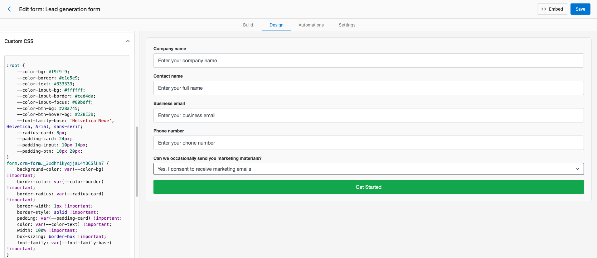

Toma nota de los nombres de clase CSS usados en nuestra plantilla que se usan para definir el estilo de los elementos del formulario. Estos se usarán para dirigirte a elementos específicos al definir el estilo del formulario con CSS y son un buen punto de partida para tu propio código CSS.

### Diseña y define el estilo de tu formulario con IA

Si no estás familiarizado con CSS o te toma tiempo lograr el aspecto y la sensación deseados de tu formulario, ¡puedes usar nuestra función Design with AI para generar un punto de partida para tu código CSS!

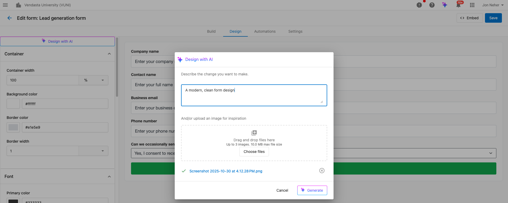

1. Ve a la pestaña **Design**
2. Haz clic en **Design with AI**
3. Sube una imagen (por ejemplo, tu sitio web) y agrega una instrucción con detalles específicos si es necesario (por ejemplo, "A modern, clean form design with contact name and business email on the same row")
4. Revisa el CSS generado y ajústalo en **Custom CSS**

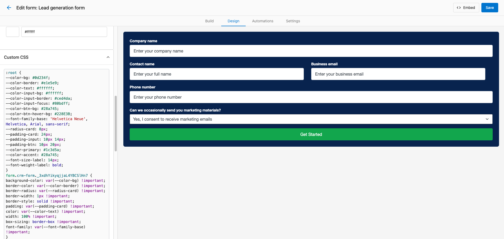

Dale a la IA una captura de pantalla de tu sitio web y pídele que defina el estilo del formulario para que coincida con el diseño y la marca de tu sitio web con cualquier formato o estilo adicional que necesites. El código CSS se generará automáticamente y estará presente cuando incorpores el formulario en tu sitio web más tarde.

## Paso 5: configura las automatizaciones del formulario

Las automatizaciones se pueden usar para activar acciones cuando se envía un formulario. Por ejemplo, puedes enviar una notificación por correo a un miembro del equipo, agregar el contacto a una lista específica, asignar el contacto a un miembro del equipo, o activar un flujo de trabajo.

Aunque puedes crear tus propias automatizaciones desde cero, hay algunas plantillas prediseñadas que puedes usar para comenzar rápidamente. Haz clic en la pestaña de automatizaciones y selecciona la plantilla "Send a follow up email when a form is submitted" y haz clic en **Use template**.

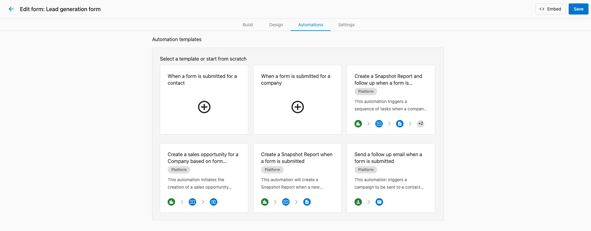

:::tip Tipos de disparador de automatización para plantillas
Los formularios pueden activar una automatización para un **contact** o una **company**. El ícono verde en una plantilla de automatización te indica para qué tipo de registro se activará la automatización.


:::

Verás un mensaje de error cuando selecciones la plantilla. Esta plantilla de automatización requiere que elijas una campaña de correo que se enviará al contacto cuando se envíe el formulario. Elige una campaña existente en el menú desplegable y luego haz clic en **Save automation**.

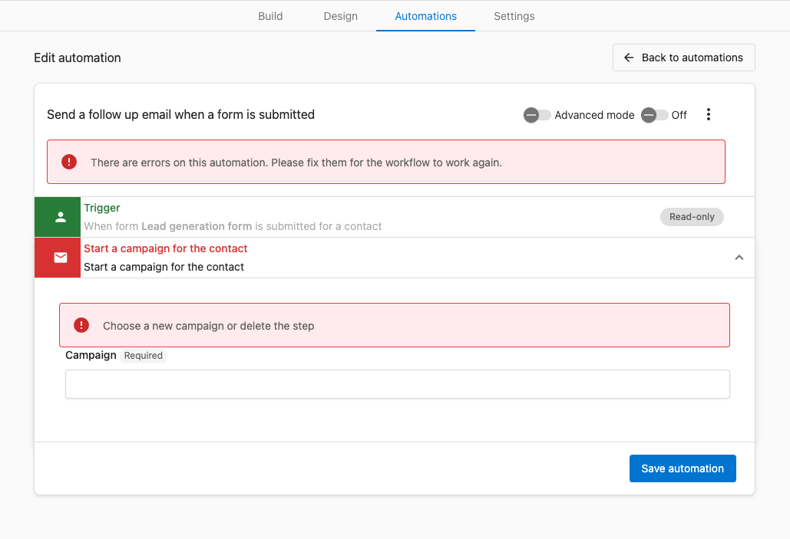

:::tip Crear campañas para automatizaciones de formulario
Si no tienes una campaña adecuada creada, puedes guardar la automatización y volver más tarde. Para obtener más información sobre cómo crear plantillas de correo para campañas y automatizaciones, consulta [Create marketing emails](../campaigns/create-email-campaigns.mdx) para comenzar.
:::

:::info Crear automatizaciones más complejas para formularios
Puedes editar las plantillas de automatización de formulario existentes usando el interruptor **Advanced mode** en Forms. El constructor de automatizaciones te ofrece muchas más acciones y lógica condicional que puedes usar para crear automatizaciones más complejas para formularios.

Para obtener más información sobre cómo crear automatizaciones con el constructor de automatizaciones, consulta [Creating and configuring automations](../../automations/my-automations/creating-and-configuring-automations.mdx).
:::

## Paso 6: ajustes de envío de formulario y publicación

Con la mayor parte de la configuración del formulario completa, ahora puedes configurar los ajustes del formulario y publicarlo en tu sitio web. Estos no están directamente relacionados con la apariencia del formulario en sí o la información que captura, pero son importantes para cómo se comporta y se usa el formulario.


El campo **Redirect link** te permite enviar a los usuarios a otra URL después de que envían un formulario. Configúralo en una URL adecuada si tienes una. Si dejas este campo en blanco, el usuario recibirá un mensaje de confirmación después de enviar el formulario.

La **Conversations integration** hace que cada nuevo envío de formulario aparezca como una nueva conversación o un nuevo mensaje para una conversación existente. Esta es una excelente manera de ver los envíos de formulario como parte del historial de conversación integral de un contacto o empresa. Marca la casilla junto a **Create a conversation** si aún no está activada.


:::tip Detener los envíos de spam de los formularios
Puedes proteger tus formularios de los envíos de spam habilitando reCAPTCHA. Esto requerirá que los usuarios completen un desafío CAPTCHA antes de poder enviar el formulario. Aunque esto es importante, requiere algo de configuración adicional.

Para obtener más información sobre cómo habilitar reCAPTCHA, consulta [reCAPTCHA key configuration](./recaptcha-key.mdx).
:::

Haz clic en el botón `Embed` para ver el código que necesitas para incorporar el formulario en tu sitio web. Puedes copiar el código y pegarlo en el código HTML de tu sitio web para incorporar el formulario.

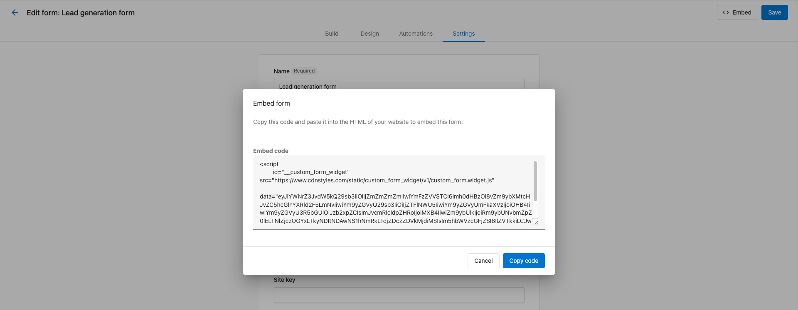

## Paso 7: prueba tu formulario

Antes de activar tu formulario en vivo, debes probarlo para asegurarte de que funcione como se espera. Para este formulario del tutorial, eso significa:

- Envía un cliente potencial de prueba y verifica que se creen el contacto/empresa
- Comprueba que la automatización envíe una campaña como se espera
- Verifica que se cree una conversación como se espera

Una vez que estos pasos estén completos, puedes activar tu formulario en vivo y ¡comenzar a captar clientes potenciales!

:::tip Probar el código de incorporación de los formularios
¡No tienes que pegar el código de incorporación de tu formulario en tu sitio web para probarlo! Hay muchos sitios web excelentes que te permiten probar código HTML de manera muy simple y rápida. Algunos ejemplos incluyen:
- [CodePen](https://codepen.io/)
- [JSFiddle](https://jsfiddle.net/)
- [W3Schools](https://www.w3schools.com/html/html_examples.asp)
:::

## Incorporar varios formularios en una página

Puedes colocar de forma segura más de una incorporación de formulario en la misma página. Cada formulario se renderiza dentro de su propio shadow DOM aislado, por lo que los estilos y scripts de un formulario nunca afectan a otro.

Duplica la etiqueta de incorporación `<script>` para cada formulario que quieras mostrar, cambiando solo el atributo `data=`:

```html
<!-- First form -->
<script
  async
  data-crm-form-widget
  src="https://www.cdnlinks.vendasta.com/.../custom_form.widget.js"
  data="YOUR_BASE64_DATA_FORM_1"
></script>

<!-- Second form -->
<script
  async
  data-crm-form-widget
  src="https://www.cdnlinks.vendasta.com/.../custom_form.widget.js"
  data="YOUR_BASE64_DATA_FORM_2"
></script>
```

Copia el código de incorporación de la pestaña **Embed** en el editor de formularios para cada formulario; el valor `data=` (una cadena en Base64) es el único atributo que difiere entre instancias. La URL `src=` permanece igual.

:::info Incorporación de formulario único heredada
Los códigos de incorporación antiguos que usan `id="__custom_form_widget"` aún funcionan para páginas con un solo formulario. Actualiza al patrón `data-crm-form-widget` cuando necesites varios formularios en la misma página.
:::

:::tip Aplicaciones de una sola página
Si tu sitio inserta etiquetas de incorporación de formulario dinámicamente después de que se carga la página, llama a `window.CRMFormsInit()` después de insertar las etiquetas para activar la inicialización sin recargar la página.
:::

## Definir el estilo de los formularios desde la página anfitriona

Cada formulario se renderiza dentro de un shadow DOM para el aislamiento de CSS. Los selectores CSS estándar en las hojas de estilo de tu página **no pueden** cruzar el límite del shadow; no tienen efecto en los elementos dentro del formulario:

```css
/* ❌ These selectors do NOT reach inside the form */
.crm-form-host input { border: 2px solid blue; }
.crm-form-host label { color: navy; }
```

Usa el pseudo-elemento CSS [`::part()`](https://developer.mozilla.org/en-US/docs/Web/CSS/::part) para definir el estilo de los elementos del formulario desde fuera de la raíz del shadow:

```css
/* ✅ ::part() crosses the shadow DOM boundary */
.crm-form-host::part(input) {
  border: 2px solid #3b82f6;
  border-radius: 6px;
}

.crm-form-host::part(label) {
  font-weight: 600;
  color: #1d4ed8;
}

.crm-form-host::part(submit-button) {
  background-color: #2563eb;
  color: white;
  border-radius: 999px;
  padding: 10px 28px;
}
```

### Nombres de parte disponibles

| Nombre de parte | A qué se dirige |
|-----------|----------------|
| `form` | El elemento contenedor del formulario |
| `input` | Todos los elementos input, textarea y select |
| `label` | Todas las etiquetas de campo |
| `submit-button` | El botón de envío |
| `section-button` | Los botones siguiente/atrás en formularios de varias secciones |
| `{type}-input` | Input por tipo de campo, por ejemplo, `email-input`, `text-input` |
| `{type}-label` | Label por tipo de campo, por ejemplo, `email-label` |
| `{fieldId}-input` | El elemento input de un campo específico |
| `{fieldId}-label` | El label de un campo específico |
| `consent-input` | Los inputs de casilla de consentimiento |
| `consent-field-label` | El label sobre un grupo de campo de consentimiento |
| `consent-description` | El texto de descripción del campo de consentimiento |
| `promo-card` | Las tarjetas de la sección promocional |
| `success-page` | El contenedor de la página de éxito mostrado después del envío |
| `success-icon` | El ícono de marca de verificación en la página de éxito |
| `success-heading` | El encabezado en la página de éxito |
| `success-body` | El texto del cuerpo en la página de éxito |

### Limitar los estilos a una instancia de formulario específica

Cuando hay varios formularios en la misma página, puedes limitar las reglas `::part()` a un formulario específico usando su ID de formulario como un nombre de parte adicional. El ID de formulario es el valor `FormConfigID-...` visible en tu código de incorporación.

```css
/* Style inputs only in the contact form */
.crm-form-host::part(FormConfigID-abc123 input) {
  border-color: #7c3aed;
  border-radius: 12px;
}

/* Style the submit button only in the newsletter form */
.crm-form-host::part(FormConfigID-xyz456 submit-button) {
  background-color: #059669;
}
```

:::tip Encontrar tu ID de formulario
Tu ID de formulario aparece en el código de incorporación del editor de formularios. Sigue el patrón `FormConfigID-xxxxxxxx-xxxx-xxxx-xxxx-xxxxxxxxxxxx`. También puedes inspeccionar la página renderizada en las DevTools del navegador y buscar el elemento anfitrión: `<div class="crm-form-host" data-form-id="FormConfigID-...">`.
:::

## Interactuar con formularios usando JavaScript

Debido a que cada formulario se renderiza dentro de una raíz shadow, `document.querySelector()` por sí solo no puede alcanzar los elementos dentro de él. Usa la propiedad `shadowRoot` del elemento anfitrión para consultar dentro del árbol shadow.

### Seleccionar una instancia de formulario

El elemento anfitrión de cada formulario tiene la clase `crm-form-host` y un atributo `data-form-id`. Úsalos para dirigirte a un formulario específico cuando hay varios en la página:

```javascript
// Select a specific form by its form ID
const host = document.querySelector('[data-form-id="FormConfigID-abc123"]');
const shadowRoot = host?.shadowRoot;
```

### Rellenar previamente los valores de campo

Una vez que tengas la raíz shadow, consulta y establece los valores de la misma manera que lo harías con elementos DOM normales:

```javascript
const host = document.querySelector('[data-form-id="FormConfigID-abc123"]');
const shadowRoot = host?.shadowRoot;
if (!shadowRoot) return;

// Pre-fill a text input by its name attribute
const nameInput = shadowRoot.querySelector('input[name="contactName"]');
if (nameInput) {
  nameInput.value = 'Jane Smith';
}

// Select an option in a dropdown
const sourceSelect = shadowRoot.querySelector('select[name="leadSource"]');
if (sourceSelect) {
  sourceSelect.value = 'website';
}
```

:::info Momento de inicialización
Los formularios se cargan de forma asíncrona. Ejecuta cualquier JavaScript que lea o escriba en los campos del formulario después de que el formulario se haya renderizado, por ejemplo, en respuesta a una interacción del usuario. Evita ejecutar la lógica de rellenado previo inmediatamente al cargar la página antes de que exista la raíz shadow del formulario.
:::

## Preguntas frecuentes

<details>
<summary>¿Puedo crear formularios sin usar plantillas?</summary>

¡Sí! Aunque las plantillas ofrecen un punto de partida rápido, puedes crear un formulario en blanco desde cero. Ve a `Marketing` → `Forms` y haz clic en **Create form** para comenzar con un formulario completamente vacío y construirlo exactamente como lo necesitas.

</details>

<details>
<summary>¿Cómo hago que mi formulario sea responsivo para móviles?</summary>

Los formularios son automáticamente responsivos para móviles de forma predeterminada, y el asistente de diseño con IA puede ayudar a garantizar que tu formulario se vea muy bien en todos los dispositivos. Prueba tu formulario en diferentes tamaños de pantalla usando las herramientas de desarrollo de tu navegador.

</details>

<details>
<summary>¿Puedo integrar formularios con otras plataformas?</summary>

¡Sí! Los formularios se pueden integrar con varias plataformas a través de automatizaciones y webhooks. Por ejemplo, puedes enviar datos de formulario a CRM, herramientas de automatización de marketing o aplicaciones personalizadas. Consulta la [documentación de Automations](../../automations/index.mdx) para obtener consejos sobre cómo crear integraciones con otros sistemas.

</details>

<details>
<summary>¿Cómo evito los envíos de spam?</summary>

Habilita la protección reCAPTCHA en los ajustes del formulario para evitar el spam automatizado. Puedes elegir entre verificación visible con casilla o protección invisible. Consulta [reCAPTCHA key configuration](./recaptcha-key.mdx) para instrucciones de configuración.

</details>
