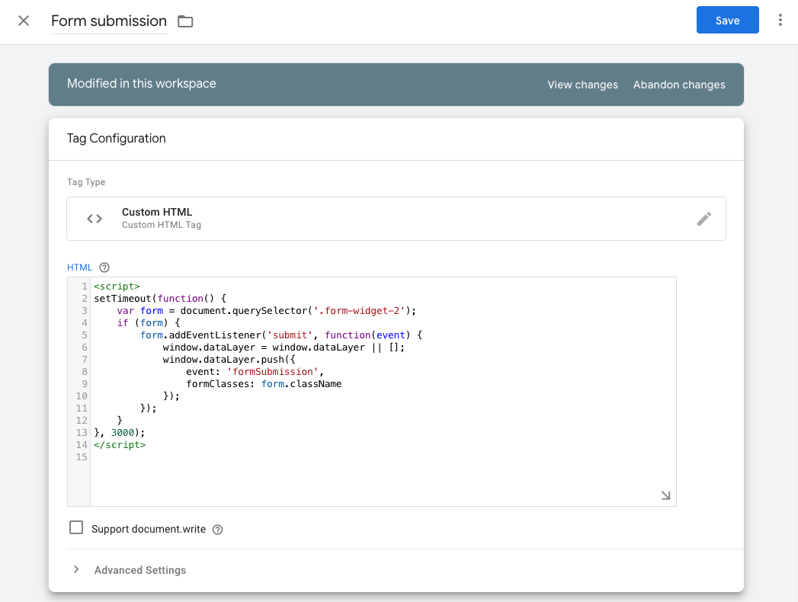
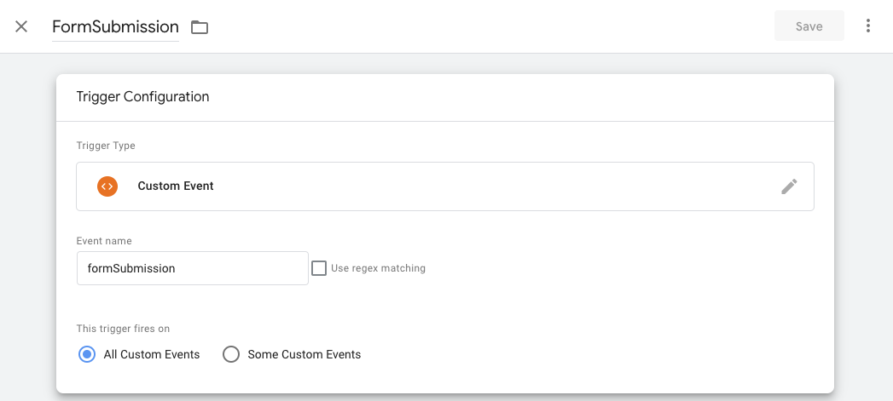
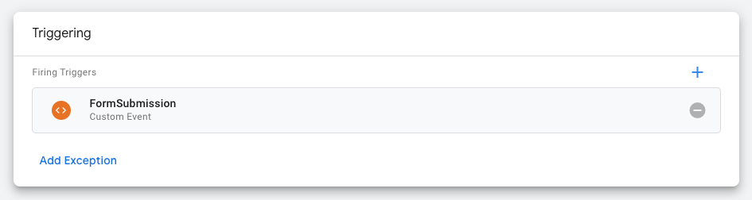
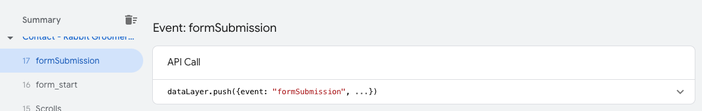
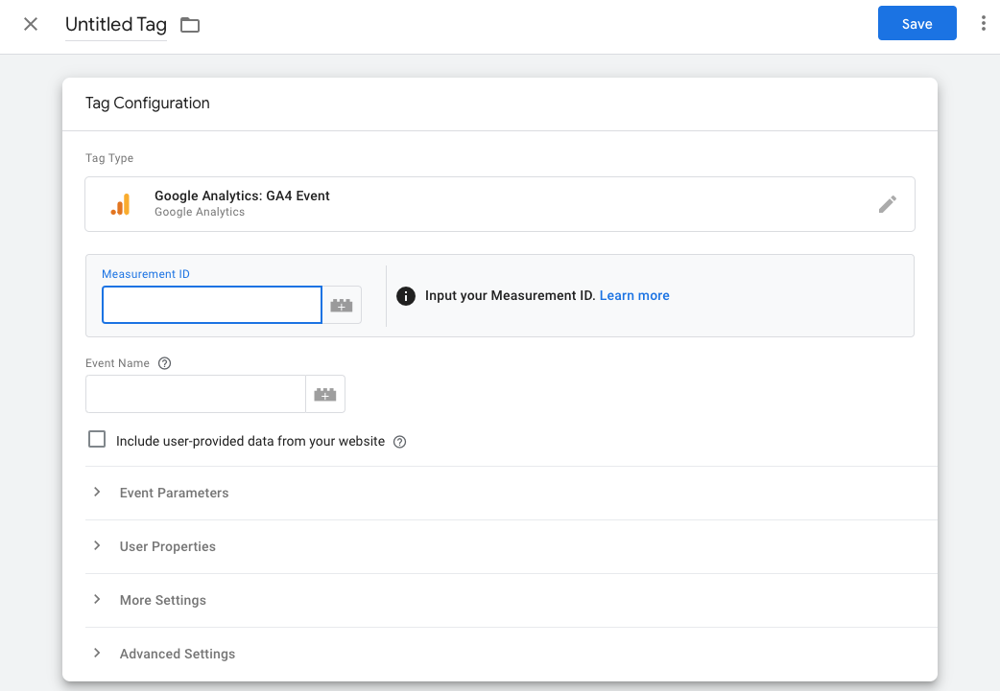

Este artículo te ayudará a hacer seguimiento de los envíos de formulario en tu sitio web usando Google Analytics 4 a través de Google Tag Manager. Esto es útil para cualquiera que quiera hacer seguimiento de las interacciones de los usuarios con los formularios en su sitio web.

:::info Parámetros UTM y campos dinámicos
Forms captura automáticamente los parámetros UTM estándar (`utm_source`, `utm_medium`, `utm_campaign`, `utm_content`, `utm_term`). También puedes usar campos ocultos con "Populate field dynamically" para almacenar parámetros de consulta específicos (por ejemplo, `campaign`) en el envío.
:::

## Requisitos previos

Antes de comenzar, asegúrate de tener:

1. Una cuenta de Google Tag Manager configurada
2. Una propiedad de Google Analytics 4 configurada
3. Un sitio web con formularios que quieres rastrear

## Crear un disparador para envíos de formulario en Google Tag Manager

Primero, necesitarás crear un disparador en Google Tag Manager que se active cuando se envíe un formulario en tu sitio web.

1. Inicia sesión en tu cuenta de Google Tag Manager
2. Ve a la sección Triggers y haz clic en `New`
3. Elige el tipo de disparador como `Form Submission`
4. Configura el disparador para que se active en `All Forms` o en formularios específicos según tus necesidades
5. Nombra tu disparador (por ejemplo, "Form Submission Trigger") y guárdalo

## Crear una etiqueta de evento de Google Analytics 4

A continuación, necesitarás crear una etiqueta en Google Tag Manager que envíe los datos de envío de formulario a Google Analytics 4.

1. Ve a la sección Tags y haz clic en `New`
2. Elige el tipo de etiqueta como `Google Analytics: GA4 Event`
3. Configura la etiqueta con tu ID de medición de Google Analytics 4
4. Establece el nombre del evento en `form_submission` o cualquier nombre que prefieras
5. Agrega parámetros de evento si es necesario (por ejemplo, `form_id`, `form_name`)
6. Selecciona el disparador que creaste anteriormente
7. Nombra tu etiqueta (por ejemplo, "GA4 - Form Submission") y guárdala

## Probar tu configuración

Después de configurar el disparador y la etiqueta, es importante probar tu configuración para asegurarte de que funcione correctamente.

1. Haz clic en el botón `Preview` en Google Tag Manager
2. Ve a tu sitio web y envía un formulario
3. En el modo de depuración de Tag Assistant, verifica que se haya activado tu disparador de envío de formulario y que se haya ejecutado la etiqueta de evento de GA4

## Verificar los datos en Google Analytics 4

Una vez que hayas confirmado que tu etiqueta se activa correctamente, debes verificar que los datos se estén registrando en Google Analytics 4.

1. Inicia sesión en tu propiedad de Google Analytics 4
2. Ve a `Reports` → `Realtime`
3. Envía un formulario en tu sitio web
4. Comprueba si el evento `form_submission` aparece en el informe Realtime

## Configurar informes personalizados

Puedes crear informes personalizados en Google Analytics 4 para analizar tus datos de envío de formulario de manera más efectiva.

1. Ve a Explore en tu propiedad de Google Analytics 4
2. Crea una nueva exploración
3. Agrega `form_submission` como un evento en tu informe
4. Agrega dimensiones y métricas según lo que quieras analizar
5. Guarda tu exploración

## Solución de problemas

Si no ves datos de envío de formulario en Google Analytics 4, revisa lo siguiente:

- Asegúrate de que tu contenedor de Google Tag Manager esté publicado
- Verifica que las condiciones de tu disparador estén configuradas correctamente
- Comprueba que tu etiqueta de configuración de GA4 esté correctamente implementada
- Asegúrate de que no haya errores de JavaScript en tu sitio web que puedan impedir que se active la etiqueta
- Confirma que los formularios de tu sitio web realmente se estén enviando y no estén siendo bloqueados por errores de validación

## Conclusión

Seguir estos pasos configura el seguimiento de envíos de formulario en tu sitio web usando Google Analytics 4 a través de Google Tag Manager. Usa estos datos para analizar cómo interactúan los visitantes con tus formularios e identificar dónde mejorar.
