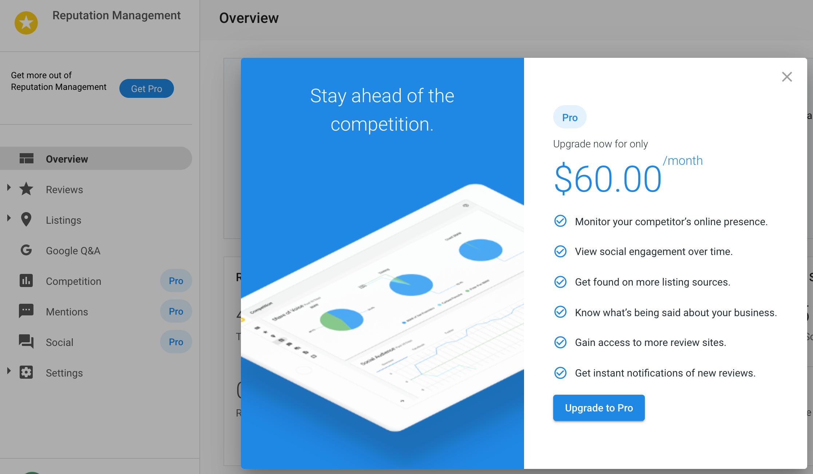
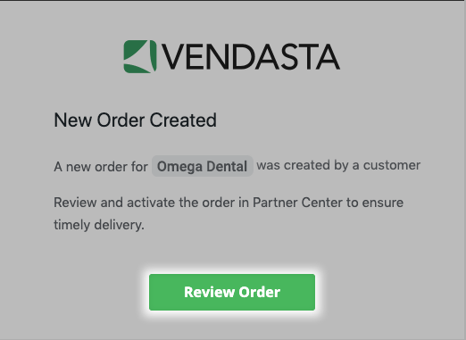
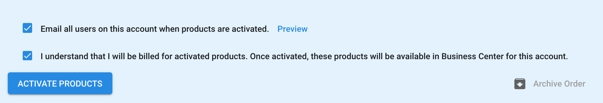

# Descripción general de Products

Products es tu lugar central para gestionar los productos activados, configurar precios y marca, y hacer seguimiento del crecimiento y los ingresos.

## ¿Por qué usar Products?

- Ve qué impulsa el crecimiento y haz seguimiento de las ventas y la adopción en la tienda
- Configura precios de venta al público, marca de marca blanca y rutas de mejora de plan
- Supervisa el rendimiento con métricas en tiempo real (activaciones, desactivaciones, crecimiento neto)
- Mejora la experiencia del cliente con pruebas, acceso del equipo y complementos

## Qué hay en esta sección

El resto de esta página resume `Partner Center` → `Marketplace` → `Products` (pestañas, precios y métricas de crecimiento). Para procedimientos completos sobre temas específicos, consulta:

- **[Create & Manage Custom Products](./create-manage-custom-products.mdx)**: crea tus propios productos con **Create Product**: configuración rápida y avanzada, categorías, páginas de marketing y formularios de pedido, complementos ilimitados, webhooks y SSO.
- **[Google Workspace complete integration guide](./google-workspace-complete-guide.mdx)**: requisitos previos, dominio y DNS, configuraciones nuevas y transferencias de suscripción, SSO y gestión de usuarios, solución de problemas, y un **video explicativo de configuración** (incrustado desde Google Drive).

## Qué incluye

Por producto puedes ver la **disponibilidad en la tienda**, las **cuentas activas** y las **métricas de crecimiento** (activaciones, desactivaciones, crecimiento neto). Puedes configurar el precio de venta al público, la marca de marca blanca, la activación automática, las rutas de mejora de plan, las pruebas gratuitas, el acceso del equipo y los complementos. Los productos retirados se identifican con una insignia de estado **Legacy**. Filtra por **All Products** o **My Products** en `Partner Center` → `Marketplace` → `Products`.

## Configuración de productos

Haz clic en cualquier producto para abrir las opciones de gestión:

### Pestaña Overview
- Analíticas de cuenta (uso, geografía, tendencias), rendimiento específico por mercado y visibilidad en la tienda por mercado, segmento o región.

### Pestaña Product Info
- **Retail pricing**: comienza desde el MSRP; establece precios por canal (equipos, mercados, segmentos), tarifas de configuración, períodos de facturación y actualizaciones automáticas opcionales.

- **Auto-activation**: activa "Auto-activate when ordered" para una implementación instantánea (solo cuentas nuevas; no aplica a las creadas por CSV o desde la tienda).

- **White-label branding**: usa tus propios nombres e íconos de producto (niveles pagos seleccionados).

- **Upgrade paths**: autoservicio, contactar a ventas o paquete personalizado; personaliza los modales (título, contenido, CTA).

- **Free trials**: define la duración, los términos y los mensajes para reducir la fricción y mejorar la conversión.

- **Team access**: controla qué roles pueden acceder a los productos para soporte, demostraciones y capacitación.

### Pestaña Add-ons
- Consulta los complementos; supervisa las ventas y las cuentas activas; configura el precio y la disponibilidad.

## Importar tu catálogo mediante CSV

Puedes importar productos de forma masiva a tu catálogo desde un archivo CSV. La importación se ejecuta en segundo plano, por lo que puedes seguir trabajando mientras se procesa, y valida cada fila antes de importarla. Una vez que finaliza la importación, recibes una notificación con un informe completo de lo que se importó correctamente y lo que falló, incluyendo el motivo de cada falla, como un precio no válido.

## Buenas prácticas

- **Precios**: realiza investigaciones competitivas periódicas y alinea los precios con el valor entregado. Esta pantalla muestra tu precio de venta al público sugerido. Tu costo mayorista se encuentra en las columnas `Your cost` en `Marketplace` → `Discover Products`, así que compara ambos ahí para verificar que cada producto siga siendo rentable, y luego ajusta el precio de venta al público según las condiciones del mercado y la demanda.
- **Rendimiento**: revisa las métricas de crecimiento semanalmente. Usa los patrones de activación y desactivación para detectar el ajuste producto-mercado y problemas de incorporación. Enfoca el marketing y las ventas en los productos que impulsan el crecimiento y la retención.
- **Configuración**: mantén la marca de marca blanca consistente con tu marca. Prueba las rutas de mejora de plan y las pruebas para mejorar la conversión y el valor de vida del cliente. Usa el acceso del equipo y la activación automática para equilibrar el soporte y la eficiencia.

## Preguntas frecuentes

¿Dónde gestiono las notificaciones de resumen diario para las activaciones de productos?

Ícono de notificación (barra superior) → `Settings` → `Accounts` → `Daily Activity` → deselecciona "Emails" (a nivel de plataforma o de usuario).

¿Puedo cambiar el compromiso de 1 año en un producto?

Sí, en el precio de venta al público: ajusta la frecuencia de facturación (por ejemplo, anual → mensual) en **Product Info**. La frecuencia mayorista es fija; se te sigue cobrando anualmente aunque factures a los clientes mensualmente.

¿Cómo desactivo la activación automática de productos?

`Marketplace` → `Products` → selecciona el producto → **Product Info** → desactiva **Automatic Activation**.

¿Cómo puedo cambiar el nombre de los productos en el Marketplace?

`Marketplace` → `Products` → producto → `Product Info` → `White-label Branding` → actívalo, ingresa el nombre, guarda. Solo para productos que admiten marca blanca.

¿Cómo inicio una prueba de producto?

Algunos productos (por ejemplo, Reputation AI, ActiveCampaign) ofrecen pruebas. Actívala desde `Business App` → `My Products`.

¿Cómo activo un producto estándar para un cliente?

Ve a la Business App del cliente y haz clic en **Add** junto a **Order Forms**. Haz clic en **+ Order** en la parte superior derecha, selecciona el producto, revisa el precio, haz clic en **Next** y luego en **Purchase**. El producto aparece de inmediato en la lista de productos activos del cliente sin configuración adicional.

¿Cómo configuro la ruta de mejora de plan para un producto?

Ve a `Marketplace` → `Products`, selecciona un producto y luego haz clic en la pestaña **Product Info**. En la sección **Upgrade Path**, elige una de tres opciones:

- **Order form** (predeterminada): se le pide al cliente que envíe un formulario de pedido para la edición Pro.
- **Contact a salesperson**: se dirige a los clientes a una página donde pueden enviar un mensaje al vendedor asignado.
- **Upgrade to a custom package**: se lleva a los clientes a un paquete personalizado que tú defines.

Para la opción de paquete personalizado, primero debes crear y publicar el paquete en tu Store; consulta [Packages](/marketplace/packages) para conocer los pasos. Luego:

1. Selecciona **Upgrade to a custom package** y busca tu paquete en el campo **Choose package**. Puedes seleccionar hasta 30 paquetes.
2. Si seleccionas varios paquetes, elige qué precio mostrar en el menú desplegable **Display price**. Marca **Hide price** para ocultar el precio del modal.
3. Haz clic en **Custom modal content** para definir un título, texto del cuerpo, etiqueta de llamado a la acción e imagen personalizada, luego haz clic en **Save**.

¿Cómo cumplo un pedido de mejora de producto realizado por un cliente?

1. Ve a **Orders** y haz clic en el ID del pedido que quieres cumplir.

2. En el panel derecho, selecciona `Actions` → `Activate Products`.

3. Confirma que los detalles del negocio sean correctos y haz clic en **Continue**.
4. Completa los detalles requeridos del pedido y haz clic en **Continue**.
5. Revisa el pedido y haz clic en **Confirm** para completar el cumplimiento.

También puedes cumplir un pedido seleccionando la notificación del pedido desde tu panel de notificaciones.

¿Puedo enlazar directamente a un producto específico?

Sí. Cada producto que abres en `Marketplace` → `Products` tiene su propia URL. Cópiala desde la barra de direcciones de tu navegador para guardarla como marcador o compartir un enlace directo a ese producto.

## Gestión avanzada de productos

- **Markets**: con Markets, define precios y disponibilidad por región, usa marca específica por mercado y supervisa el rendimiento por mercado.
- **Integrations**: supervisa el estado, configura webhooks para eventos de producto y gestiona el acceso a la API.
- **Revenue**: usa precios dinámicos y promocionales, ajusta las rutas de mejora de plan y haz seguimiento del valor de vida del cliente.
