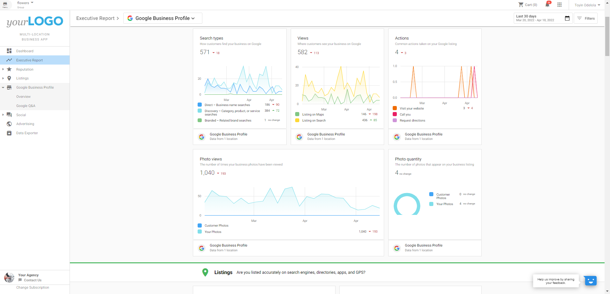
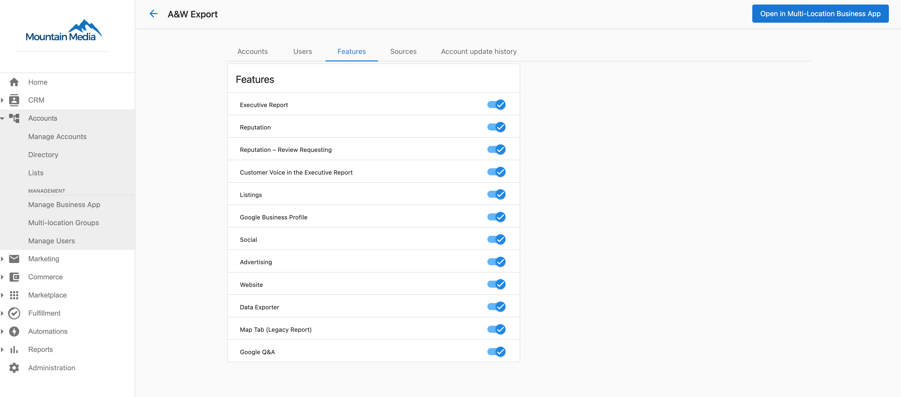
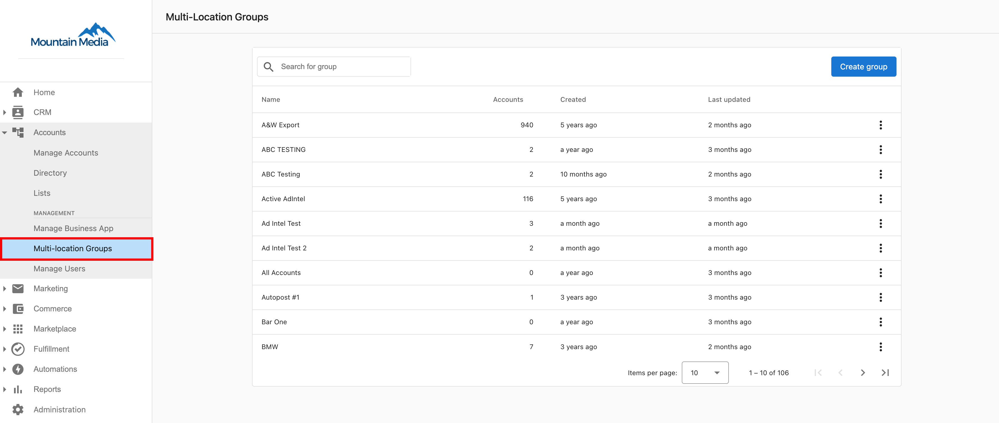
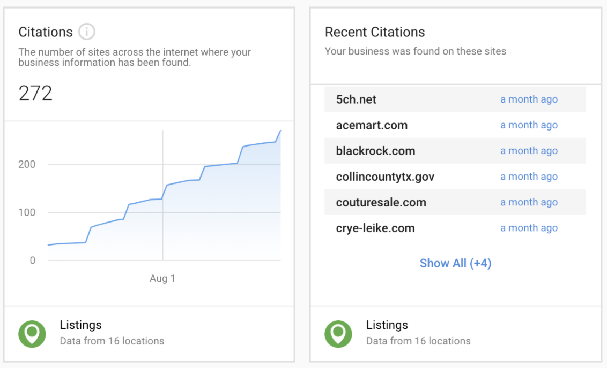

# Descripción general de Executive Report

El Multi-Location Executive Report es un potente resumen consolidado de métricas en cualquier número de ubicaciones de negocio. Con un selector de fechas personalizado y filtrado, puedes desglosar los datos para ver tendencias en el rendimiento de marketing en un grupo multiubicación. Disponible en Multi-Location Business App y totalmente de marca blanca, el informe respalda el análisis de necesidades y los informes de comprobación de rendimiento.

## ¿Por qué usar Executive Report?

**Prospectar e identificar oportunidades:** el informe muestra los datos de marketing recopilados de todas las cuentas de negocio del grupo. Ejecuta Snapshot Reports para un grupo de ubicaciones y luego consulta esos datos en Multi-Location Business App para que los usuarios puedan ver oportunidades de mejora.

**Informes de comprobación de rendimiento:** las líneas de tendencia y los números de cambio delta muestran cambios a corto o largo plazo en muchas cuentas y demuestran el impacto de tu trabajo.

## Funciones clave

- **Datos rápidos**: desglosa y analiza grandes conjuntos de datos rápidamente.
- **Cambios a corto plazo y tendencias a largo plazo**: compara métricas de un período a otro con una selección de fecha personalizada.
- **De marca blanca**: el informe es tuyo, con tu propio logotipo y marca.
- **Filtrado**: filtra por geografía, categoría de negocio, región, grupos de ubicaciones o fuentes de listados/reseñas.

## Qué datos se incluyen

El informe puede incluir:

- Google Business Profile
- Advertising Intelligence
- Google Analytics
- Reputation (Top Review Sources, Recent Reviews, Review Rating, Review Volume, Average Time to Response)
- Datos de listados
- Redes sociales (con tecnología de Social AI)

Con el tiempo se agregarán productos adicionales de Marketplace y otras fuentes de métricas de terceros.

## Cómo ver el informe

Los usuarios de Multi-Location Business App pueden ver el Executive Report de su grupo multiubicación dentro de la aplicación. La plataforma no envía el informe por correo electrónico a los usuarios. Como partner, abre el informe yendo a `Partner Center` → `Accounts` → `Multi-Location Groups`, usando el menú kebab en el nombre del grupo para abrir **Multi-Location Business App**, y luego seleccionando **Executive Report** en el panel izquierdo.

El contenido del informe está determinado por las funciones habilitadas para el grupo en `Partner Center` → `Accounts` → `Multi-Location Groups` → *Nombre del grupo* → **Features**.

## Preguntas frecuentes

¿Cómo configuro el Executive Report?

El Multi-Location Executive Report recopila datos de todas las ubicaciones individuales y los consolida en un informe fácil de entender. El informe respeta las selecciones hechas en `Partner Center` → `Accounts` → `Multi-Location Groups` → *Nombre del grupo* → **Features**.

¿Por qué los usuarios no reciben el Executive Report?

Los usuarios multiubicación ven el Executive Report dentro de Multi-Location Business App. La plataforma no envía los Executive Reports por correo electrónico a los usuarios.

Como partner, puedes ver el informe de la siguiente manera:

1. Ve a `Partner Center` → `Accounts` → `Multi-Location Groups`.
2. Haz clic en el menú kebab en el nombre del grupo y abre **Multi-Location Business App**.
3. Selecciona **Executive Report** en el panel izquierdo para ver el informe.

¿Por qué mi Listing Score se ve diferente en el Multi-Location Executive Report en comparación con un informe de una sola ubicación?

Esto es esperado: los dos informes calculan el Listing Score de manera diferente.

El Listing Score de **Business App de una sola ubicación** incluye las citas como parte del cálculo. El Listing Score del **Multi-Location Executive Report** no incluye citas; usa un subconjunto de señales de listados que se pueden agregar de manera consistente en todas las ubicaciones del grupo.

Debido a que las citas se excluyen del cálculo multiubicación, la puntuación que ves en el Multi-Location Executive Report generalmente será más baja que la puntuación mostrada en la Business App de cualquier ubicación individual. Ambas puntuaciones son precisas para lo que miden; simplemente miden cosas diferentes.

¿Por qué mi tasa de respuesta a reseñas y el tiempo promedio de respuesta se ven diferentes entre las pestañas Overview y Reviews?

Ambas pestañas son precisas: usan rangos de fechas diferentes por diseño.

- **Pestaña Overview**: muestra datos limitados a tu filtro de fecha seleccionado. Si has definido un rango de fechas personalizado, la tasa de respuesta y el tiempo de respuesta reflejan solo ese período.
- **Pestaña Reviews**: siempre muestra datos históricos completos del grupo, independientemente del filtro de fecha establecido en Overview.

Esto significa que las dos pestañas a menudo mostrarán números diferentes, lo cual es esperado, no un error.

**Para compararlas directamente:** establece el filtro de fecha de Overview desde la fecha más temprana posible (1 de enero de 2001) hasta hoy. Esto alinea Overview con los datos históricos completos para que ambas pestañas reflejen el mismo período.

**Por qué el tiempo de respuesta histórico puede verse inusualmente alto:** el cálculo histórico incluye reseñas que llegaron antes de que Reputation AI se activara para la ubicación, reseñas que nunca recibieron respuesta. Esto eleva significativamente el tiempo de respuesta promedio. Filtrar Overview a un período más reciente ofrece una vista más representativa del rendimiento actual.

¿Cómo funciona el seguimiento de citas?

El seguimiento de citas en Executive Report proporciona comprobación de rendimiento bajo la categoría de Listings. Las citas son menciones de un negocio encontradas en línea: un nombre de negocio más otro detalle (número de teléfono, sitio web o dirección). Ayudan a los motores de búsqueda a entender un negocio y mejorar su capacidad de ser encontrado.

La tarjeta de seguimiento de citas en Executive Report tiene tecnología de **Reputation AI Pro**; aparece solo para cuentas que tienen Reputation AI Pro activo. Si Reputation AI Pro no está activo para un cliente, la tarjeta de citas no aparece en su Executive Report.

**Citation Builder** y **Listing Sync Pro** son complementos de Local SEO independientes que pueden ayudar a generar y aumentar las citas encontradas para un negocio. Ninguno requiere que Reputation AI Pro esté activo; se venden y se usan por su cuenta. Citation Builder está disponible actualmente solo para negocios ubicados en **EE. UU.**

