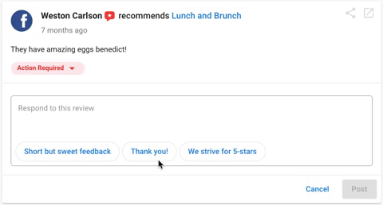
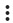
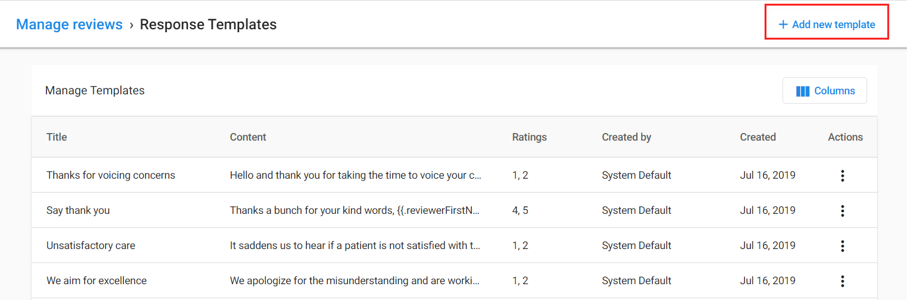

Las sugerencias de respuesta a reseñas facilitan responder rápidamente a las reseñas de clientes. Hay varias respuestas sugeridas para diferentes calificaciones por estrellas, lo que facilita encontrar una respuesta que se ajuste a tu reseña.

:::note
Las respuestas a reseñas asistidas por IA solo están disponibles en el plan **Premium**. En el plan Professional, las respuestas sugeridas son plantillas preescritas en lugar de generadas por IA.
:::

## Responder a reseñas

1. Abre Multi-location Business App desde tu Partner Center o panel de marca blanca.
2. Haz clic en una ubicación que tenga una reseña a la que quieras responder.
3. Haz clic en **Reviews** en el menú de navegación izquierdo.
4. Encuentra la reseña a la que quieres responder y haz clic en **Reply** en la esquina inferior derecha de la reseña.

5. Cuando se abra el cuadro de respuesta, haz clic en **Use suggested response**.

6. Aparecerá una lista de respuestas en una ventana emergente. Las respuestas sugeridas se adaptan según la calificación por estrellas de la reseña.
7. Selecciona la respuesta que mejor se ajuste a la reseña. El texto aparecerá en el cuadro de respuesta y puedes editarlo si es necesario.
8. Cuando estés listo, haz clic en **Reply**.

## Guardar una respuesta como plantilla

Al seleccionar una respuesta sugerida, tienes la opción de guardarla como plantilla para usar en futuras respuestas a reseñas.

1. Selecciona una respuesta sugerida.
2. Haz clic en la casilla "Save as template for future use".
3. Haz clic en **Use this response**.

## Usar plantillas guardadas

Las plantillas guardadas aparecen junto a las respuestas sugeridas. Puedes acceder a ellas de la misma manera.

1. Haz clic en **Reply** en una reseña.
2. Haz clic en **Use suggested response**.
3. Tus plantillas guardadas aparecerán en la parte superior de la lista de sugerencias.

## Cómo se comportan las respuestas sugeridas cuando se editan las reseñas

Si un cliente edita una reseña existente, el borrador de respuesta sugerida se actualiza para esa misma reseña según el texto y la calificación por estrellas más recientes.

Si ya se ha publicado una respuesta para la versión original de la reseña, no se muestra un borrador de respuesta en la tarjeta de la reseña.

## Buenas prácticas para responder a reseñas

- Personaliza siempre las respuestas sugeridas antes de publicarlas.
- Dirígete al cliente por su nombre cuando sea posible.
- Haz referencia a puntos específicos mencionados en la reseña.
- Para reseñas negativas, ofrece resolver la situación y proporciona información de contacto para asistencia adicional.
- Mantén las respuestas profesionales y corteses, incluso para reseñas negativas.
- Responde con prontitud a todas las reseñas, tanto positivas como negativas.

## Preguntas frecuentes

¿Editar una reseña establece su estado como pendiente de respuesta en Reputation AI?

No. Editar una reseña no cambia su estado de respuesta en el panel. El estado permanece como estaba después de la edición.

