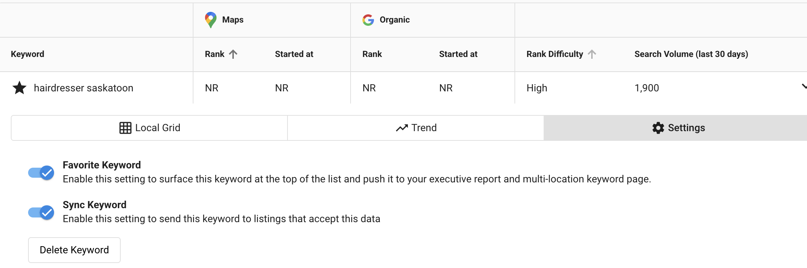

## ¿Qué es la adición masiva de palabras clave?
La adición masiva de palabras clave te permite aplicar una lista de palabras clave a varias ubicaciones en un solo paso. Las palabras clave se aplican en el orden en que las ingresas hasta que se alcanza el límite de palabras clave de cada ubicación. Esta función también hace seguimiento de qué palabras clave se agregaron con éxito a cada ubicación, dándote información clara para informes y actualizaciones futuras. Las palabras clave agregadas se marcan como favoritas y se sincronizan automáticamente cuando la configuración de administrador lo permite.

## ¿Por qué es importante la adición masiva de palabras clave?
Cuando gestionas varias ubicaciones, agregar palabras clave una por una consume mucho tiempo y es propenso a errores. La adición masiva de palabras clave te ayuda a:
- Ahorrar horas al aplicar palabras clave a todas las ubicaciones seleccionadas a la vez
- Mantener una cobertura de palabras clave consistente en todas las ubicaciones
- Reducir el trabajo manual y el error humano
- Ver rápidamente qué palabras clave se agregaron con éxito

## ¿Qué incluye la adición masiva de palabras clave?
- Aplica hasta 15 palabras clave a la vez
- Selecciona varias ubicaciones en un grupo
- Marcado como favorito y sincronización automáticos de palabras clave (si está habilitado en la configuración de administrador)
- Seguimiento de las adiciones exitosas de palabras clave por ubicación

## Cómo agregar palabras clave de forma masiva
1. Abre el grupo multiubicación desde el menú desplegable `Accounts`.
2. En Multi-Location Business App, ve al menú desplegable `All Listings`.
3. Selecciona `Keyword Tracking` y abre la pestaña `Keywords`.
4. Haz clic en `Bulk Add Keywords`.
5. Ingresa tus palabras clave en el orden deseado (hasta 15).
6. Selecciona las ubicaciones donde quieres aplicarlas.
7. Guarda tus cambios.

:::note
Las palabras clave se agregan a cada ubicación en el orden de la lista hasta que se alcanza el límite de palabras clave de esa ubicación.
:::

## Puntos para recordar
- Puedes agregar hasta 15 palabras clave en una sola acción masiva.
- Cada ubicación tiene su propio límite de palabras clave.
- Las palabras clave no se agregarán a ubicaciones que ya hayan alcanzado su límite.
- Los cambios aparecen en Multi-Location Business App dentro de las 24 horas.
- El marcado como favorito y la sincronización automáticos solo ocurren si la configuración de administrador está habilitada.

## Preguntas frecuentes (FAQ)

¿Puedo agregar más de 15 palabras clave a la vez?

No. El límite es de 15 palabras clave por adición masiva. Puedes repetir el proceso para agregar más.

¿Qué sucede si una ubicación alcanzó su límite de palabras clave?

Las palabras clave se omitirán para esa ubicación, pero se seguirán aplicando a otras que tengan cupo disponible.

¿Cuándo veré aparecer las palabras clave?

Los cambios se reflejan en Multi-Location Business App después de 24 horas.

¿Las palabras clave se marcarán como favoritas automáticamente?

Sí, pero solo si la configuración de administrador para marcar como favorito y sincronizar está habilitada.

¿Importa el orden de las palabras clave?

Sí. Las palabras clave se aplican en el orden en que las ingresas hasta que se alcanza el límite de la ubicación.

¿Puedo quitar palabras clave de forma masiva?

No. Esta función es solo para agregar palabras clave.

¿Veré un informe de qué palabras clave se aplicaron con éxito?

Sí. El sistema hace seguimiento de qué palabras clave se agregaron a cada ubicación para fines de informes.

¿Obtendré un resumen de las palabras clave que no se aplicaron?

Sí, se proporcionará un resumen de las palabras clave y los motivos de la falla.

