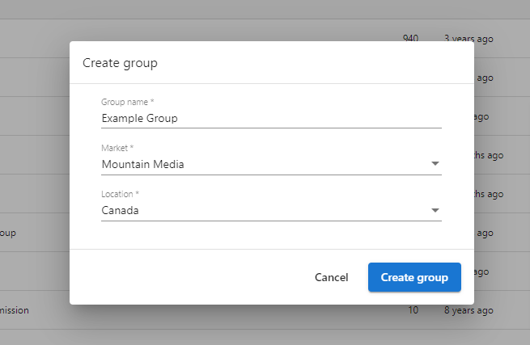
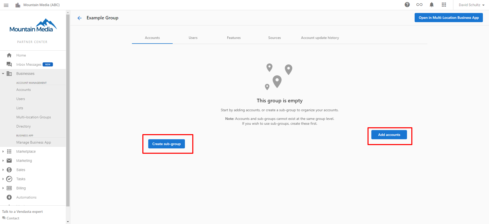
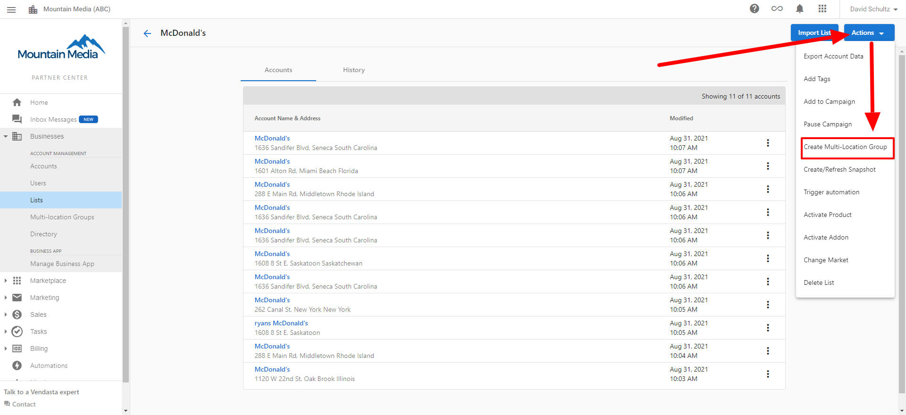

Esta guía te lleva a través de la configuración de Multi-Location Business App para gestionar de manera eficiente varias ubicaciones de negocio desde una sola plataforma.

## Requisitos previos

Antes de comenzar, asegúrate de tener:

- Cuentas de Business App activas para cada ubicación
- Acceso de partner o administrador al portal multiubicación
- Permisos de usuario configurados correctamente

## Descripción general del proceso de configuración

La configuración de Multi-Location Business App implica organizar tus ubicaciones de negocio en grupos lógicos para una gestión optimizada. Puedes crear y gestionar estos grupos de negocio mediante varios métodos diseñados para eficiencia y flexibilidad.

### Crear grupos de negocio

Puedes crear grupos de negocio usando dos métodos principales:

#### Método 1: desde la página principal de la app Multi-Location

1. Ve a la página principal de la app Multi-Location
2. Haz clic en `Create Group`
3. Ingresa los detalles del grupo y guarda

#### Método 2: desde Business List

1. En Business App, ve a la sección `Business List`
2. Selecciona varios negocios usando las casillas de verificación
3. Haz clic en `Add to Group` en el menú de acciones
4. Elige un grupo existente o crea uno nuevo

#### Crear desde la vista de lista

También puedes crear un grupo directamente desde la vista de lista:

1. Selecciona varios negocios en la lista
2. Haz clic en `Create Group`
3. Completa los detalles requeridos

### Importar ubicaciones de negocio

Para una configuración masiva eficiente, puedes agregar rápidamente varias ubicaciones de negocio:

1. Prepara un archivo CSV con todos los detalles de la ubicación
2. Ve a `Import` en la app Multi-Location
3. Sube tu archivo CSV
4. Asigna las columnas a los campos requeridos
5. Envía la importación

## Pasos de configuración

Sigue estos pasos para completar la configuración de tu Multi-Location Business App:

1. **Create Business Groups**: organiza las ubicaciones usando los métodos anteriores
2. **Add Locations**: asigna cuentas existentes de Business App o importa nuevas
3. **Configure Permissions**: establece los niveles de acceso de usuario para cada grupo
4. **Customize Dashboard**: configura las métricas y preferencias de informes
5. **Train Users**: asegúrate de que los miembros del equipo entiendan la interfaz multiubicación

## Gestionar grupos de negocio

Una vez creados, puedes gestionar fácilmente tus grupos de negocio:

- Edita los detalles y miembros del grupo
- Ve analíticas agregadas
- Aplica acciones masivas en todas las ubicaciones de un grupo
- Crea campañas de marketing dirigidas para grupos específicos

## Beneficios para los partners

Multi-Location Business App ofrece ventajas significativas cuando gestionas varias ubicaciones de clientes:

- **Eficiencia mejorada**: gestiona varias ubicaciones sin cambiar entre cuentas
- **Mejor información**: ve datos agregados para identificar tendencias entre ubicaciones
- **Operaciones optimizadas**: aplica cambios, actualizaciones y campañas a varias ubicaciones simultáneamente
- **Estructura organizada**: crea agrupaciones lógicas que coincidan con la organización de tu negocio

## Próximos pasos

Una vez que hayas completado la configuración inicial:

- [Agrega cuentas a un grupo](./add-accounts-to-a-multi-location-group.mdx) para poblar tus grupos de negocio
- [Configura subgrupos](./multi-location-sub-groups.mdx) para organizar aún más las ubicaciones
- Configura módulos específicos como [publicación en redes sociales](../social/multi-location-social-posting.mdx)
- Configura [informes ejecutivos](../executive-report/executive-report.mdx) para las partes interesadas

Con tu Multi-Location Business App correctamente configurado, ahora puedes gestionar y supervisar de manera eficiente varias ubicaciones de negocio desde una sola plataforma unificada.
