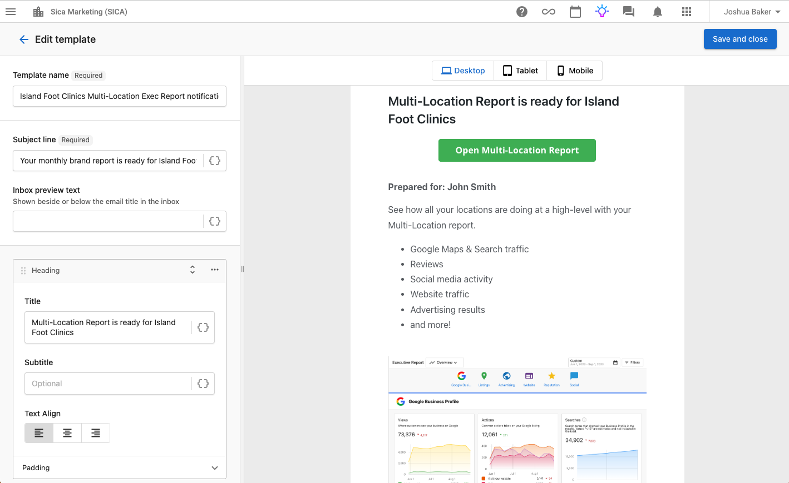

## Entender las limitaciones de notificaciones multiubicación

:::warning
Los grupos multiubicación no tienen notificaciones de usuario integradas. Las notificaciones en la plataforma de Vendasta solo funcionan a nivel de ubicación individual. Esto significa:

- Los usuarios recibirán notificaciones separadas de cada ubicación individual en su grupo
- No hay correos de resumen consolidados ni Executive Reports multiubicación
- Los partners deben crear soluciones personalizadas para la comunicación multiubicación
:::

## Crear notificaciones multiubicación personalizadas usando Automations

### Descripción general

Dado que no hay notificaciones multiubicación integradas, puedes crear recordatorios personalizados de Executive Report usando la plataforma Automations de Vendasta. Este enfoque te permite:

- Enviar correos personalizados y de marca a clientes multiubicación
- Consolidar varias notificaciones de ubicación en un solo recordatorio mensual
- Dirigir a los clientes a sus Executive Reports y paneles multiubicación
- Mantener el compromiso regular mientras reduces el ruido de correos

### Pasos de implementación

#### Paso 1: crea una plantilla de correo personalizada

1. Ve a `Automations` en tu Partner Center
2. Crea una nueva plantilla de correo con:
   - **Contenido predefinido** específico para tu cliente/marca
   - **Nombre de marca** y mensajes personalizados
   - **Enlace directo** a su informe de Multi-Location Business App
   - **Llamado a la acción claro** para revisar el panel

*Ejemplo de una plantilla de correo personalizada de Executive Report multiubicación con marca personalizada y enlace directo al panel.*

#### Paso 2: configura la automatización

1. Crea una nueva automatización, con el disparador `Manually started`
2. Usa el paso de automatización `Delay until certain day of month` y configúralo para enviar al comienzo de cada mes (por ejemplo, el día 2 del mes)
3. Agrega un paso para enviar tu campaña de correo de notificación personalizada

#### Paso 3: configura los ajustes de cuenta

1. **Inicia la automatización** desde la cuenta designada como "sede central" para el grupo multiubicación
2. **Quita a los clientes** de las notificaciones de Executive Report de ubicaciones individuales para reducir el ruido
3. **Prueba la automatización** primero con un grupo pequeño

### Caso de estudio real

**Cliente:** clínica de podología con 22 ubicaciones
**Enfoque:** recordatorio mensual personalizado de Executive Report multiubicación

**Resultados:**
- Redujo el ruido de correos de 22 mensajes a 1 notificación consolidada
- Aumentó el compromiso con los informes multiubicación
- Demostró el valor continuo del partner mediante comunicación personalizada
- Mejoró la satisfacción del cliente con informes optimizados

### Buenas prácticas

#### Pautas de contenido de correo
- **Personaliza** con el nombre de marca y los mensajes específicos del cliente
- **Incluye enlaces directos** a su panel multiubicación
- **Destaca los puntos de valor clave** que estás entregando
- **Usa un llamado a la acción** claro
- **Mantén el contenido conciso** pero informativo

#### Gestión de automatizaciones
- Inicia la automatización desde la cuenta designada como "sede central"
- Usa una programación mensual en lugar de ciclos continuos de 30 días
- Supervisa las tasas de entrega y el compromiso
- Revisa y actualiza el contenido del correo regularmente

#### Comunicación con el cliente
- Informa a los clientes sobre el nuevo sistema de notificaciones
- Explica cómo reemplaza los correos de ubicaciones individuales
- Proporciona instrucciones claras para acceder a los informes
- Establece expectativas sobre el momento y la frecuencia

## Escalar tu estrategia de notificaciones

A medida que implementas esta solución con varios clientes, considera estos enfoques:

1. **Crea variaciones de plantillas** para diferentes tipos de clientes e industrias
2. **Desarrolla marcos de mensajería estándar** que se puedan personalizar rápidamente
3. **Construye bibliotecas de automatizaciones** para una implementación rápida en nuevos clientes
4. **Capacita a los miembros del equipo** en los procesos de configuración y personalización
5. **Documenta las preferencias del cliente** para optimizar la personalización

## Solución de problemas

### Problemas comunes

**La automatización no se inicia**
- Verifica que estés iniciando desde la cuenta de sede central correcta
- Comprueba que la cuenta tenga la asignación correcta al grupo multiubicación
- Asegúrate de que la plantilla de correo esté configurada correctamente

**Los correos no se entregan**
- Confirma que las direcciones de correo de los destinatarios estén actualizadas
- Revisa los filtros de spam y la capacidad de entrega de correo
- Verifica la configuración de programación de la automatización

**Varios grupos multiubicación**
- Elige el grupo principal para las notificaciones
- Considera automatizaciones separadas para diferentes segmentos de negocio
- Documenta qué grupo atiende cada automatización

### Recursos de soporte

- Contacta a Vendasta Support para solucionar problemas de automatización
- Revisa la documentación de Automations para funciones avanzadas
- Únete a la comunidad de partners para compartir buenas prácticas

---

:::note
Esta solución requiere configuración y personalización manual para cada cliente. Aunque no es tan automatizada como las funciones integradas de la plataforma, brinda a los partners la flexibilidad de crear comunicación personalizada y valiosa con sus clientes multiubicación.
:::

## Próximos pasos

1. **Revisa tus clientes multiubicación**: identifica cuáles se beneficiarían de notificaciones consolidadas
2. **Planifica tu estrategia de contenido de correo**: desarrolla plantillas y marcos de mensajería
3. **Configura automatizaciones de prueba**: comienza con un cliente para refinar el proceso
4. **Escala gradualmente**: implementa con clientes adicionales según el éxito y los comentarios
5. **Supervisa y optimiza**: haz seguimiento del compromiso y ajusta el contenido/momento según sea necesario

Al implementar notificaciones multiubicación personalizadas, puedes ofrecer más valor a tus clientes mientras reduces la fatiga de notificaciones y demuestras un compromiso continuo con su rendimiento multiubicación.
