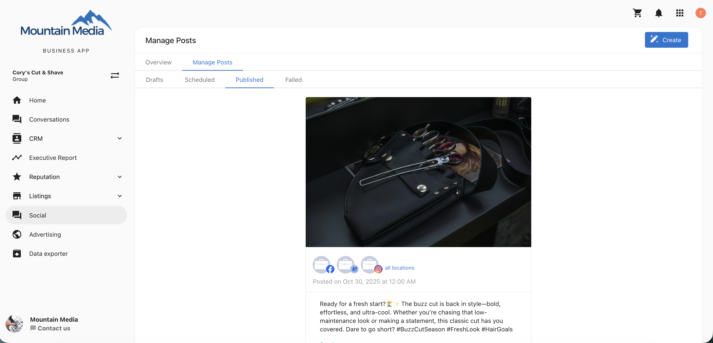
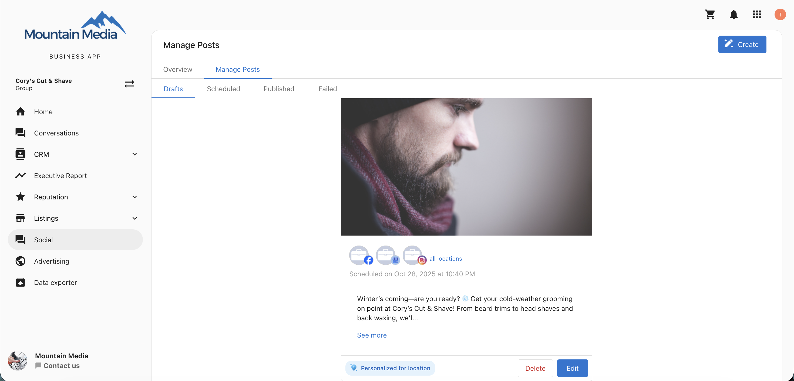
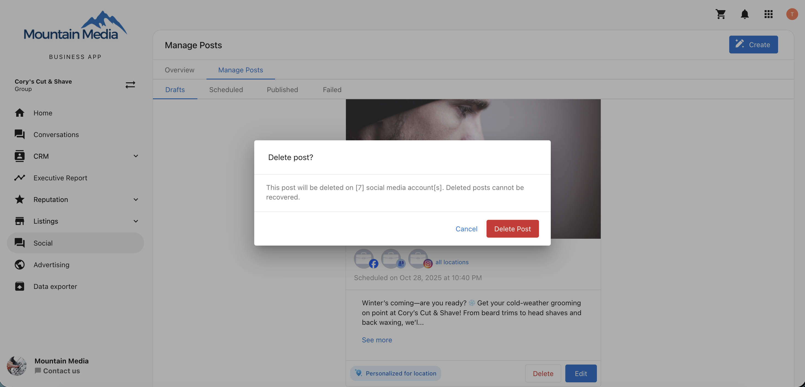

## Gestionar publicaciones multiubicación

La función **Manage Posts** te permite ver y gestionar todas las publicaciones sociales, incluidos borradores, programadas, publicadas y fallidas, en cada ubicación de tu grupo multiubicación.
Puedes hacer seguimiento, editar o eliminar publicaciones fácilmente desde un panel centralizado, sin cambiar entre ubicaciones individuales.

## ¿Por qué es importante gestionar las publicaciones multiubicación?

Esta función simplifica la gestión de redes sociales para negocios con varias ubicaciones al permitirte:

- Supervisar el estado de las publicaciones en todas las ubicaciones en una sola vista
- Identificar y solucionar publicaciones fallidas con mensajes de error detallados
- Editar contenido, medios o detalles de publicación antes de que una publicación se active
- Eliminar publicaciones de manera consistente en todas las ubicaciones desde un solo lugar

## ¿Qué incluye la función 'manage posts'?

- Una **lista unificada de publicaciones** que muestra todas las publicaciones por estado (Drafts, Scheduled, Published, Failed)
- **Visibilidad de ubicación** para cada publicación en todo el grupo
- **Redes sociales en las que se puede hacer clic** para navegar a la vista de una ubicación individual
- **Mensajes de error** para publicaciones que no se pueden publicar, con detalles a nivel de ubicación
- **Funciones de edición y eliminación** para borradores, publicaciones programadas y publicadas

## Cómo usar manage posts

1. Ve a `Multi-Location` → `Social` → `Manage Posts`.

2. Elige una pestaña para ver publicaciones por estado: `Drafts`, `Scheduled`, `Published` o `Failed`.

3. Haz clic en una publicación para ver los detalles y las acciones disponibles.

### Filtrar borradores por contexto

Al ver los borradores, usa el tipo de filtro que coincida con tu flujo de trabajo:

- **Calendar / Report**: los borradores se enumeran por **fecha programada**
- **Post Menu**: los borradores se enumeran por **fecha de actualización**

### Ver publicaciones en todas las ubicaciones

- Puedes ver dónde existe una publicación (borrador, programada, publicada) en todas las ubicaciones vinculadas.
- Al hacer clic en un **ícono de red social** irás directamente a la vista de esa red para la ubicación seleccionada.
- Para publicaciones fallidas, verás la ubicación exacta donde falló la publicación y el mensaje de error relacionado.
- Si la personalización del contenido para una o más ubicaciones falla, la publicación muestra una insignia de **Personalization failed** en su lugar. Al pasar el cursor sobre la insignia se muestra: *No se pudo completar la personalización para cada ubicación. Elimina esta publicación y crea una nueva para volver a intentarlo.* Esto aplica tanto en la versión web como en la móvil.

### Editar publicaciones

Puedes editar publicaciones en **borrador** y **programadas** para actualizar lo siguiente:

- Contenido de la publicación
- Medios
- Fecha y hora
- Ubicaciones seleccionadas
- Redes sociales

Para editar una publicación:

1. Haz clic en la publicación que quieres actualizar.
2. Selecciona `Edit`.
3. Haz tus cambios y guarda la publicación.

### Programar publicaciones en borrador desde las tarjetas de publicación

En la pestaña `Drafts`, cada tarjeta de publicación en borrador incluye una acción `Schedule` para que puedas programar la publicación directamente desde la tarjeta.

- `Schedule` solo está disponible para publicaciones en estado `Drafts`.
- La acción está disponible en las vistas de escritorio y móvil.
- Después de programar una publicación en borrador, aparece una barra de confirmación (snackbar).

Antes de que la acción `Schedule` se habilite, se aplican verificaciones de fecha y hora:

- Si la fecha y hora seleccionadas están en el pasado, la programación se deshabilita y se muestra: `Please select a future date and time to schedule this post`.
- Si la fecha y hora seleccionadas están en el pasado y no hay una cuenta social válida conectada, la programación se deshabilita y se muestra: `Please ensure the scheduled time is in the future and at least one social account is connected`.

:::info
Las ediciones hechas a nivel multiubicación se reflejan en todas las publicaciones conectadas de una sola ubicación.
:::

### Eliminar publicaciones

Puedes eliminar borradores, publicaciones programadas y publicadas directamente desde la vista multiubicación.

Para eliminar una publicación:

1. Haz clic en la publicación que quieres eliminar.
2. Selecciona `Delete`.
3. Confirma la eliminación.

Cuando una publicación se elimina a nivel multiubicación, también se elimina de todas las cuentas conectadas de una sola ubicación.

:::warning
Las publicaciones de **Instagram** publicadas no se eliminarán de las cuentas de una sola ubicación aunque se eliminen a nivel multiubicación.
:::

## Preguntas frecuentes

¿Puedo editar publicaciones publicadas?

No. Solo se pueden editar los borradores y las publicaciones programadas.

¿Puedo ver en qué ubicaciones se ha publicado una publicación?

Sí. La vista `All Locations` muestra dónde se ha creado como borrador, programado o publicado cada publicación.

¿Puedo hacer clic para ver la red social de una ubicación?

Sí. Haz clic en el ícono de la red social para navegar directamente a la página de esa ubicación.

¿Puedo corregir publicaciones fallidas?

Sí. Puedes ver el mensaje de error específico de cada publicación fallida y editar o volver a intentar la publicación.

¿Puedo eliminar publicaciones publicadas?

Sí, pero las publicaciones de Instagram eliminadas permanecerán a nivel de ubicación individual.

¿Puedo cambiar la fecha y hora de una publicación programada?

Sí. Puedes actualizar los detalles de programación en la vista `Edit` de las publicaciones programadas.

¿Los cambios a nivel de ubicación individual afectan la publicación multiubicación?

No. Las actualizaciones hechas en una sola ubicación no se reflejan en la vista multiubicación.

¿Puedo ver los medios asociados a las publicaciones?

Sí. Puedes previsualizar las imágenes o videos adjuntos en la vista de detalles de la publicación.

¿Qué sucede cuando elimino un borrador?

El borrador se elimina del grupo multiubicación y de todas las cuentas de ubicación individual asociadas.

¿Las publicaciones fallidas se reintentan automáticamente?

No. Deberás editar y volver a programar manualmente la publicación fallida.

¿Qué significa la insignia "Personalization failed"?

Esta insignia aparece en una publicación multiubicación cuando no se pudo completar la personalización del contenido para una o más ubicaciones. A diferencia de otras publicaciones fallidas, no puedes editar ni reintentar estas; elimina la publicación y crea una nueva para volver a intentarlo.

