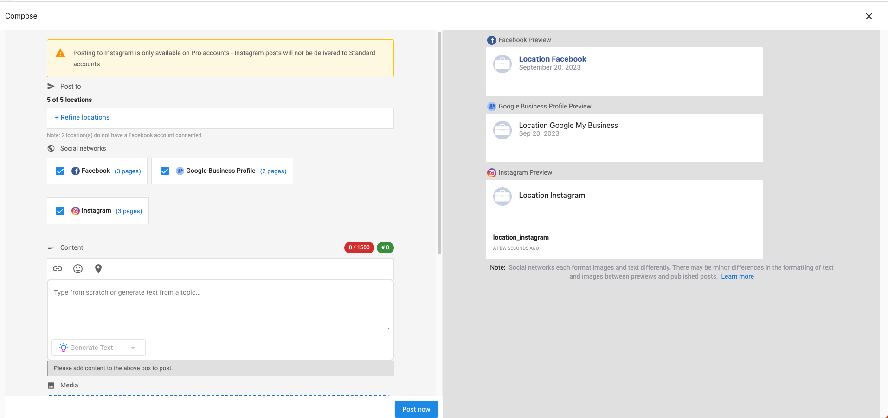
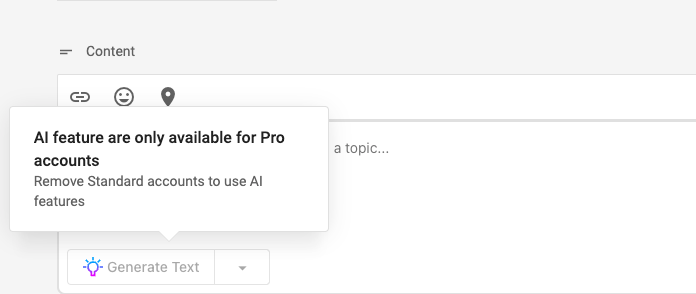
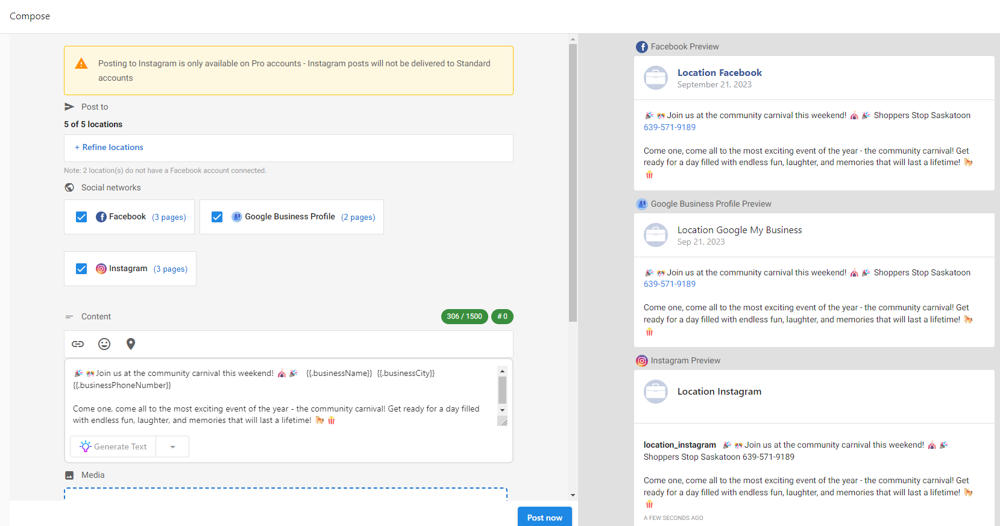

Con la publicación social de Multi-location Business App, puedes:

- Publicar en varias páginas de Facebook, Instagram o Google Business Profile a la vez
- Personalizar publicaciones para cada ubicación individual mediante contenido dinámico y permitir que las ubicaciones individuales personalicen las publicaciones multiubicación en su propia app de Social AI.
- Revisar y supervisar el rendimiento de la marca y profundizar en ubicaciones individuales en una sola vista

## Cómo funciona

Creas y programas publicaciones desde Multi-location Business App; esas publicaciones se publican en las cuentas sociales conectadas de cada ubicación. Puedes dirigirte a todas las ubicaciones o refinar por grupo, geografía o ubicación individual. Las ubicaciones también pueden personalizar o editar publicaciones programadas en su propia app de Social AI.

:::info
**Requisitos:** Multi-location Business App debe estar configurado para tu grupo, y cada ubicación debe tener Social AI Standard o Pro. Para obtener mejores resultados, usa una cuenta por ubicación con Facebook, Instagram y Google Business Profile conectados a la app de Social AI de esa cuenta.
:::

## Crear una publicación

Ve a **Multi-Location Business App → Social → Overview**. Aquí verás el resumen del rendimiento social de tu marca con detalles para cada ubicación. Haz clic en el botón **Compose Post** para abrir el compositor.

:::note
Publicar en Instagram y usar la función de IA es una funcionalidad Pro.
:::

### Paso 2 - Los eventos de Google Business y los llamados a la acción también se incluyen al redactar una publicación.

### Paso 3 - Refinar ubicaciones

De forma predeterminada, todas las ubicaciones están seleccionadas. Haz clic en Refine Locations para seleccionar ubicaciones por Group, Geography o Location.

1. **Group**: selecciona un grupo que hayas creado previamente. Puedes crear grupos según la forma en que quieras clasificar tus ubicaciones. (Ejemplo: franquicias, sucursales de propiedad corporativa, etc.)
2. **Geography**: selecciona ubicaciones por país o por estado/provincia
3. **Location**: selecciona ubicaciones específicas que quieres incluir en tu publicación

:::warning
Si dos o más de tus ubicaciones seleccionadas comparten la misma conexión de Facebook, Instagram, LinkedIn o X, no podrás guardar la publicación. Verás:

**"Posts cannot be saved because the same Facebook/Instagram/LinkedIn/X connection is linked to multiple locations to stop duplicate posts. To continue, either remove this social connection from the other location(s) or remove the affected location."**

Cuando sea posible, el mensaje nombra la ubicación específica. Elimina la conexión compartida de la otra ubicación, o elimina la ubicación afectada, y guarda la publicación de nuevo.
:::

### Ver publicaciones recientes y programadas

En **Recent** y **Scheduled**, cada publicación aparece una vez para Facebook y Google Business Profile. Haz clic en **all locations** para ver en qué cuentas se publicó la publicación. Haz clic en el **nombre de una cuenta individual** para abrir la vista de esa ubicación.

## Contenido dinámico

Una vez que hayas refinado las ubicaciones, puedes continuar con la creación de tu publicación. Usando contenido dinámico, puedes personalizar tu publicación para cada ubicación. Simplemente haz clic en el ícono de contenido dinámico  para agregar cualquiera de la siguiente información:

1. Nombre del negocio
2. Ciudad
3. Número de teléfono

El contenido dinámico obtiene automáticamente los detalles de cada ubicación. Puedes ver cómo se verá tu publicación en el panel de vista previa del compositor.

Una vez que hayas terminado con tu publicación, puedes elegir publicarla de inmediato o programarla para una fecha y hora específicas.

## Personalización sencilla

Cada ubicación puede personalizar una publicación multiubicación programada a través de Social AI en su propia Business App. Pueden editar la publicación como lo harían con cualquier publicación normal: cambiar la fecha y hora de publicación, editar el texto, cambiar imágenes, agregar hashtags, etc.

Simplemente ve a Business App → Social AI → `My Posts` → `Scheduled Posts` o haz clic en **View More** en la sección Scheduled Posts de la página Overview. Verás la publicación multiubicación programada y podrás editarla.

:::note
**NOTA:** editar una publicación multiubicación para una sola ubicación te impedirá hacer ediciones masivas a la publicación de esa ubicación a través de Multi-location Business App.

Si intentas hacer cambios a tus Scheduled Posts multiubicación, también verás un aviso a través de Multi-location Business App → Social → `Managed Posts` → `Scheduled Posts`.

:::

## Manage Posts

Al hacer clic en Multi-location Business App → Social → **Managed Posts** podrás ver Recent Posts. También puedes ver y editar Scheduled Posts, así como reintentar publicaciones que puedan haber fallado. También puedes ver qué ubicaciones están incluidas en cada publicación haciendo clic en el enlace de ubicaciones.

## Overview

Finalmente, a través de la página Overview, puedes ver cómo le está yendo a tu marca en general y comparar el rendimiento entre tus diferentes ubicaciones.

Las estadísticas de "new posts" y "engagement" en la parte superior de la página incluyen datos de publicaciones publicadas a través de la plataforma y directamente en los sitios de redes sociales conectados.

Al hacer clic en una ubicación se abrirá un panel lateral con más detalles específicos de esa ubicación. A través de este panel, puedes abrir la Business App, la app de Social AI o el Executive Report de esa ubicación en una pestaña separada.

## Preguntas frecuentes

¿Qué redes sociales son compatibles con la publicación social multiubicación?

La publicación multiubicación admite solo **Facebook**, **Instagram** y **Google Business Profile**. Otras plataformas que tus ubicaciones puedan tener conectadas, como LinkedIn o X, no están disponibles para publicaciones multiubicación y deben publicarse individualmente desde la app de Social AI propia de cada ubicación.

**Requisitos de Instagram:** publicar en Instagram requiere Social AI **Pro**. Las ubicaciones con Social AI Standard no recibirán publicaciones de Instagram de una campaña multiubicación, incluso si Instagram está conectado a su cuenta. La publicación aún se publicará en sus páginas de Facebook y Google Business Profile.

¿Por qué no puedo guardar una publicación en algunas de mis ubicaciones seleccionadas?

Esto sucede cuando dos o más de tus ubicaciones seleccionadas comparten la misma conexión de Facebook, Instagram, LinkedIn o X. La publicación social multiubicación bloquea el guardado en este caso para evitar publicaciones duplicadas. Elimina la conexión compartida de la otra ubicación (o ubicaciones), o elimina la ubicación afectada, y guarda la publicación de nuevo.

¿Puedo crear campañas de Social Marketing a nivel de grupo multiubicación?

No. La creación de campañas no está disponible a nivel de grupo multiubicación. Crea campañas desde una sola ubicación en su lugar.

¿La IA puede personalizar el contenido por ubicación, y puedo usar Premium o Pro en la sede central con Standard en las sucursales?

Sí. Puedes personalizar el contenido por ubicación. Se admiten ediciones mixtas: una cuenta de sede central en Premium o Pro puede publicar en Facebook, LinkedIn, Instagram y Google Business Profile, mientras que las cuentas de sucursal en Standard pueden publicar en Facebook y Google Business Profile.

