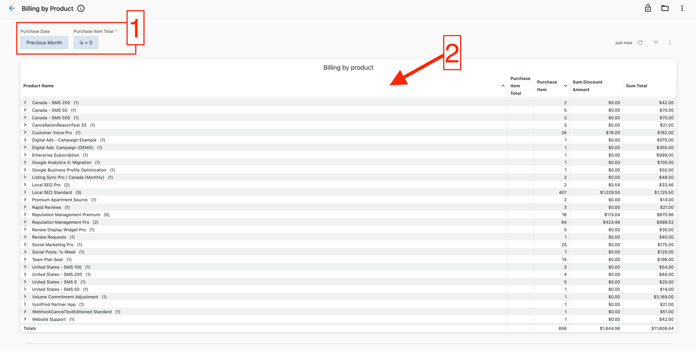
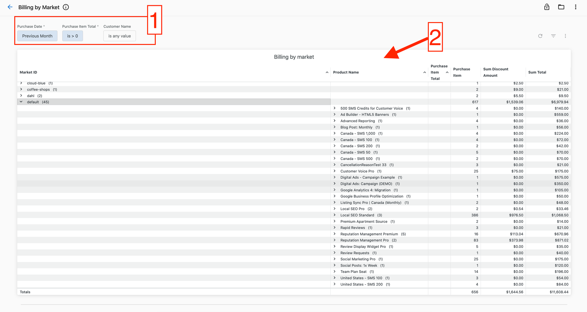
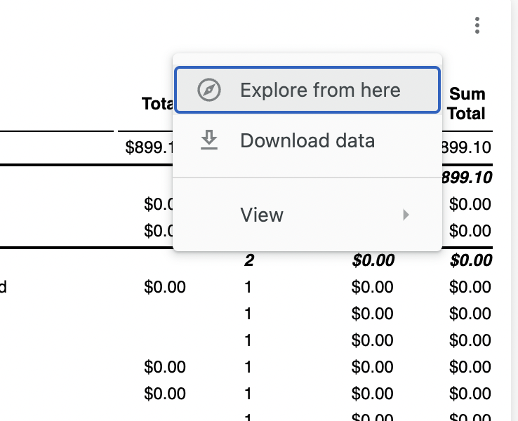

Haz seguimiento del rendimiento financiero de tu organización con análisis detallados de facturación y gestión de cuentas por cobrar. Estos informes ofrecen información sobre la distribución de ingresos, los patrones de pago y los saldos pendientes por productos, mercados y clientes.

## Informes de facturación

### Informe de facturación por producto

Consulta todas las compras de productos en un período seleccionado para comprender la distribución del gasto entre productos y las cantidades de unidades compradas.

1. Selecciona un período usando el filtro en la parte superior
2. Revisa el número de unidades, descuentos y totales de cada producto en la tabla

### Informe de facturación por mercado

Analiza las compras de productos por mercado para comprender los patrones de gasto en distintas regiones y la distribución de productos dentro de cada mercado.

1. Selecciona un período o filtra por clientes específicos usando los filtros superiores
2. Consulta las unidades compradas, descuentos y totales por mercado en la tabla

### Informe de facturación por cliente y mercado

Examina las compras de productos por mercado y cliente, lo que te permite ver el gasto a nivel de mercado y profundizar en el gasto de clientes individuales.

1. Selecciona tu período o filtra por clientes específicos usando los filtros superiores
2. Revisa las unidades compradas, descuentos y totales por cliente dentro de cada mercado

### Informe de facturación por cliente

Consulta todas las compras de productos por cliente individual en un período seleccionado para la conciliación de cuentas y el análisis del gasto de clientes.

1. Selecciona un período o filtra por un cliente específico usando los filtros superiores
2. Revisa los productos comprados, descuentos y totales de cada cliente

## Informes de cuentas por cobrar

### Antigüedad de cuentas por cobrar por vendedor

Haz seguimiento de los saldos pendientes y los montos vencidos segmentados por el vendedor asociado a cada cuenta.

1. Revisa los montos adeudados y vencidos por vendedor, cliente y moneda en la tabla
2. Consulta los montos vencidos agrupados en ventanas de 30 días para determinar la prioridad de seguimiento
3. Haz clic en los montos para ver el desglose detallado de facturas
4. Usa los filtros para seleccionar mercados, monedas o vendedores específicos

:::caution
Cuando hay varias monedas involucradas, filtra por `Currency` o `Market-ID` (mercados con una sola moneda) para garantizar que los totales y subtotales se calculen correctamente.
:::

### Antigüedad de cuentas por cobrar por cliente

Supervisa los saldos pendientes por cliente para hacer seguimiento del cumplimiento de los términos de pago e identificar cuentas que requieren seguimiento.

1. Consulta los montos actualmente adeudados y vencidos por cliente en la tabla
2. Revisa los montos vencidos en grupos de 30 días para priorizar los esfuerzos de cobro
3. Haz clic en los montos para ver los detalles de las facturas que los componen
4. Filtra por cuentas, mercados o monedas específicas en la parte superior

:::caution
Cuando hay varias monedas involucradas, filtra por `Currency` o `Market-ID` (mercados con una sola moneda) para garantizar que los totales se calculen correctamente.
:::

## Opciones de descarga

Descarga los datos de los informes financieros en varios formatos:

**Para informes completos:**
1. Haz clic en el ícono de tres puntos en la esquina superior derecha
2. Selecciona `Download` para ver las opciones de formato

**Para gráficos específicos:**
1. Haz clic en los tres puntos junto a cualquier gráfico
2. Selecciona `Download data`

## Actualidad de los datos

Los informes financieros se actualizan diariamente a las 12:00 AM UTC. Las etiquetas de actualidad de datos en la parte inferior de cada panel indican:

1. **Intervalo de actualización** (texto en negrita): con qué frecuencia se actualiza la fuente de datos con la frecuencia de actualización más baja
2. **Marca de tiempo de la última actualización** (texto en la parte inferior): el momento más temprano en que se actualizó por última vez alguna fuente de datos

:::tip
Usa los informes financieros para identificar tendencias de ingresos, hacer seguimiento de patrones de pago y priorizar los esfuerzos de cobro. Los informes de antigüedad ayudan a mantener un flujo de caja saludable al destacar las cuentas vencidas que requieren atención inmediata.
:::

## Artículos relacionados

- [Premium Reports overview](./index.mdx): primeros pasos con Premium Reports
- [Sales performance reports](./sales-performance-reports.mdx): análisis de actividad de ventas y pipeline
- [Operations reports](./operations-reports.mdx): monitoreo de conexiones de cuentas y automatización
