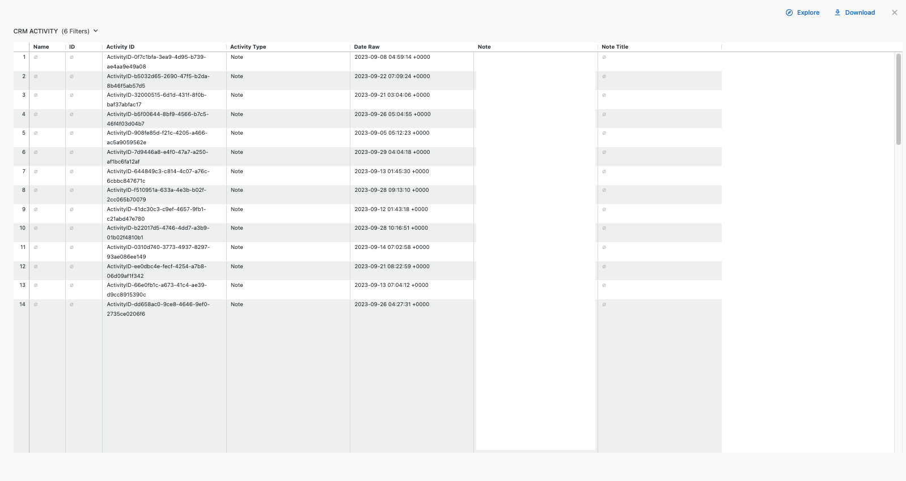
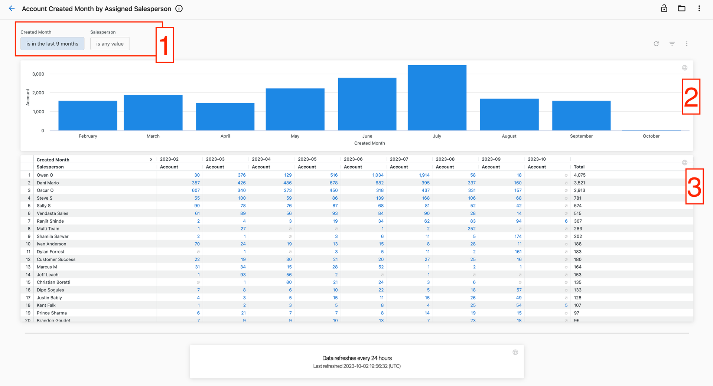
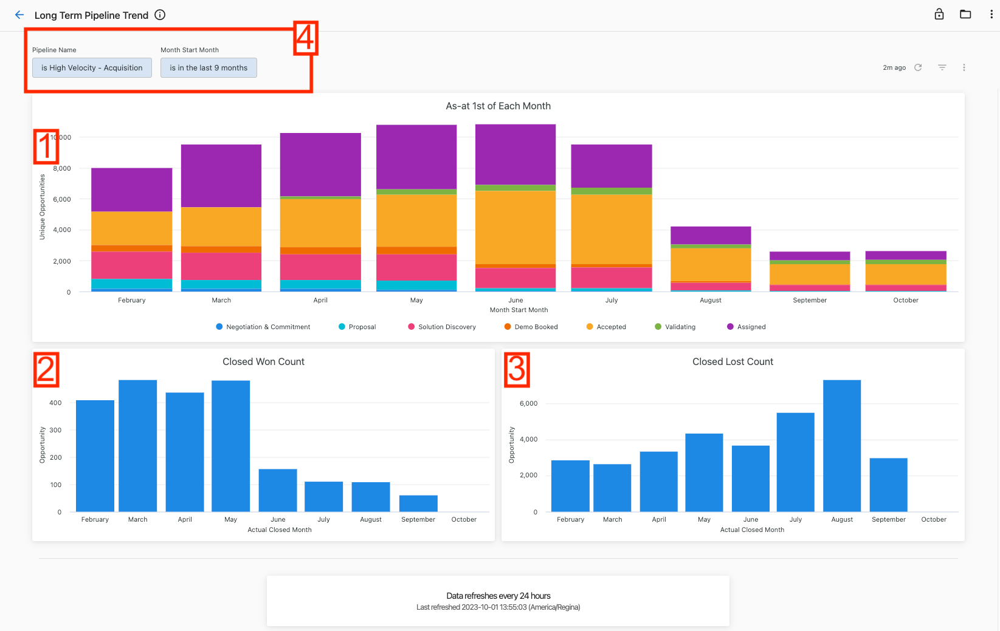

Supervisa y analiza el rendimiento de tu equipo de ventas con seguimiento de actividad integral y análisis de pipeline. Estos informes ofrecen información sobre las actividades de ventas, el avance de oportunidades, el tamaño de las negociaciones y la productividad del equipo.

## Actividades de ventas por vendedor

Haz seguimiento de las interacciones con clientes y los esfuerzos de ventas realizados por tu equipo cada mes, con desgloses de actividad detallados.

1. Filtra por período, vendedor específico o equipo usando los filtros superiores
2. Elige entre actividades registradas manualmente o actividades del sistema capturadas automáticamente
3. Consulta los números de actividad agregados en el gráfico de barras para obtener información rápida
4. Revisa los conteos de actividad mensuales por vendedor en la tabla detallada
5. Haz clic en los conteos de la tabla o en las porciones del gráfico para ver los desgloses detallados de actividad

La vista detallada muestra todas las actividades que contribuyen a cada conteo, brindando visibilidad sobre interacciones específicas con clientes y esfuerzos de ventas.

## Informes de rendimiento del pipeline

### Creación de cuentas por vendedor

Supervisa cuántas cuentas se crearon cada mes, agrupadas por vendedor asignado, para hacer seguimiento de la generación de nuevos negocios.

1. Filtra por período de creación o vendedor específico usando los filtros superiores
2. Consulta la tendencia agregada de cuentas creadas por mes en la visualización
3. Revisa los conteos mensuales detallados por vendedor en la tabla
4. Haz clic en los números para ver qué cuentas específicas componen esos conteos

### Pipeline por mes y propietario

Haz seguimiento del valor del pipeline para cada mes y propietario para supervisar el progreso de ventas e identificar posibles problemas.

1. Consulta el valor potencial total de cada mes en el gráfico de barras
2. Revisa el valor detallado del pipeline por vendedor para cada mes en la tabla
3. Usa los filtros para acotar por estado, pipeline específico, nombre de etapa, vendedor o mes de cierre esperado

Los gerentes de ventas pueden identificar qué vendedores están en camino de cumplir sus objetivos y cuáles necesitan apoyo adicional, además de detectar tendencias del pipeline.

### Tamaño promedio de negociaciones ganadas

Analiza el tamaño promedio de las oportunidades ganadas cada mes para hacer seguimiento del avance de las negociaciones e identificar tendencias.

1. Consulta las tendencias de valor promedio del pipeline en el gráfico de barras mensual
2. Revisa los valores promedio detallados del pipeline por vendedor en la tabla
3. Consulta los promedios por vendedor en la columna de la derecha y los promedios mensuales en la fila inferior
4. Filtra por estado, pipeline, vendedor o mes de cierre real

Usa estos datos para comparar el tamaño promedio de las negociaciones a lo largo del tiempo y compararlo con otros equipos o estándares de la industria.

### Tendencias del pipeline a largo plazo

Supervisa los cambios en el tamaño del pipeline a lo largo del tiempo para hacer seguimiento del crecimiento e identificar tendencias en la composición del pipeline.

1. Consulta las oportunidades únicas al inicio de cada mes, desglosadas por etapa del pipeline
2. Haz seguimiento de los conteos de negociaciones ganadas para meses específicos
3. Supervisa los conteos de negociaciones perdidas para meses específicos  
4. Filtra por pipeline específico o mes de cierre real para profundizar

Este informe muestra el tamaño del pipeline el día 1 de cada mes, agrupado por etapa histórica, lo que ayuda a identificar cómo cambia la composición del pipeline a lo largo del tiempo y si los esfuerzos de crecimiento están funcionando.

### Identificación de oportunidades estancadas

Identifica oportunidades que no se han actualizado recientemente para garantizar que ninguna negociación quede olvidada o descuidada.

El informe Stale Dated Opportunities ayuda a los equipos de ventas a hacer seguimiento de oportunidades potencialmente descuidadas y garantizar una gestión activa de todas las negociaciones en curso.

## Opciones de descarga

Descarga los datos de rendimiento de ventas para un análisis adicional:

**Para informes completos:**
1. Haz clic en el ícono de tres puntos en la esquina superior derecha de cualquier panel
2. Selecciona `Download` para ver los formatos disponibles

**Para conjuntos de datos específicos:**
- Haz clic en elementos individuales del gráfico para acceder a los desgloses detallados
- Usa los filtros de la tabla para refinar los datos antes de descargarlos

## Actualidad de los datos

Los informes de rendimiento de ventas se actualizan diariamente a las 12:00 AM UTC. La información de actualidad de datos aparece en la parte inferior de cada panel:

1. **Intervalo de actualización** (texto en negrita): con qué frecuencia se actualiza la fuente de datos con la frecuencia de actualización más baja
2. **Marca de tiempo de la última actualización** (texto en la parte inferior): el momento más temprano en que se actualizó por última vez alguna fuente de datos

:::tip
Usa los informes de rendimiento de ventas para hacer seguimiento de la productividad individual y del equipo, identificar oportunidades de coaching y supervisar la salud del pipeline. La revisión periódica ayuda a garantizar actividades de ventas consistentes y un avance saludable de las negociaciones.
:::

## Artículos relacionados

- [Premium Reports overview](./index.mdx): primeros pasos con Premium Reports
- [Financial reports](./financial-reports.mdx): análisis de facturación y cuentas por cobrar
- [Operations reports](./operations-reports.mdx): monitoreo de conexiones de cuentas y automatización
