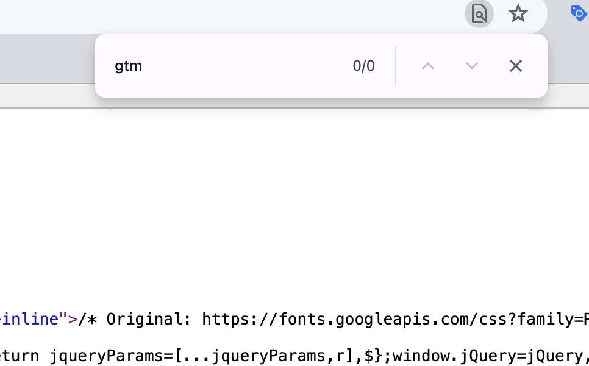
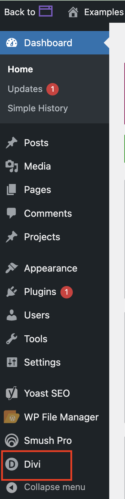

Este artículo te guía a través de los aspectos esenciales de las etiquetas de Google Tag Manager (GTM) y Facebook Meta Pixels. Entender e implementar estas herramientas es crucial para hacer seguimiento y optimizar tus campañas de marketing digital, asegurando que obtengas el máximo provecho de tus esfuerzos publicitarios.

## ¿Qué es un GTM?

**Google Tag Manager (GTM)** es una herramienta gratuita proporcionada por Google que te permite gestionar e implementar etiquetas de marketing (fragmentos de código o píxeles de seguimiento) en tu sitio web sin tener que modificar el código directamente. Las etiquetas son pequeños fragmentos de código del sitio web que pueden medir el tráfico y el comportamiento de los visitantes, entender el impacto de la publicidad en línea y los canales sociales, usar remarketing y segmentación de audiencia, y probar y mejorar tu sitio.

### Cómo funciona GTM

GTM usa una etiqueta de contenedor para contener todas las demás etiquetas de tu sitio, como Google Analytics, Google Ads, o etiquetas de terceros. Cuando un usuario visita tu sitio web, se activa la etiqueta de contenedor y dispara todas las etiquetas contenidas dentro según reglas específicas que configuras. Esto permite un mayor control y flexibilidad en la gestión de tus etiquetas sin necesidad de involucrar a un desarrollador para cada actualización.

### Por qué necesitas GTM en tu sitio web

1.  **Facilidad de uso:** los especialistas en marketing pueden agregar y actualizar fácilmente las etiquetas del sitio web sin necesitar conocimientos técnicos ni ayuda de un desarrollador.
2.  **Velocidad:** las actualizaciones y cambios a las etiquetas se pueden hacer de manera rápida y eficiente.
3.  **Flexibilidad:** te permite implementar una amplia variedad de etiquetas de diferentes proveedores.
4.  **Depuración y modo de vista previa:** puedes probar y depurar tus etiquetas antes de implementarlas en vivo, reduciendo errores y asegurando la recopilación correcta de datos.
5.  **Gestión centralizada:** todas las etiquetas se gestionan desde una plataforma, simplificando el proceso y mejorando la organización.

GTM es crucial para ejecutar campañas publicitarias digitales efectivas. Garantiza una recopilación precisa de datos y permite un mejor seguimiento, optimización, e informes de rendimiento.

## ¿Qué es un Facebook Meta Pixel?

Un **Facebook Meta Pixel** es un fragmento de código JavaScript que colocas en tu sitio web. Te permite hacer seguimiento de la actividad de los visitantes en tu sitio, recopilar información sobre tu audiencia, y medir la efectividad de tus campañas publicitarias de Facebook.

### Cómo funciona el Facebook Meta Pixel

Cuando alguien visita tu sitio web y realiza una acción (como completar una compra), el Facebook Pixel se activa y reporta esta acción. Esto te permite rastrear a los visitantes mientras interactúan con tu sitio web, asegurando que tus anuncios se muestren a las personas correctas y midiendo los resultados de tus anuncios.

### Por qué necesitas Facebook Meta Pixel en tu sitio web

1.  **Información de la audiencia:** te ayuda a entender mejor a tu audiencia haciendo seguimiento de sus interacciones en tu sitio web.
    
2.  **Segmentación de anuncios:** te permite crear audiencias personalizadas basadas en acciones específicas que las personas realizan en tu sitio, generando anuncios más segmentados y efectivos.
    
3.  **Seguimiento de conversiones:** mide la efectividad de tus anuncios de Facebook haciendo seguimiento de las acciones realizadas por los usuarios en tu sitio web.
    
4.  **Optimización:** permite que los algoritmos de Facebook optimicen la entrega de anuncios a las personas que tienen más probabilidades de realizar la acción deseada, mejorando el ROI.
    
5.  **Retargeting:** te permite volver a segmentar a los usuarios que han visitado tu sitio pero no completaron las acciones deseadas, aumentando las posibilidades de conversión.
    

Implementar el Facebook Meta Pixel es esencial para ejecutar campañas publicitarias exitosas en Facebook. Proporciona datos valiosos para optimizar los anuncios y entender el comportamiento de los usuarios en tu sitio web.

## Obtener el código de GTM o el código de Facebook Meta Pixel

Para agregar un GTM o un Facebook Meta Pixel a tu sitio web, deberás agregar el código del contenedor de GTM o del píxel al sitio web.

### Encontrar el código de GTM

1.  Abre el [sitio web de Google Tag Manager](https://tagmanager.google.com/) e inicia sesión con la cuenta de Google que usaste para crear las etiquetas y contenedores.
2.  Una vez creado tu contenedor, Google Tag Manager te proporcionará los fragmentos de código de GTM. Habrá dos piezas de código: una para colocar en la sección `<head>` y otra en la sección `<body>` del HTML de tu sitio web.
    1.  El GTM en sí es bastante corto (por ejemplo: GTM-ABCDEFG), pero el código completo tendrá varias líneas de texto.

### Encontrar el código del Facebook Meta Pixel

1.  Inicia sesión en tu cuenta de Facebook y ve a [Facebook Ads Manager](https://www.facebook.com/adsmanager).
    
2.  Haz clic en el ícono de menú (una cuadrícula de nueve pequeños cuadrados) en la esquina superior izquierda para abrir el menú de Business Tools. Selecciona `Events Manager`.
    
3.  En Events Manager, verás una lista de fuentes de datos. Busca la sección etiquetada "Pixels".
    
4.  Encuentra y haz clic en el nombre de tu píxel. Si tienes varios píxeles, selecciona con el que quieres trabajar.
    
5.  Una vez que hagas clic en tu píxel, se te llevará a la página de detalles del píxel.
    
6.  Haz clic en el botón `Set Up` en la esquina superior derecha.
    
    1.  Elige `Install Pixel` y luego `Manually add pixel code to website` para acceder al código del píxel.
        

## Verificar tu sitio web en busca de código existente

En caso de que el código ya se haya colocado en el sitio, es una buena idea verificarlo primero.

1.  Abre la página de inicio (o cualquier página) de tu sitio web en una computadora de escritorio.
2.  Haz clic derecho en la página y selecciona "Inspect" del menú desplegable.  
    
3.  Después de que se te redirija a la pestaña adicional, haz clic en CTRL + F (Windows) o Command + F (Mac) y pega tu código en la barra de búsqueda.  
    
    1.  Revisa los resultados para ver si alguno coincide con tu GTM o Facebook Meta Pixel.
4.  Si el código no está en el sitio web, procede con los siguientes pasos para agregarlo.

## Agregar un GTM o un Facebook Meta Pixel a tu sitio web

### Acceder al backend del sitio web

1.  Ve al backend de tu sitio web y navega a las secciones HTML. (Los pasos serán diferentes dependiendo de tu plataforma y constructor de sitio web.)
    
    _A continuación se muestran los pasos para un sitio web de WordPress construido con Divi:_
    
2.  Dentro del panel de WordPress, haz clic en `Divi` en la barra de navegación de la izquierda.  
    
3.  Desde la página de opciones del tema Divi, haz clic en la pestaña `Integration`.  
    
4.  Busca dos cuadros en los que se puede agregar código, uno para `<head>` y uno para `<body>`.  
    

### Agregar el código de GTM al sitio web

1.  Desde Google Tag Manager, copia los fragmentos de código de GTM y pégalos en el HTML de tu sitio web donde se indique.
    1.  Pega el código para `<head>` en la sección relevante y el código para `<body>` en la sección relevante.
        1.  El fragmento de `<head>` debe colocarse lo más alto posible dentro de la sección `<head>`, y el fragmento de `<body>` inmediatamente después de la etiqueta de apertura `<body>`.
            
            Este enfoque asegura que tus etiquetas en el GTM se activen lo antes posible, mientras que colocar el código más abajo en el script HTML hará que se activen más tarde y podría resultar en la pérdida de algunos de tus datos.
            
2.  Haz clic en el botón verde `Save Changes` en la parte inferior de la página.

### Agregar el código del Facebook Meta Pixel al sitio

1.  Copia el código completo del píxel proporcionado por Facebook.
2.  Pega el código del píxel en el HTML de tu sitio web dentro de la sección de encabezado (es decir, `<head>`).
    1.  (Necesitarás acceder al backend de tu sitio web para hacer esto).
3.  Pega el código completo del píxel justo antes de la etiqueta de cierre `</head>`.  
    
4.  Haz clic en el botón verde `Save Changes` en la parte inferior de la página.

Ahora que se han agregado el código de GTM y/o los códigos del Facebook Meta Pixel al sitio, debes verificar la instalación y que estén funcionando correctamente.

## Verificar la instalación y funcionalidad correctas de GTM o Facebook Meta Pixel en el sitio web

### Verifica tu instalación de GTM

Para verificar que has instalado el GTM y que está funcionando correctamente, puedes usar una herramienta de extensión del navegador, como [Tag Assistant Companion](https://chromewebstore.google.com/detail/tag-assistant-companion/jmekfmbnaedfebfnmakmokmlfpblbfdm) de Google en la Chrome Web Store.  
_Nota: los pasos a continuación describen [Tag Assistant Legacy](https://chromewebstore.google.com/detail/deprecated-tag-assistant/kejbdjndbnbjgmefkgdddjlbokphdefk), una extensión más antigua de Google que está en desuso y ya no se mantiene. Tag Assistant Companion es el equivalente actual y mantenido activamente de Google, aunque su interfaz difiere de los pasos descritos a continuación._

1.  Instala y habilita la extensión del navegador Tag Assistant Legacy desde la Chrome Web Store.
2.  Visita la página de inicio de tu sitio web en el front end. Haz clic en la extensión del navegador Tag Legacy. En la ventana emergente, haz clic en el botón azul `Enable`.
    
    1.  Actualiza/recarga la página de inicio de tu sitio web dentro de la misma pestaña.
        
3.  Google Tag Assistant Legacy te mostrará qué etiquetas de Google se agregaron y si están funcionando correctamente. Puede tomar unos momentos para que se refleje la lista completa.  
    
    1.  Si hay errores, puedes hacer clic en ellos para ver más detalles.

### Verifica tu instalación del Facebook Meta Pixel

Puedes usar una herramienta de extensión del navegador, como [Meta Pixel Helper](https://chromewebstore.google.com/detail/meta-pixel-helper/fdgfkebogiimcoedlicjlajpkdmockpc) de la Chrome Web Store, para verificar que has instalado el píxel y que está funcionando correctamente.

1.  Instala y habilita la extensión del navegador Meta Pixel Helper desde la Chrome Web Store.
2.  Visita el front end de tu sitio web y la página donde instalaste el píxel. El Pixel Helper indicará si el píxel está correctamente instalado y activándose.  
    1.  Si no lo está, verás un mensaje de error.  
        

Siguiendo estos pasos, puedes agregar exitosamente Google Tag Manager (GTM) y/o Facebook Meta Pixel a tu sitio web. Esto te permitirá hacer seguimiento de las interacciones de los usuarios, optimizar tus campañas publicitarias, y crear audiencias segmentadas.
