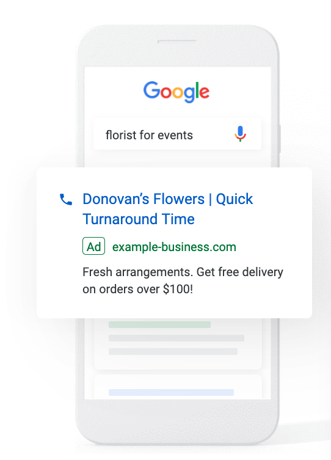
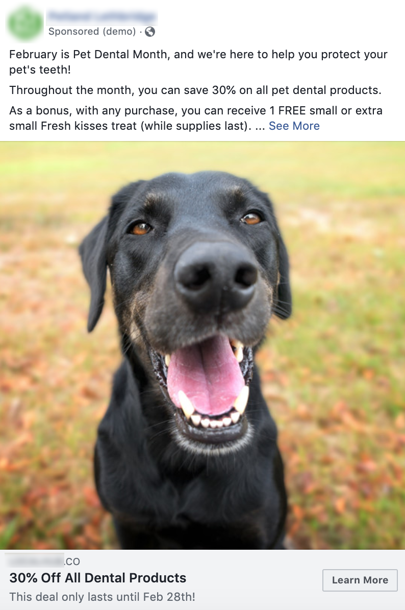
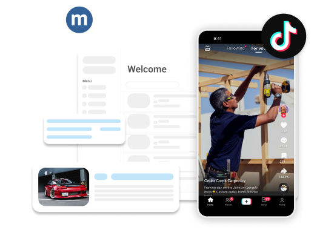

Con la [Specialty Ad Campaign](https://partners.vendasta.com/marketplace/products/MP-WM65PB2J5PL6BCNLB5JJN58DDQWXZVPN), Vendasta Services ofrece publicidad en una diversa gama de plataformas, atendiendo diferentes necesidades y presupuestos.

## Anuncios de búsqueda - Google y Bing

Las campañas de búsqueda en Google y Bing están entre los formatos más populares. Estos anuncios basados en texto aparecen en los resultados de los motores de búsqueda cuando los usuarios buscan términos como "peluquerías en Nueva York" o "florería para eventos". Segmentan a personas que buscan activamente los servicios de un negocio, lo que los hace muy efectivos para generar conversiones inmediatas.

La configuración es rápida ya que no se necesitan creativos. Estos anuncios son de pago por clic, lo que significa que solo pagas cuando alguien hace clic en tu anuncio. Dependiendo de tu presupuesto de gasto publicitario mensual, podemos ejecutar estos anuncios solo en Google o en Google y Bing juntos. Esto es beneficioso ya que a menudo obtenemos altas conversiones en Bing. Ejecutar anuncios en ambas plataformas maximiza el alcance y los resultados potenciales.

* **Compatible con:** [Specialty Ad Campaign](https://partners.vendasta.com/marketplace/products/MP-WM65PB2J5PL6BCNLB5JJN58DDQWXZVPN)

## Anuncios de display - Google

Los anuncios de display son banners basados en imágenes que se muestran en sitios web junto con el contenido regular del sitio. Ayudan a aumentar el reconocimiento de marca segmentando a los usuarios mientras navegan en línea. También puedes volver a segmentar a usuarios que han interactuado previamente con tus anuncios o sitio web.

A diferencia de los anuncios de búsqueda, los anuncios de display son excelentes para promocionar productos o servicios de nicho que las personas podrían no estar buscando. Usan elementos visuales para familiarizar a los clientes potenciales con tu producto. Estos anuncios no son de pago por clic; pagas por impresiones, lo que significa que tu anuncio se ve independientemente de los clics. Esta exposición ayuda a construir familiaridad de marca inconsciente, aumentando la probabilidad de conversiones futuras.
* **Compatible con:** [Specialty Ad Campaign](https://partners.vendasta.com/marketplace/products/MP-WM65PB2J5PL6BCNLB5JJN58DDQWXZVPN)

## Anuncios sociales de Facebook e Instagram (Meta)

Los anuncios de Facebook e Instagram son mejores para la generación de demanda, similar a los anuncios de display, en lugar de conversiones inmediatas. Aprovechar los extensos datos de usuario de Facebook permite una segmentación precisa según datos demográficos e intereses.

Los anuncios más efectivos en estas plataformas se parecen a publicaciones sociales en lugar de anuncios tradicionales. Por ejemplo, un anuncio de productos dentales para perros podría presentar una foto tierna de un perro, haciéndolo parecer una publicación regular que los usuarios podrían compartir, marcar con me gusta, o con la que podrían interactuar. Este enfoque aumenta la probabilidad de que los usuarios se detengan a leer e interactuar con el anuncio.

Al crear anuncios, elige imágenes y videos de alta calidad que se integren perfectamente en los feeds de los usuarios, asegurando que parezcan contenido natural de redes sociales. Esta estrategia mejora la interacción y hace que tus anuncios sean más efectivos en estas plataformas visuales.
* **Compatible con:** [Specialty Ad Campaign](https://partners.vendasta.com/marketplace/products/MP-WM65PB2J5PL6BCNLB5JJN58DDQWXZVPN)

## Anuncios de video de YouTube

****

YouTube, una de las principales plataformas de medios del mundo, ofrece un alcance inmenso para tu negocio. Nuestro equipo asegura que tus anuncios segmenten a la audiencia correcta, ya sea que estén listos para comprar o interactuar con tu marca. Podemos segmentar según datos demográficos, intereses, palabras clave, o canales específicos de YouTube.

Los anuncios de YouTube son ideales para expandir el reconocimiento de marca a través de contenido de video atractivo. Estos anuncios pueden aparecer en varios lugares: antes, durante, o después de videos (omitibles o no omitibles), como banners en la parte inferior, o en la barra lateral con videos recomendados.

Los creadores de contenido en YouTube colocan estratégicamente anuncios en sus videos para maximizar el impacto, a menudo en puntos de alta interacción. Esta práctica, combinada con las capacidades de segmentación de YouTube, asegura que tus anuncios lleguen a la audiencia correcta en el momento correcto, haciéndolos memorables y efectivos para impulsar la interacción y las conversiones.
* **Compatible con:** [Specialty Ad Campaign](https://partners.vendasta.com/marketplace/products/MP-WM65PB2J5PL6BCNLB5JJN58DDQWXZVPN)

## Anuncios de TikTok

Los anuncios de TikTok son videos verticales (9:16) de formato corto que aparecen de forma nativa en el feed For You y en otros espacios de TikTok, incluidos los resultados de búsqueda y TikTok Shop. Alcanzan una audiencia grande y multigeneracional y son adecuados para generar reconocimiento y demanda a través de video atractivo, de manera similar a los anuncios sociales y de video.

Dependiendo del objetivo de la campaña, tu cliente puede ejecutar una variedad de formatos: video in-feed, espacios premium de primera impresión (TopView y Top Feed), Spark Ads que impulsan las publicaciones orgánicas existentes del negocio, Search Ads que aparecen en los resultados de búsqueda de TikTok, anuncios de generación de clientes potenciales con formularios de cliente potencial en la app, y espacios comprables de TikTok Shop para comercio electrónico.
* **Compatible con:** [Specialty Ad Campaign](https://partners.vendasta.com/marketplace/products/MP-WM65PB2J5PL6BCNLB5JJN58DDQWXZVPN)

## Anuncios de LinkedIn

LinkedIn es una plataforma orientada a negocios, lo que la hace ideal para el reclutamiento laboral, la generación de clientes potenciales, y el aumento de la visibilidad de la empresa, como anunciar nuevas ubicaciones. Sin embargo, no siempre es el ajuste ideal para todos los escenarios publicitarios.

Los anuncios de LinkedIn tienen un gasto publicitario mínimo más alto, pero el valor de las conversiones puede ser significativo. Por ejemplo, aunque podrías ver menos conversiones que con las campañas de búsqueda, cada conversión podría generar contratos de alto valor, haciendo que la inversión valga la pena.

Una consideración clave es que los anuncios de LinkedIn no se pueden hacer de marca blanca. Los anuncios deben gestionarse a través de cuentas personales de LinkedIn, que son públicamente buscables. Esta limitación significa que quizás quieras ajustar cómo presentas los procesos de campaña de anuncios de LinkedIn a tus clientes. Si te gustaría obtener recomendaciones sobre cómo pivotar este enfoque, te recomendamos contactar a tu representante de ventas de Vendasta para su opinión.
* **Compatible con:** [Specialty Ad Campaign](https://partners.vendasta.com/marketplace/products/MP-WM65PB2J5PL6BCNLB5JJN58DDQWXZVPN)

## Solicitar una propuesta

Para que nuestros estrategas revisen los objetivos de tu campaña y proporcionen recomendaciones de plataforma, presupuesto, y estrategia, puedes [solicitar una propuesta de anuncios digitales](https://digital-ads-proposal.websitepro.hosting/) antes de hacer el pedido.

Las campañas publicitarias de MatchCraft se pueden ejecutar en una diversa gama de plataformas, atendiendo diferentes necesidades y presupuestos de negocio. Esta guía describe las plataformas clave y las asocia con los servicios de anuncios gestionados disponibles.

## Preguntas frecuentes (FAQ)

¿Cuál es la diferencia entre los anuncios de búsqueda y los anuncios de display?

Los anuncios de búsqueda aparecen en los resultados de Google o Bing cuando los usuarios buscan activamente un servicio (pago por clic).
Los anuncios de display son banners visuales que se muestran en sitios web (pago por impresión) para generar reconocimiento, incluso cuando los usuarios no están buscando.

¿Puedo tener acceso de administrador a la cuenta de anuncios o a Google Analytics?

No. Para proteger la integridad de la campaña, la seguridad de los datos, y el cumplimiento de las políticas de Google, no podemos proporcionar acceso de administrador. Esto evita cambios no autorizados, protege la información sensible, y garantiza una supervisión adecuada de la cuenta.

Si tienes más preguntas, contáctanos en [marketingservices@yourdigitalagents.com](mailto:marketingservices@yourdigitalagents.com).

¿Puedo ejecutar anuncios tanto en Google como en Bing?

Sí. Ejecutar anuncios en ambos amplía el alcance y a menudo mejora los resultados de conversión, ya que Bing a veces genera tasas de conversión altas. Nuestras campañas se pueden configurar para ejecutarse en una o ambas plataformas dependiendo del presupuesto.

¿Admiten anuncios de inventario de Facebook Marketplace?

Sí. Aunque Facebook Marketplace no tiene un tipo de anuncio independiente, la entrega en Marketplace es compatible cuando usamos un catálogo de productos (Commerce Manager) y ejecutamos una campaña Advantage+ Catalog / Dynamic Ads Sales. Si Marketplace está habilitado como canal de venta en tu catálogo, Meta entregará automáticamente los productos a los espacios elegibles, incluidos Marketplace, Facebook Feed, e Instagram Feed.

¿Qué gestionamos para las campañas de Facebook Marketplace?

Nuestro equipo se encarga de la configuración y optimización completas de las campañas de venta basadas en catálogo y asegura que los productos se distribuyan en todos los espacios elegibles de Meta.

¿Qué necesitan que proporcione para los anuncios de Facebook Marketplace?

Debes crear un catálogo de productos o integrar un feed, y habilitar Marketplace como canal de venta si está disponible para tu tipo de negocio.

