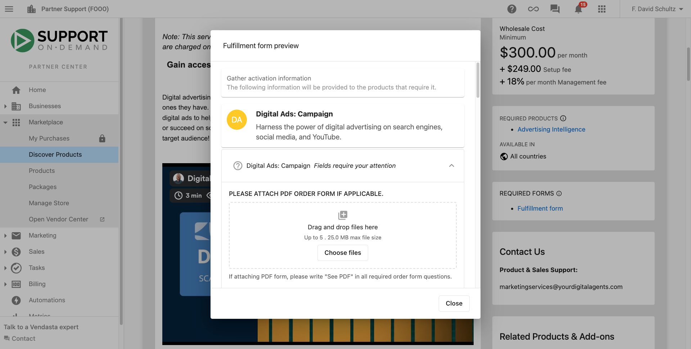

Construir un nuevo sitio web, hacerte cargo de tu publicación social, y configurar una campaña publicitaria digital exitosa viene con muchas partes en movimiento.

Estos pasos están diseñados para ayudarte a equiparte con muchos recursos e información para obtener aún más de tus servicios cumplidos.

### Encuentra los detalles y activos del producto en Marketplace

1.  Ve a `Partner Center` → `Marketplace` → [`Discover Products`](https://partners.vendasta.com/marketplace/products)
2.  Haz clic en `Add filter`, luego en `Vendor`
3.  Marca la casilla `Services`
4.  Haz clic en cualquier servicio sobre el que quieras aprender más
5.  Lee la información del producto, encuentra las preguntas frecuentes, y consulta los complementos
6.  Haz clic en `Screenshots & Files` para encontrar imágenes de marketing y presentaciones de venta
7.  Haz clic en el botón `Start Selling` en la esquina superior derecha para agregarlo a tu tienda

### Familiarízate con las expectativas de servicio

Para entender los cronogramas, detalles, y entregables que puedes esperar después de hacer un pedido, consulta la [guía de expectativas por servicio](./expectations-by-service-within-vendasta-services.md) para obtener una descripción general de alto nivel y de referencia en todas las líneas de producto.

### Revisa los formularios de cumplimiento

Un paso importante para garantizar un tiempo de respuesta rápido para tu cumplimiento es proporcionar un formulario de cumplimiento completado. La información en estos formularios ayuda a los equipos de Vendasta Services a completar los servicios solicitados de acuerdo con lo que quieres.

La información del formulario de cumplimiento está disponible en `Partner Center` → `Marketplace` → `Discover Products` visitando cualquiera de las páginas de producto. A la derecha, encontrarás una sección para `Required Forms` y al hacer clic en ella se te mostrará el formulario.

