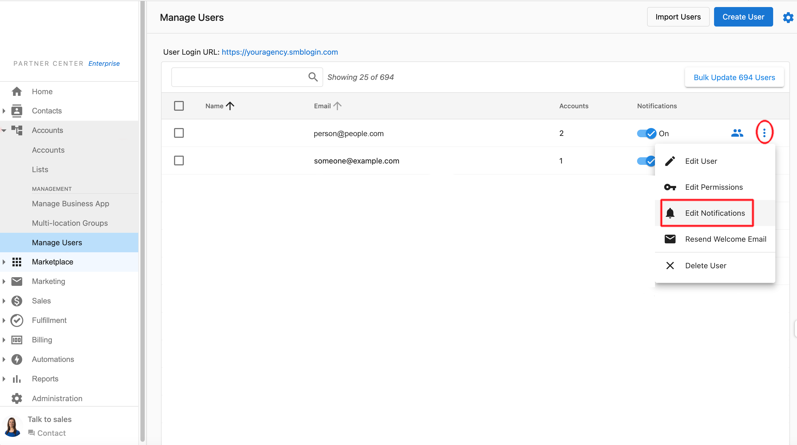

Vendasta Services ofrece servicios de gestión de reputación que pueden incluir un proceso de aprobación opcional para las respuestas a reseñas negativas. Los usuarios pueden recibir notificaciones con respuestas propuestas a reseñas negativas.

Para recibir estas notificaciones por correo electrónico, debes [agregar a la persona correspondiente como usuario a la cuenta en Partner Center](../../accounts/manage-users/) y configurar las notificaciones de usuario aplicables.

## Configurar las notificaciones de usuario

(Reputation AI deberá estar activo en la cuenta)  
  

1.  En Partner Center, haz clic en `Accounts` → `Manage Users`.  
      
      
    
2.  Junto al usuario correspondiente, haz clic en los 3 puntos, luego en `Edit Notifications` en el menú desplegable.  
      
      
    
3.  Se te mostrará una lista de cuentas a las que se ha agregado al usuario. Haz clic en la flecha desplegable junto a la cuenta correspondiente para expandir la lista de notificaciones.
    1.  Haz clic en `Reputation AI` para mostrar las notificaciones asociadas con la plataforma Reputation AI.  
          
          
        
4.  Cuando agregas por primera vez a un usuario a una cuenta, todas las notificaciones para ese usuario/cuenta estarán habilitadas de forma predeterminada. Asegúrate de que las siguientes notificaciones de `Instant Email` estén habilitadas:

    - `Review`
    - `Review Response`
    - `Review Response Approval`

Con estas notificaciones habilitadas, el usuario recibirá notificaciones por correo electrónico cuando haya una respuesta a una reseña que requiera su aprobación, como una respuesta a una reseña negativa. El correo electrónico se verá así:

**Asunto:** New Review Response Approval for Business Name

El usuario puede hacer clic en `Approve or Request Changes` dentro del correo electrónico para ser redirigido a la plataforma, donde puede proporcionar retroalimentación sobre la respuesta a la reseña directamente al equipo de cumplimiento.
