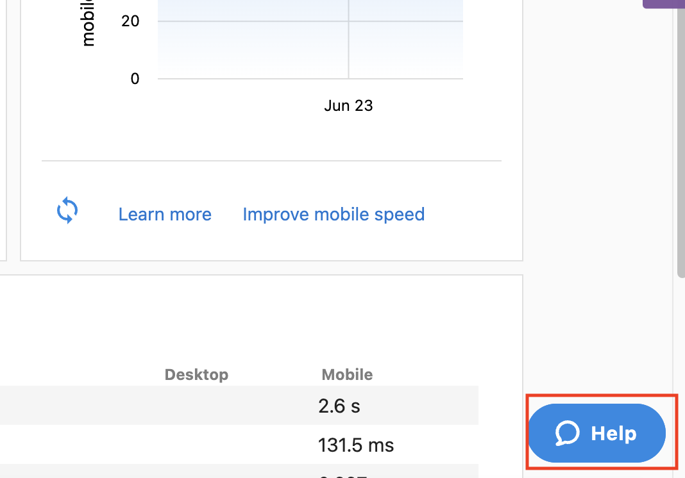

Este artículo detalla qué incluye el producto [Website Support](https://partners.vendasta.com/marketplace/products/MP-5FTSXB8XVSDRJW4RFQ84B8H3SGKG56JC) de Vendasta Services y el proceso/las buenas prácticas para enviar solicitudes a nuestro equipo de Website Support.

## Qué incluye Website Support de Vendasta Services

Website Support es un servicio de cumplimiento ofrecido por Vendasta Services para sitios web de WordPress alojados en la plataforma WordPress Hosting Pro de Vendasta.

## Qué incluye

*   Acceso al equipo para soporte técnico
*   Cambios menores a la apariencia del sitio web, como:
    *   Fuentes
    *   Colores
    *   Medios (imágenes, videos, íconos)
    *   Actualizaciones de texto
    *   Campos y configuración del formulario de contacto
    *   Reorganización o duplicación de secciones existentes
*   Cambiar un formulario de contacto de terceros a un formulario de CRM para que los envíos fluyan a tu CRM como clientes potenciales
*   Las actualizaciones de backend se completan trimestralmente para garantizar la estabilidad de WordPress
*   Actualizaciones de plugins y temas a pedido
*   Revisiones de estado del sitio web a pedido
*   Monitoreo de tiempo de actividad y soporte urgente si tu sitio web se desconecta
*   Carga de hasta 3 publicaciones de blog por mes (el contenido debe proporcionarse)
*   Instalación de AI Chat Receptionist

## AI Chat Receptionist

Sin costo adicional, nuestro equipo instalará el AI Chat Receptionist en tu nueva construcción de sitio web o en un sitio web importado. Esto incluye:
*   Código de chat web agregado al sitio web
*   Prueba básica (abrir el chat, confirmar que se puede enviar un mensaje)
*   Agregar los colores de marca al AI Chat Receptionist

Este servicio no es una configuración completa de extremo a extremo del AI Chat Receptionist, y es solo para instalación básica de código. Si necesitas funciones avanzadas como configuración completa de marca más allá de los colores básicos de marca, mensajería SMS, llamadas de voz, o flujos de conversación personalizados, explora nuestro servicio [AI Receptionist Setup & Support](../ai-workforce/ai-receptionist.md).

## Qué no está incluido en el soporte mensual

Website Support está diseñado para mantenimiento continuo y actualizaciones de alcance definido, no para reconstrucciones completas o desarrollo personalizado complejo.

El cargo mensual no incluye:

*   Mantener o integrar correos electrónicos
*   Nueva funcionalidad o desarrollo complejo (definido por alcance y facturado por hora)
*   Agregar plugins o código para agregar una nueva función al sitio web
*   Integrar calendarios de reserva, calculadoras, etc.
*   Cambios de imágenes/productos adicionales más allá del alcance incluido de 25 al mes (facturado por tarifa de producto/imagen)
*   Respaldar temas o plantillas de código personalizado
*   Crear secciones o páginas de sitio web adicionales
*   Integrar pagos fuera de Square, Stripe, y PayPal

Si necesitas ayuda con alguna de estas funciones, contáctanos y nuestro equipo puede proporcionarte una cotización de cuántas horas de trabajo personalizado tomará.

## Cómo enviar una solicitud de soporte de sitio web a Vendasta Services

1.  Envía un correo electrónico a nuestro equipo en [marketingservices@yourdigitalagents.com](mailto:marketingservices@yourdigitalagents.com)
    1.  Enviar ediciones por correo electrónico garantiza que tu solicitud esté correctamente documentada, ya que nuestros equipos usan un sistema de tickets. Este es el mejor medio para comunicarte con nosotros.  
          
        
2.  Dentro de tu correo electrónico, comparte los detalles de las ediciones que te gustaría abordar en tu sitio web. Los detalles claros y directos minimizarán cualquier posible ida y vuelta para aclaraciones antes de que nuestro equipo pueda proceder con el trabajo.
    1.  Incluye todos los cambios solicitados en un solo correo electrónico. Esto asegura que no se omita ningún detalle ya que nuestro equipo de comunicaciones asigna el trabajo al equipo de sitios web y evita confusiones.
    2.  Adjunta cualquier archivo adjunto aplicable, imágenes/capturas de pantalla, texto web, etc.  
          
        
3.  Al recibir tu correo electrónico, un especialista de soluciones para clientes revisará tu solicitud. Si requieren aclaración adicional, te lo harán saber en su respuesta. De lo contrario, responderán en el hilo de correo electrónico para confirmar la recepción y darte una fecha estimada de actualización. Podemos garantizar una actualización sobre el proyecto dentro de 3 días hábiles.

_¿Qué es una actualización?_ Consiste en una de dos cosas:

*   La solicitud está completa y se te informa sobre el trabajo realizado.
*   Si no está completa, la actualización proporcionará información sobre el estado actual de la solicitud y perspectivas sobre cualquier retraso (por ejemplo, complejidad, volumen de solicitudes recibidas, activos/aclaraciones adicionales requeridas, etc.)

Mantente atento a nuestros correos electrónicos. Nuestro equipo puede solicitar más aclaraciones o necesitar asistencia adicional (acceso a un enlace que compartiste, etc.). Nuestro objetivo es completar este trabajo a tu satisfacción de manera oportuna, y agradecemos tu capacidad de respuesta.

## En caso de que tu sitio web se caiga
  
_Si notas que tu sitio web está caído, primero:_

1.  Verifica si tu sitio web todavía está alojado en WordPress Hosting Pro/si el producto WordPress Hosting Pro está activo en la cuenta en Partner Center.
    1.  Si desactivas WordPress Hosting Pro mientras los registros DNS apuntan hacia WordPress Hosting Pro (la plataforma de alojamiento), esto causará que el sitio web se caiga, ya que los sitios web necesitan un lugar donde "vivir".
    2.  Si trasladas el sitio web a otra plataforma de alojamiento, necesitas actualizar los registros DNS antes de desactivar WordPress Hosting Pro.  
          
        
2.  Verifica si este problema está en una página específica del sitio web o en todo el sitio web.  
      
    
3.  Verifica si este problema afecta a un dispositivo específico o a todos los dispositivos (por ejemplo, ¿esto es solo en dispositivos móviles, o los navegadores de escritorio también se ven afectados?).  
      
    _Contáctanos:_
4.  Envíanos un correo electrónico con los detalles a [marketingservices@yourdigitalagents.com](mailto:marketingservices@yourdigitalagents.com)  
    Incluye respuestas a las preguntas anteriores y, si es posible, el mensaje de error que recibes para ayudarnos a determinar la causa raíz.
    1.  Hay ocasiones en que los sitios web parecen estar caídos para usuarios específicos, así que la replicación a veces puede ser inconsistente. Proporcionar detalles sobre tu experiencia específica ayudará a nuestro equipo a solucionar y resolver el problema.  
          
        
5.  Después de enviar tu correo electrónico, también llámanos. Nuestro equipo hace todo lo posible para atender los correos urgentes de inmediato, pero llamarnos nos permitirá revisar tu solicitud y marcarla con los especialistas de soporte de sitios web de inmediato:  
    Vendasta Services: **1-866-378-8031** _(supervisado de lunes a viernes, 8 am - 5 pm CST)_
    1.  Si tu sitio web está caído fuera de este horario, alternativamente puedes contactar al equipo de Support on Demand de Vendasta:
        1.  Abre el panel de WordPress Hosting Pro y haz clic en el botón azul `Help` en la parte inferior derecha:  
              
            
        2.  Haz clic en `Live Chat` en la parte inferior de la ventana emergente:  
              
            Este chat en vivo se supervisa las 24 horas, los 7 días de la semana, y pueden ayudar con sitios web caídos fuera del horario de operación de Vendasta Services.

## Preguntas frecuentes (FAQ)

¿Qué tipo de cambios se incluyen con este servicio?

Las siguientes personalizaciones están todas incluidas con website support sin costo adicional:

* Fuentes
* Colores
* Medios (imágenes, videos, íconos)
* Texto
* Campos y configuración del formulario de contacto
* Convertir un formulario de contacto de terceros a un formulario de CRM
* Reorganización o duplicación de secciones existentes
* Acceso al equipo para soporte técnico
* Actualizaciones de plugins, temas, etc. a pedido
* Revisiones de estado de tu sitio web a pedido
* Monitoreo de tiempo de actividad y soporte urgente si tu sitio web se desconecta
* Carga de hasta 3 blogs por mes (si se proporciona el contenido)

Cualquier plugin no agregado por nuestro equipo tendrá soporte limitado, y si un plugin ya no tiene soporte, haremos todo lo posible para corregir el problema si es posible o recomendar una nueva solución a nuestra tarifa por hora.

Para cualquier otro tipo de personalización, contacta a [websites@yourdigitalagents.com](mailto:websites@yourdigitalagents.com) para una cotización del trabajo personalizado necesario.

:::note

Cualquier imagen/cambio de producto adicional más allá de lo incluido se cobrará a una tarifa por producto/imagen. Cualquier cambio de nueva funcionalidad a los sitios deberá definirse por alcance y cobrarse a una tarifa por hora. El cargo mensual no incluye mantener o integrar correos electrónicos.

:::

¿Cuál es el tiempo de respuesta para los cambios mensuales?

Las solicitudes de Website Support para cambios de imagen y texto, actualizaciones de información, carga de blogs, y activación de sitios web en dominios personalizados tienen un tiempo de respuesta de 3 días hábiles.

Las ediciones más grandes, como listas más grandes de ediciones que incluyen archivos de Adobe XD, integraciones de plugins, cambios en la funcionalidad del sitio web, y servicios adicionales que requieren cargos por hora, tienen un tiempo de respuesta de hasta 5 días hábiles.

¿Cómo proporcionarán soporte para sitios web de Duda?

Para que podamos proporcionar soporte en tu sitio web de Duda, necesitaremos que crees un usuario para nuestro equipo y nos proporciones acceso a tu sitio en el panel de Duda. Se puede crear un usuario con el siguiente correo electrónico: [websites@yourdigitalagents.com](mailto:websites@yourdigitalagents.com).

¿Qué debo hacer si recibo una advertencia o error de indexación de Google?

Todos quieren asegurarse de que su sitio web aparezca en los resultados de búsqueda de Google. Cuando se lanza o cambia un sitio web nuevo, necesita ser indexado por Google.

No hay control sobre cuándo Google indexa un sitio web. Dicho esto, incluimos un plugin de WordPress en cada sitio web que creamos que envía automáticamente los cambios de tu sitio a Google y otros motores de búsqueda importantes.

Ten en cuenta también que no necesitas que cada página de tu sitio web esté indexada para que Google la encuentre. Siempre que tu página de inicio esté indexada, puede comenzar a aparecer en los resultados de búsqueda.

Si has recibido un correo electrónico de Google sobre un error de indexación, reenvíalo a nuestro equipo en [marketingservices@yourdigitalagents.com](mailto:marketingservices@yourdigitalagents.com) y podemos investigar y tomar las acciones apropiadas a partir de ahí.

¿Pueden instalar AI Chat Receptionist en mi sitio web?

¡Sí! Website Support incluye la instalación del AI Chat Receptionist en tu nueva construcción de sitio web o en un sitio web importado. Esto incluye:
*   Código de chat web agregado al sitio web
*   Prueba básica (abrir el chat, confirmar que se puede enviar un mensaje)
*   Agregar los colores de marca al AI Chat Receptionist

Este servicio no es una configuración completa de extremo a extremo del AI Chat Receptionist, y es solo para instalación básica de código. Si necesitas funciones avanzadas como configuración completa de marca más allá de los colores básicos de marca, mensajería SMS, llamadas de voz, o flujos de conversación personalizados, explora nuestro servicio [AI Receptionist Setup & Support](../ai-workforce/ai-receptionist.md).

¿Qué tipo de formularios configurarán en mi sitio?

Como parte de Website Support, podemos convertir un formulario de contacto de terceros existente en un formulario de CRM para que los envíos fluyan directamente a tu CRM como clientes potenciales. Configuramos formularios estándar de contacto y captación de clientes potenciales.

No construimos funcionalidad avanzada de formularios, incluida:

*   Visibilidad condicional avanzada a nivel de campo (mostrar u ocultar campos según la entrada)
*   Campos calculados
*   Reglas de validación complejas
*   Formularios de varias páginas con guardar y reanudar progreso
*   Campos de pago nativos
*   Reserva de citas nativa
*   Vistas previas de formulario completamente responsivas
*   Prellenado de campos basado en lógica

Si necesitas alguna de estas funciones avanzadas, contáctanos y nuestro equipo puede definir el alcance del trabajo personalizado para ti.

¿Qué pasará con mi formulario existente y los datos de envío?

Cuando convertimos tu formulario a un formulario de CRM, el formulario heredado se desactiva y se elimina del front end de tu sitio, así que los visitantes solo ven el nuevo formulario de CRM. No eliminamos el plugin de formulario heredado, así que cualquier envío recopilado previamente permanece visible en tu backend de WordPress. Tus entradas de formulario existentes también se migran al CRM.

