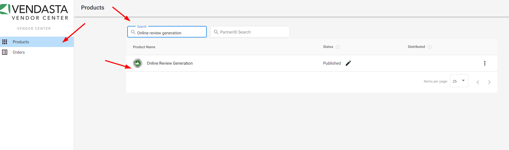

# Descripción general de Vendor Center

Vendor Center es tu plataforma para crear y gestionar productos y servicios personalizados que puedes vender a través del Vendasta Marketplace. Diseñado para darte control total sobre la creación de productos, los precios, la integración y el cumplimiento, Vendor Center te ayuda a crear productos que se integran sin problemas con el ecosistema de Vendasta.

## Acerca de Vendasta Marketplace

El Vendasta Marketplace conecta a los proveedores con Resellers en todo el mundo. Los Resellers compran productos a precios mayoristas y los revenden a sus clientes (pymes). Tus productos serán comprados por Resellers a través del Marketplace y luego vendidos a sus clientes.

## ¿Por qué usar Vendor Center?

Crea productos personalizados adaptados a las necesidades específicas de tu mercado con control total sobre cada aspecto de tu oferta. Vendor Center elimina la necesidad de sistemas de gestión de productos independientes, ofrece capacidades de integración integradas y se conecta directamente al Vendasta Marketplace, ayudándote a escalar tu portafolio de productos de forma eficiente.

## Qué incluye

**Gestión de productos** — crea productos, establece precios, configura integraciones, gestiona proyectos y trabaja con resellers:

- [Crear un producto](./vendor-center-general/what-are-custom-products): productos, ediciones, complementos y el flujo de creación
- [Establecer el precio de tu producto](./vendor-center-general/set-your-products-price): modelos de precio fijo, variable y Contact Sales
- [Integrar tu producto](./vendor-center-general/integrate-your-product): integración de SSO y Business App
- [Crear proyectos](./vendor-center-general/create-projects): haz seguimiento del cumplimiento entre resellers
- [Integración con Task Manager](./vendor-center-general/task-manager-integration): automatiza proyectos y tareas generadas por eventos
- [Información de resellers](./vendor-center-general/enriched-reseller-information): pestaña de Reseller, tabla personalizable, Inbox
- [Notificaciones de resellers](./vendor-center-general/reseller-notifications): alertas de Start Selling y configuración de notificaciones

**Guías de incorporación** — requisitos y lineamientos para proveedores del Marketplace:

- [Requisitos operativos](./vendor-onboarding-guide/operational-requirements-for-marketplace-vendors): estructura de producto, ediciones, compra múltiple, precios
- [Requisitos técnicos](./vendor-onboarding-guide/technical-requirements): requisitos de integración y recursos para desarrolladores
- [Requisitos de servicio](./vendor-onboarding-guide/service-vendor-requirements): informes, carga de archivos, formularios de cumplimiento, órdenes de trabajo
- [Requisitos de marketing](./vendor-onboarding-guide/marketing-requirements-guidelines-marketplace-vendors): tarjeta de producto, ícono, imágenes de galería, materiales de marketing
- [Guía de formularios de pedido](./vendor-onboarding-guide/order-form-guide): formularios de pedido personalizados y formularios de cumplimiento

## Proyecto de incorporación

Después de firmar tu acuerdo de distribución de Vendor, recibirás un correo de bienvenida con un enlace a tu proyecto de incorporación. Accede a él en cualquier momento a través de [Partner Center → Tasks → Projects](https://partners.vendasta.com/task-manager/reporting). El proyecto es una **lista de tareas compartida** con el equipo de Vendasta Vendor que incluye tareas requeridas, puntos de integración y enlaces a documentación. Esta guía se complementa con la [Vendor Operations Guide](./vendor-onboarding-guide/operational-requirements-for-marketplace-vendors).

## Primeros pasos

### 1. Accede a Vendor Center

Accede a Vendor Center en [vendors.vendasta.com](https://vendors.vendasta.com/) o a través del menú de navegación de Partner Center. **Necesitas acceso de Partner Center Admin.** Contacta a tu Vendor Account Manager si necesitas credenciales.

### 2. Agrega a los miembros de tu equipo

Invita a miembros del equipo desde [Partner Center → Administration → My Team](https://partners.vendasta.com/my-team). **Proveedores de servicios:** asigna a los miembros del equipo el rol Digital Agent para acceso a Task Manager. Considera agregar una dirección de correo grupal para supervisar las comunicaciones con Resellers.

### 3. Explora el Marketplace

Explora el [Marketplace](https://partners.vendasta.com/marketplace/products) para ver qué han hecho otros proveedores y comprender cómo encaja tu producto.

### 4. Crea tu primer producto

- **Vendor Center:** haz clic en **Add Product** en la parte superior derecha. Desde Partner Center, ve a `Marketplace` → `Open Vendor Center`, luego **Products**.
- **Partner Center:** ve a `Marketplace` → `Products`, luego haz clic en **Create product** en la parte superior derecha. Haz clic en **Continue editing in Vendor Center** para publicar más adelante.

Consulta [Crear un producto](./vendor-center-general/what-are-custom-products) para conocer el flujo completo.

### 5. Crea tu producto

Revisa los [Requisitos operativos](./vendor-onboarding-guide/operational-requirements-for-marketplace-vendors) sobre estructura de producto y precios, y luego crea tu producto en Vendor Center.

### 6. Configura las integraciones

Configura SSO, ajustes de cumplimiento, formularios de pedido y notificaciones de resellers. Consulta [Integrar tu producto](./vendor-center-general/integrate-your-product), [Guía de formularios de pedido](./vendor-onboarding-guide/order-form-guide) e [Integración con Task Manager](./vendor-center-general/task-manager-integration) si ofreces servicios.

## Descripción general de la plataforma

### Partner Center

Los proveedores usan Partner Center para:
- [Gestionar el acceso a la plataforma de administrador para tu equipo](https://partners.vendasta.com/my-team)
- [Crear cuentas de prueba](https://partners.vendasta.com/manage-accounts)
- [Probar la activación de tus SKU](/commerce/orders/creating-and-managing-orders)
- [Acceder a Business App](/partner-center/overview)

### Business App

Business App es el portal para pymes donde los clientes acceden a los productos comprados. Úsalo para probar el inicio de sesión único, la activación de prueba, Executive Report y Activity Stream.

### Task Manager

Task Manager es la herramienta de gestión de proyectos de Vendasta. **Los proveedores de servicios deben usar Task Manager para el seguimiento del cumplimiento.** Accede a través de `Partner Center` → `Fulfillment` → `Open Task Manager`. Agrega a los miembros del equipo como **Digital Agent** en `Administration` → `My team` para obtener acceso.

## Requisitos importantes

### Integración con Executive Report

**Todos los proveedores de productos deben integrarse con Executive Report.** Esta herramienta de comprobación de resultados se genera automáticamente (semanal o mensualmente) y muestra a los clientes su actividad de marketing digital. Aprende más en la [Descripción general de Executive Report](/business-app/executive-report).

### Task Manager para proveedores de servicios

**Los proveedores de servicios deben usar Task Manager para el seguimiento del cumplimiento.** Las funciones esenciales incluyen agregar a tu equipo, acceder a Task Manager, crear plantillas y comunicarte con los clientes. Consulta la documentación de Fulfillment Project para más detalles.

## Cumplimiento de productos

La plataforma de gestión de proyectos de Vendasta permite la colaboración entre Vendors, Resellers y clientes finales. Recibe formularios de pedido interactivos, comunícate a través de Inbox y comparte tareas de proyecto. Consulta [Crear proyectos](./vendor-center-general/create-projects) e [Integración con Task Manager](./vendor-center-general/task-manager-integration) para conocer los flujos de cumplimiento.

## Después del lanzamiento del producto

Algunas funciones se desbloquean después de que se lanza tu primer producto. Encuentra tu producto en `Marketplace` → `Products` → `My Products` (no en Discover Products). Tu producto aparecerá como $0/Free en tu Partner Center.

### Realizar cambios en un SKU publicado

Los cambios en productos publicados requieren la aprobación de Vendasta. Ve a la pestaña "Compare Products" y haz clic en Request Approval. 

:::note
Los webhooks están excluidos del control de versiones y se implementan de inmediato; pruébalos primero en un producto de prueba (sandbox).
:::

## Cómo construir tu red de resellers

Los Resellers aparecen en la pestaña Resellers de tu Vendor Center después de encontrar tu producto en Discover Products y hacer clic en **Start Selling**. Esto hace que el SKU esté disponible para su Store. **Supervisa y responde a las comunicaciones de Resellers a través de Platform Inbox** (haz clic en el ícono de mensaje en Vendor Center). Consulta [Información de resellers](./vendor-center-general/enriched-reseller-information) y [Notificaciones de resellers](./vendor-center-general/reseller-notifications) para más detalles sobre cómo gestionar tu red de resellers.

## Flujos de trabajo comunes

**Creación de productos** — crea un producto con ediciones y complementos, configura precios y condiciones de facturación, agrega materiales de marketing, configura integraciones y publica en el Marketplace. Consulta [Crear un producto](./vendor-center-general/what-are-custom-products) y [Establecer el precio de tu producto](./vendor-center-general/set-your-products-price).

**Gestión de productos** — actualiza la información del producto, modifica precios y ediciones, gestiona formularios de pedido, haz seguimiento de pedidos y proyectos, y comunícate con los resellers. Consulta la [Guía de formularios de pedido](./vendor-onboarding-guide/order-form-guide).

**Operaciones de proveedor** — configura a los miembros del equipo con los roles adecuados, crea proyectos para el cumplimiento de pedidos, intégrate con Task Manager y gestiona las relaciones con resellers. Consulta [Crear proyectos](./vendor-center-general/create-projects), [Integración con Task Manager](./vendor-center-general/task-manager-integration) e [Información de resellers](./vendor-center-general/enriched-reseller-information).

## Preguntas frecuentes

¿Cómo apruebo un producto de proveedor para su activación?

Para aprobar el producto del proveedor, sigue estos pasos:

1. Desde Partner Center, navega a Vendor Center usando el menú de navegación de 9 cuadros en la parte superior izquierda de tu panel.

2. Una vez que Vendor Center esté abierto, busca un producto de proveedor y haz clic en el nombre del producto.

3. Haz clic en "Accounts" y luego en "Pending Accounts".

4. Aprueba o rechaza el pedido.

¿Por qué "Automatic Activation" no está disponible para mi producto de proveedor o personalizado?

Si el formulario de pedido en Vendor Center está activado, la opción de activación automática al crear la cuenta no estará disponible en `Marketplace` → `Products` → `Product info`.

