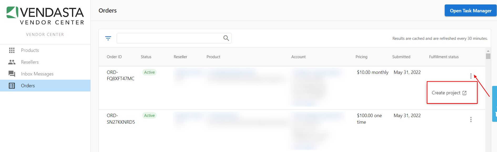

Los proyectos te permiten hacer seguimiento del trabajo que realizas con tus resellers de Vendasta. A través de ellos, obtienes acceso a Task Manager, lo que te permite agregar tareas, notas y compartir actividades directamente con tus clientes.

### Crear un proyecto

1. Inicia sesión en [Vendor Center](https://vendors.vendasta.com/)
2. Ve a `Orders`
3. Busca el pedido para el que deseas crear un proyecto
4. Haz clic en el menú de tres puntos y luego en `Create Project` 
5. Completa el formulario `Create project`
6. Haz clic en `Create project`

:::note
Ten en cuenta que cada producto incluido en un pedido de venta se separa en su propia fila. Es posible que veas el mismo `Order ID` listado dos veces si se compraron dos de tus productos en el mismo pedido.
:::

Una vez creado, lo verás vinculado en la tabla `Orders`.
