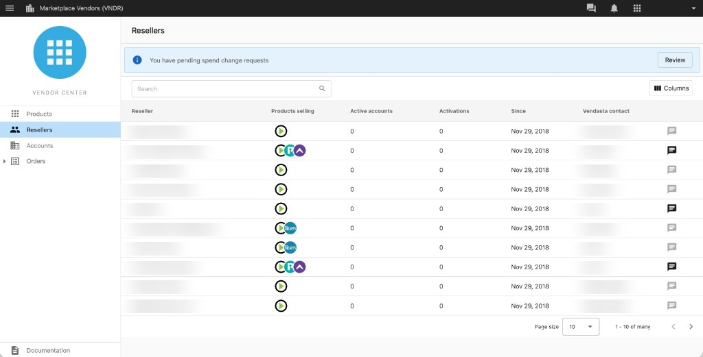

## Flujo de trabajo

La pestaña **Reseller** en el menú de navegación de Vendor Center te ofrece una vista única de todos tus resellers en un solo lugar. También puedes seguir accediendo a la información de resellers específica de un producto seleccionando primero un producto.

## Pestaña Reseller

La pestaña `Reseller` ofrece una tabla personalizable con detalles clave como nombre, correo electrónico y nivel de servicio, para ayudarte a segmentar, calificar y priorizar a qué resellers contactar.

**¿Cuáles son las funciones?**

- **Tabla personalizable:** no toda la información puede ser relevante o útil al buscar a tu cliente ideal. Al seleccionar el botón `Columns` en la parte superior derecha de la tabla Reseller, puedes elegir qué conjuntos de datos se muestran y en qué orden aparecen.
- **Products Selling:** es posible que tengas varios productos o servicios disponibles a través del Marketplace. Al destacar lo que el reseller le ofrece a sus clientes, obtendrás más información sobre las necesidades del reseller y sus clientes antes de una llamada exploratoria.
- **Active Accounts:** consulta cuántas cuentas tiene cada reseller con tus productos activados.
- **Activations:** haz seguimiento del número total de activaciones de productos en las cuentas de un reseller.
- **Since:** consulta cuándo el reseller comenzó a vender tus productos.
- **Vendasta Contact:** identifica a quién puedes contactar y con quién trabajar en Vendasta al diseñar una estrategia con un reseller o al superar un obstáculo en el ciclo de comunicación o ventas.
- **Inbox Messaging:** los proveedores pueden ofrecer a sus resellers el más alto nivel de comunicación y servicio al cliente a través de Inbox. También puede funcionar como un único punto de referencia para la comunicación, ya que elimina las distracciones de los correos electrónicos.

**Limitaciones**

- **Los productos vendidos que se muestran son específicos del proveedor:** aunque un reseller puede estar vendiendo varios productos que cubren distintas necesidades de los clientes, esta función solo muestra qué productos tuyos ofrece el reseller a sus clientes.
- **Las Active Accounts que se muestran son específicas del proveedor:** Active Accounts solo muestra las cuentas en las que se venden tus productos, no el número total de cuentas que pagan que ese reseller pueda tener en todos sus productos y servicios.
- **Las columnas no se pueden filtrar:** actualmente, la información de las columnas se puede ordenar pero no filtrar. Por ejemplo, los resellers se pueden ordenar de forma ascendente, descendente o alfabética según la columna seleccionada.

## Comunicación dentro de la plataforma

Una vez que hayas identificado a un reseller con quien hacer seguimiento, puedes enviarle un mensaje directamente a través de Inbox. Haz clic en el ícono de mensaje en el lado derecho de la tabla Reseller para abrir una conversación. Los mensajes se registran en Inbox para que nada se pierda.
