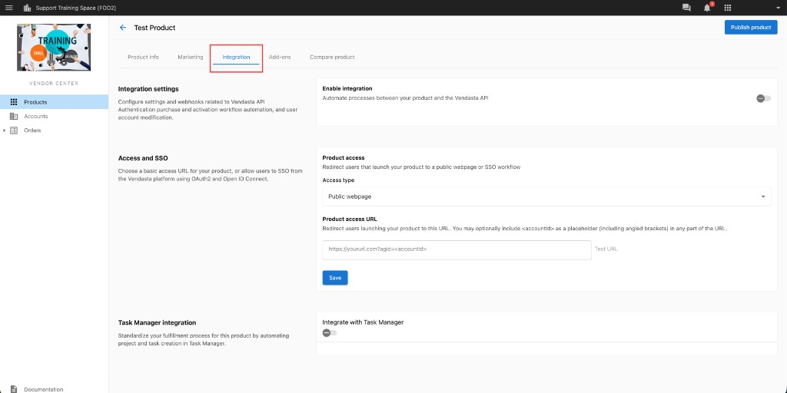
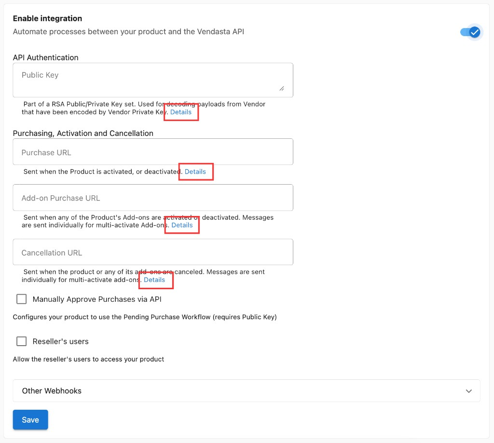

Para crear productos complejos, como aquellos en los que inicias sesión automáticamente a los usuarios de tu producto al acceder a través de Business App, puedes usar `Integrations`. Esto es accesible desde la pestaña `Integration` de tu producto en Vendor Center.

Para comenzar a integrar, activa el ajuste `Enable Integration`. En cada campo, puedes hacer clic en `Details` para encontrar información específica sobre cómo integrar tu producto.

:::info
Según la infraestructura existente de tu producto, integrarlo puede requerir trabajo técnico o de desarrollo por parte de tu equipo. Solo quienes estén familiarizados con estos conceptos deberían intentar usar estas opciones de integración avanzadas. Para explorar las opciones de integración, consulta la **[documentación para desarrolladores](https://developers.vendasta.com/)**.
:::
