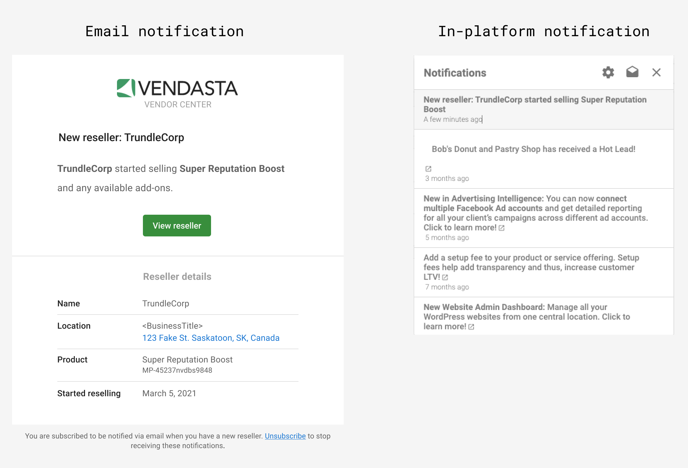
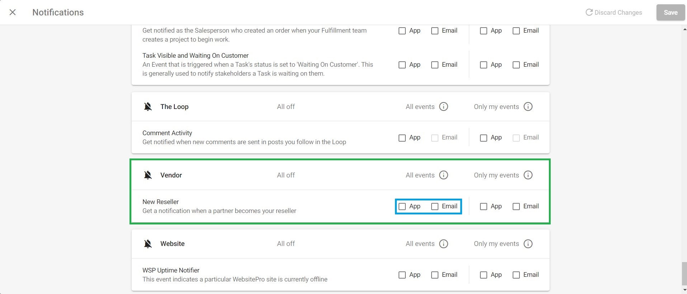
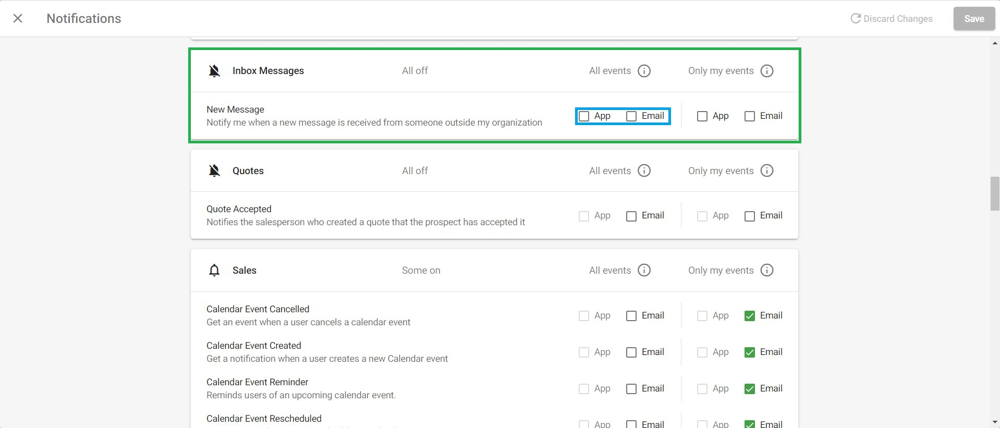

### Notificación de inicio de venta

Responder rápidamente al interés es una de las mejores formas de ganar más negocios. Vendor Center te ayuda enviándote una notificación tan pronto como una agencia hace clic en `Start Selling` en el Marketplace. Recibirás un correo electrónico y una alerta dentro de la plataforma a través de la campana de notificaciones, para que puedas hacer seguimiento de inmediato.

Si actualmente no recibes estas notificaciones, puedes ajustar tu configuración de notificaciones:

1. Haz clic en el **ícono de campana** () en la esquina superior derecha de Partner Center.
2. Haz clic en el **ícono de engranaje** () en la parte superior del menú desplegable.
3. En el menú de configuración de notificaciones que aparece, desplázate hasta `Vendor notifications` y selecciona el método que mejor te funcione.

  

- `Inbox`: ya que estamos en la configuración de notificaciones, aprovechemos para asegurarnos de que también recibas notificaciones cuando resellers potenciales tengan una pregunta o partners existentes necesiten soporte. Desplázate hacia arriba hasta la sección Inbox y selecciona las opciones que necesites.

  

### Pestaña Reseller

Una vez que una agencia se convierte en reseller, el siguiente paso es segmentarla y calificarla. La pestaña `Reseller` cuenta con una tabla personalizable con información relevante como nombre, correo electrónico y nivel de servicio, lo que te ayuda a priorizar las llamadas exploratorias e identificar a qué resellers contactar.

Para más información sobre la pestaña Reseller, consulta [Información de resellers](./enriched-reseller-information.mdx).

### Mensajes de Inbox

Los mensajes de Inbox ponen la comunicación a solo un clic de distancia, para que nada se pierda o quede sin entregar. Después de hacer clic en el ícono de mensaje en el lado derecho de la información de Reseller, se abrirá la ventana de mensajería de Inbox, donde podrás enviar y recibir mensajes directos con tus resellers.
