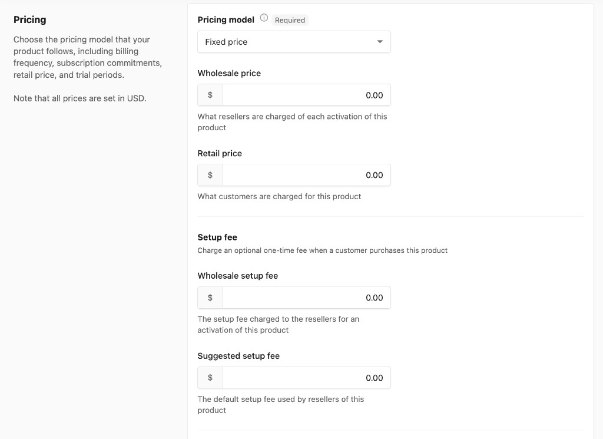
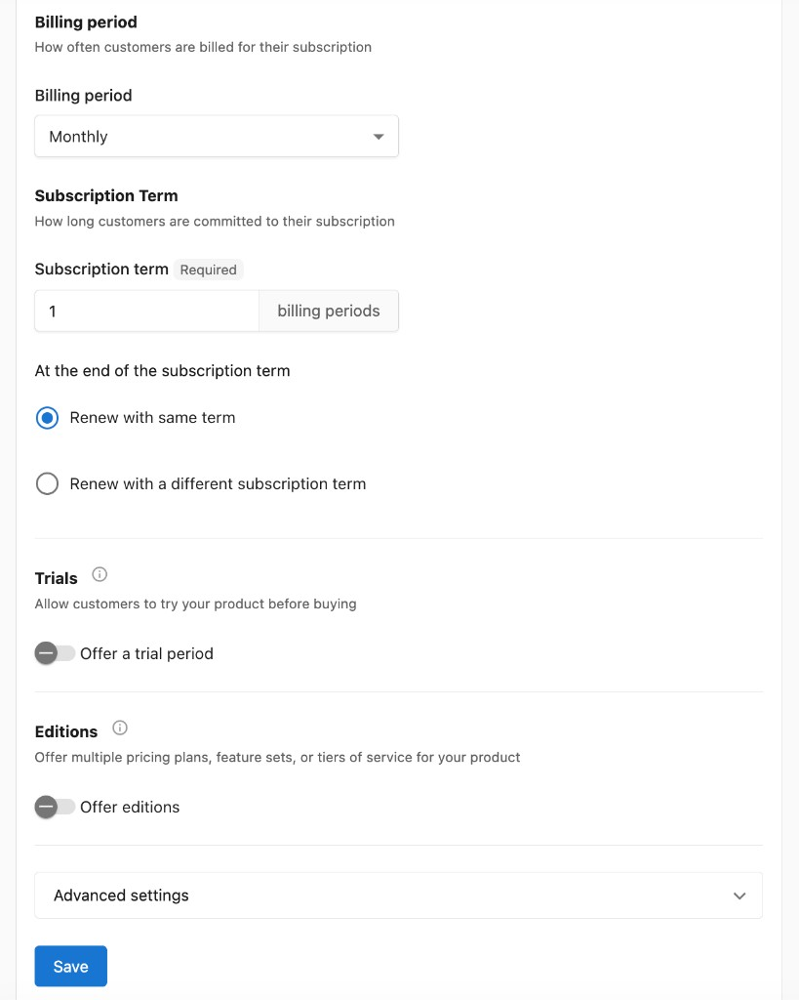
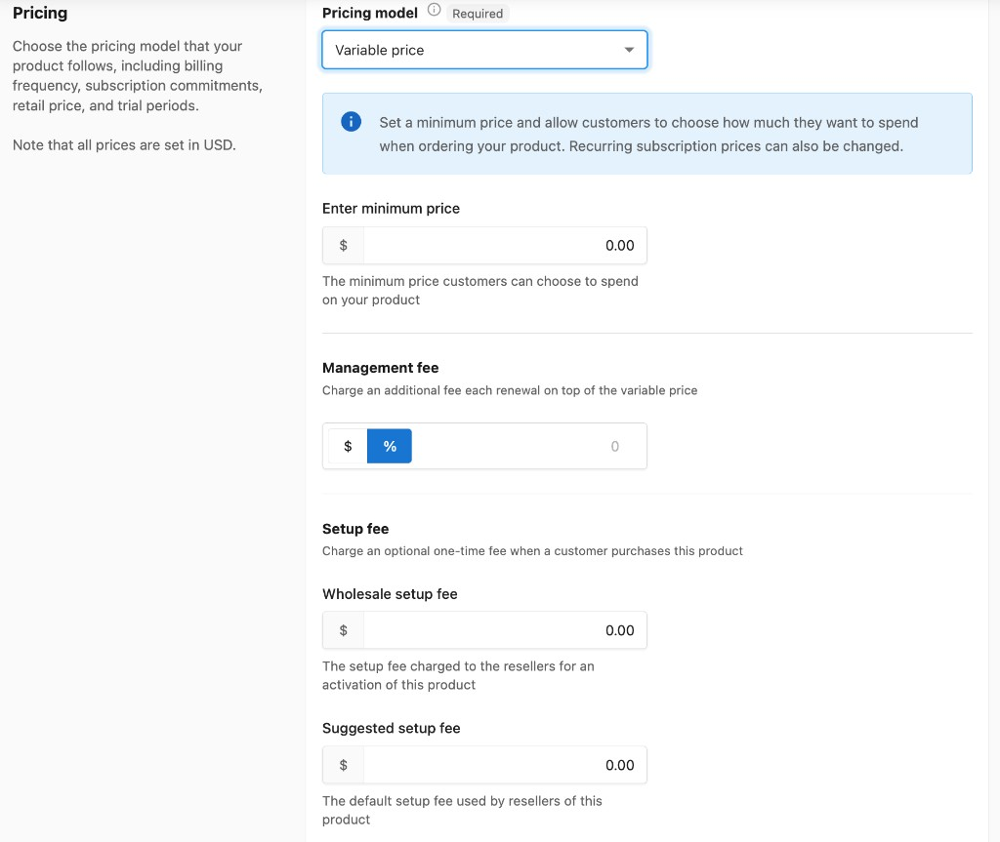

Cuando creas un producto, tendrás la opción de establecer el modelo de precios que seguirá tu producto, incluyendo la definición del período de facturación, los términos de suscripción, el precio de venta al público y la disponibilidad de prueba.

Ten en cuenta que los campos de precio en Vendor Center actualmente siempre están configurados en USD. Para partners que operan en monedas distintas de USD, el Retail Price de tu producto se puede establecer en la moneda que selecciones para tu tienda en `Partner Center` → `Marketplace` → `Manage Store`.

## Modelos de precios

Estarán disponibles distintos ajustes según el modelo de precios que selecciones. Hay tres modelos de precios: `Fixed price`, `Variable price` y `Contact Sales`.

---

### Fixed price

A los clientes se les cobra un precio fijo por tu producto, ya sea una sola vez o en cada período de facturación. Este es el modelo más común y ofrece la mayor cantidad de opciones de configuración.

**Campos de precio:**

- `Wholesale Price`: el precio cobrado a otros resellers cuando activan el producto para sus clientes (si tu producto se vende en el Marketplace).
- `Retail Price`: el precio predeterminado cobrado a los clientes. Se puede anular al agregar un producto a un paquete en tu Store, pero de forma predeterminada usa el valor que establezcas aquí.

**Tarifa de configuración:**

- `Wholesale setup fee`: la tarifa de configuración única cobrada a los resellers por una activación de este producto.
- `Suggested setup fee`: la tarifa de configuración predeterminada usada por los resellers de este producto.

- `Billing period`: con qué frecuencia se factura a los clientes por su suscripción. Elige `One time`, `Monthly` o `Yearly`.
- `Subscription term`: establece el número de períodos de facturación a los que se comprometen los clientes. Al final del período de suscripción, elige `Renew with same term` o `Renew with a different subscription term`.
- `Trials`: actívalo para permitir que los clientes prueben tu producto antes de comprarlo. Especifica el número de días de prueba gratuitos.
- `Editions`: actívalo para crear varios planes de precios, conjuntos de funciones o niveles de servicio para tu producto. Los clientes pueden mejorar o reducir su plan entre ediciones. Las ediciones comparten material de marketing y complementos, pero cada una tiene su propia configuración de precios. Haz clic en `Add edition` para configurar. Déjalo desactivado si tu producto no necesita varias opciones de precios.

---

### Variable price

Los clientes eligen cuánto quieren gastar al pedir tu producto, por encima de un mínimo que establezcas. Este modelo es útil para adaptar servicios continuos a las necesidades cambiantes de un cliente, ya que los usuarios de Partner Center también pueden solicitar cambiar el precio de suscripción de una cuenta.

- `Minimum price`: el monto más bajo que un cliente o usuario de Partner Center puede seleccionar al pedir o ajustar el precio de suscripción.
- `Management fee`: cobra una tarifa adicional en cada renovación además del precio variable. Se puede establecer como un monto fijo en dólares o como un porcentaje.
- `Setup fee`: agrega un cargo único cuando un cliente compra tu producto. Incluye `Wholesale setup fee` (cobrado a los resellers) y `Suggested setup fee` (predeterminado para los resellers).
- `Billing period`: con qué frecuencia se factura a los clientes por su suscripción. Elige `One time`, `Monthly` o `Yearly`.
- `Subscription term`: establece el número de períodos de facturación a los que se comprometen los clientes. Al final del período de suscripción, elige `Renew with same term` o `Renew with a different subscription term`.

---

### Contact Sales

Oculta el precio a los clientes, requiriendo que contacten a un vendedor para obtener información de precios. Usa esto cuando tu producto requiera precios detallados o basados en casos específicos.

:::info
Los clientes no pueden comprar productos Contact Sales a través del carrito de compras porque no tienen un precio asociado. Agregar un producto Contact Sales al carrito enviará un pedido de venta para que lo apruebes antes de que el producto pueda activarse.
:::

---

## Configuración avanzada

:::info
La configuración avanzada está disponible para todos los modelos de precios (Fixed price, Variable price y Contact Sales).
:::

### Permitir varias compras por cuenta (desactiva la compatibilidad con complementos)

De forma predeterminada, solo se puede activar una instancia de un producto en una cuenta a la vez. 

**Para productos base (productos de nivel superior):** incluso si este ajuste está activado, el sistema no permitirá ajustes de cantidad durante la activación del pedido. El campo de cantidad en el pedido no se puede modificar debido a integraciones personalizadas con ciertos productos y sus formularios asociados, como GoDaddy. Ten en cuenta que los complementos no se pueden usar con productos que tengan este ajuste activado.

**Para complementos:** si este ajuste está activado, la cantidad se puede ajustar en el pedido. Sin embargo, esto no se recomienda para cantidades de alto volumen (como cientos de unidades). Partner Center está diseñado principalmente para productos SaaS y no está optimizado para ventas de artículos físicos de alto volumen. Procesar grandes cantidades puede provocar tiempos de carga lentos o hacer que los pedidos fallen.

**Buena práctica para pedidos de alto volumen:** si necesitas cumplir pedidos con grandes cantidades, usa Order forms para especificar las cantidades necesarias para el cumplimiento. Deberás calcular manualmente el costo total e ingresarlo en el pedido.

Una vez configurado, haz clic en `Save` para guardar los precios de tu producto.
