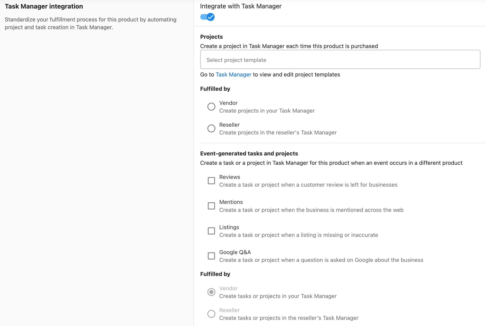

Con las **integraciones de cumplimiento** y las **tareas y proyectos generados por eventos**, los usuarios de Task Manager pueden generar automáticamente tareas y proyectos para escalar su equipo de cumplimiento. Cada vez que se compra un producto específico, se puede crear un proyecto o generar tareas basadas en eventos como reseñas, menciones o listados. Una Task Manager Integration estandariza tu proceso de cumplimiento para un producto automatizando la creación de proyectos y tareas en Task Manager.

## ¿Cómo funciona la integración con Task Manager?

Cuando la configuración de generación de tareas y las integraciones de cumplimiento están activadas, las tareas y proyectos se generan automáticamente dentro de Task Manager. Estos ajustes se activan a nivel de producto o servicio dentro de Vendor Center y se generan cuando ese producto se pide en Partner Center. Una integración de Task Manager puede crear proyectos/tareas en tu Task Manager o en el Task Manager del Reseller.

## Cómo configurar una integración con Task Manager

Ve a **Vendor Center > [Elige un producto] > Integration > Task Manager Integration > activa Integrate with Task Manager**

## Projects

Un proyecto se crea automáticamente cada vez que se compra tu producto. Úsalo para estandarizar el cumplimiento, de modo que cada venta inicie el mismo flujo de trabajo usando una plantilla de proyecto.

1. Ve a **Vendor Center > [Elige un producto] > Integration > Task Manager Integration > activa Integrate with Task Manager**
2. Selecciona una plantilla de proyecto existente o crea una nueva en Task Manager. Esta plantilla se usará para generar un proyecto cada vez que se compre el producto.
3. Selecciona quién cumple el proyecto:
   - **Vendor**: crea proyectos en tu Task Manager
   - **Reseller**: crea proyectos en el Task Manager del reseller

## Tareas y proyectos generados por eventos

A diferencia del cumplimiento basado en proyectos, las tareas y proyectos generados por eventos se activan por eventos externos en lugar de una compra. Cuando ocurre algo en otro producto, como una nueva reseña, una mención web o un listado inexacto, se crea automáticamente una tarea o proyecto para que tu equipo pueda responder.

1. Ve a **Vendor Center > [Elige un producto] > Integration > Task Manager Integration > activa Integrate with Task Manager**   
2. Crea una tarea o un proyecto en Task Manager para este producto cuando ocurra un evento en un producto diferente
3. Selecciona cualquiera de las siguientes opciones para tareas y proyectos generados por eventos
   - **Reviews**: crea una tarea o proyecto cuando un cliente deja una reseña para negocios
   - **Mentions**: crea una tarea o proyecto cuando se menciona al negocio en la web
   - **Listings**: crea una tarea o proyecto cuando falta un listado o es inexacto

4. Selecciona quién cumple el proyecto 
   - **Vendor**: crea proyectos en tu Task Manager
   - **Reseller**: crea proyectos en el Task Manager del reseller
