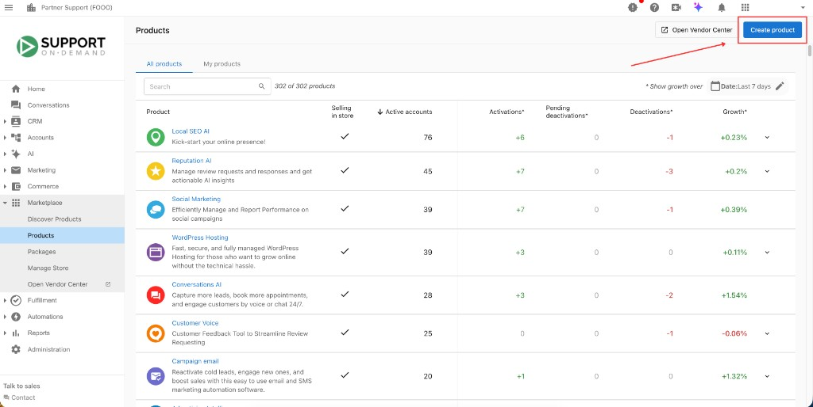
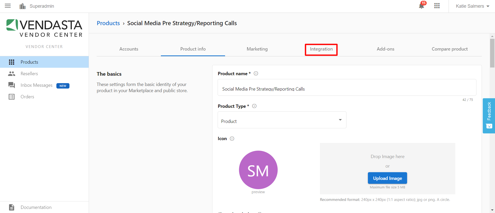
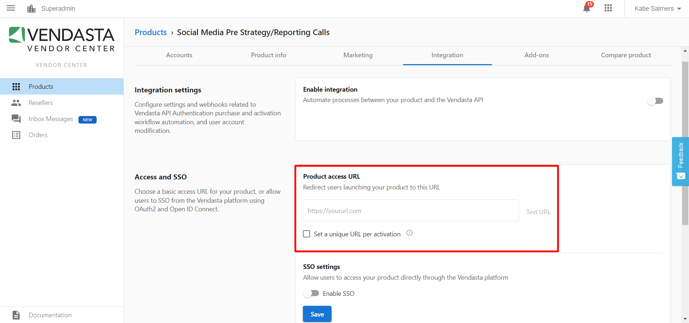
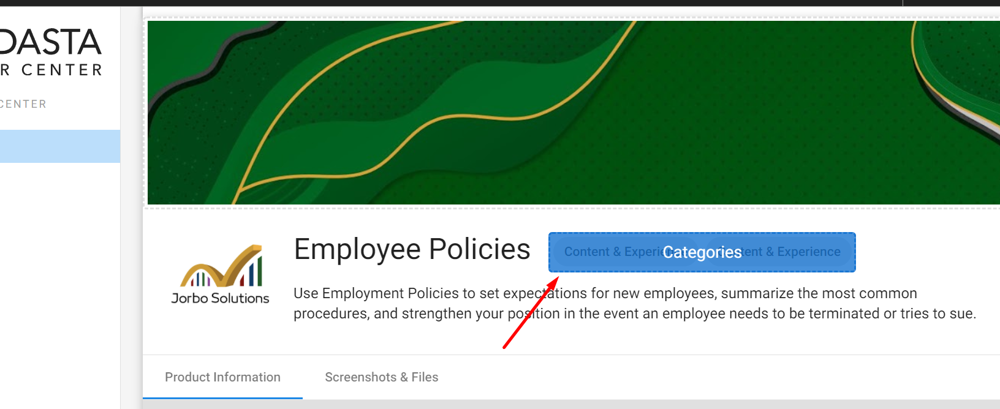
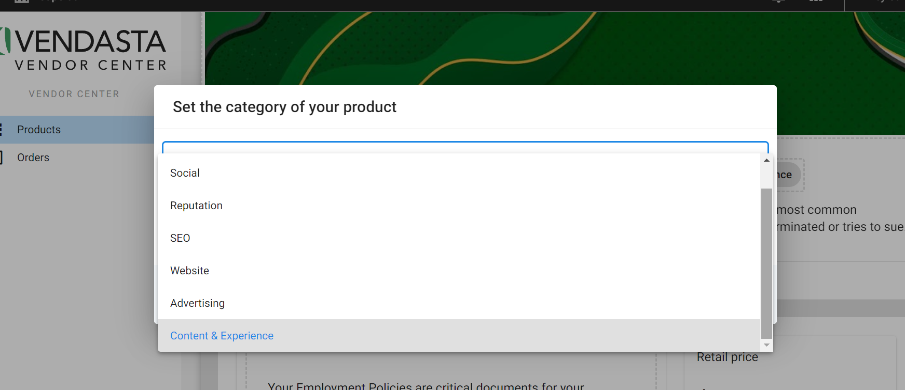
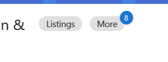

Al igual que los productos que encuentras en el Vendasta Marketplace, puedes vender los productos que creas en tu tienda por separado, empaquetarlos y venderlos junto con otros productos y servicios, activarlos para tus clientes y facturarlos usando Vendasta Payments.

## Products

Un producto es una representación de algo que vendes a través de la plataforma de Vendasta. Puedes usar productos para representar un producto digital, un servicio que ofreces, un producto físico que ofreces o cualquier otra cosa que quieras vender a tus clientes.

Cuando creas un producto, tienes control total sobre:

- Nombre
- Precio
- Material de marketing
- Formulario de pedido
- Y más

Naturalmente, algunas de las cosas que vendes serán más complicadas que otras. Por eso puedes personalizar cómo fijas el precio, entregas y cumples lo que vendes usando ediciones de producto y complementos.

## Editions

Las ediciones son versiones de tu producto que representan distintos niveles de servicio, funcionalidad u opciones de precios que ofreces. Los clientes pueden elegir una edición de tu producto para comprar y luego mejorar o reducir su plan a una edición diferente cuando sus necesidades cambien.

Las ediciones de un producto comparten material de marketing y complementos, pero cada edición puede tener su propia configuración de precios.

## Add-ons

Cuando creas un producto, es posible que quieras crear uno o varios complementos para vender junto con él. Usa los complementos para permitir la compra de funciones o servicios opcionales relacionados con tu producto.

Por ejemplo, imagina que ofreces un servicio de creación de sitios web a tus clientes. Crea un complemento para representar servicios adicionales que ofreces como parte de la creación de ese sitio web: agregar una página adicional al sitio web, agregar funcionalidad de comercio electrónico al sitio web que creas, soporte técnico las 24 horas, etc.

Usa los complementos para agregar valor y flexibilidad a los productos que ofreces a tus clientes. Los clientes no pueden comprar un complemento hasta que hayan comprado el producto principal del complemento, así que asegúrate de que los complementos que crees agreguen valor al producto al que pertenecen.

## Cómo crear un producto

Puedes crear un producto desde Partner Center o desde Vendor Center:

### Partner Center

Ve a `Marketplace` → `Products`, luego haz clic en `Create product` en la esquina superior derecha.

### Vendor Center

1. Desde Partner Center, haz clic en `Open Vendor Center`, que aparece en la barra lateral izquierda bajo `Marketplace` o en la esquina superior derecha junto a `Create product`.
2. En Vendor Center, ve a `Products`, luego haz clic en `Add Product` en la esquina superior derecha.

Ambos caminos abren el mismo flujo de creación de producto. Al hacer clic en el botón, se abre un cuadro de diálogo `Add Product`. Completa los cuatro pasos:

1. `Basic Info`: ingresa el nombre del producto, selecciona el tipo de producto y sube una imagen.
2. `Pricing`: establece tu precio y opciones de facturación.
3. `Marketing`: agrega materiales de marketing para el listado de tu producto.
4. `Confirmation`: revisa tus elecciones.

Cuando termines estos pasos, puedes hacer clic en `Publish to store` para que el producto esté disponible de inmediato, o en `Continue editing in Vendor Center` para más opciones.

## Personalizar en Vendor Center

Si eliges continuar editando, llegarás a la página de tu producto en Vendor Center. Aquí tienes acceso a más opciones en varias pestañas:

- `Product info`: perfecciona el nombre del producto, el tipo, el ícono, la descripción corta y el correo electrónico de contacto del proveedor. Aquí también estableces el modelo de precios, los precios, el período de facturación, los términos de suscripción, las pruebas y las ediciones, además de la activación del producto y los formularios de pedido.
- `Marketing`: agrega y gestiona materiales de marketing para tu listado en el Marketplace.
- `Integration`: configura SSO, cumplimiento y acceso al producto. Consulta [Integrar tu producto](./integrate-your-product).
- `Add-ons`: crea complementos para vender junto con tu producto.
- `Compare product`: abre tu producto en el Marketplace para previsualizar cómo se verá al publicarse, y suspende nuevas activaciones.

### Guías relacionadas

- [Establece el precio de tu producto](./set-your-products-price): ajusta los precios y elige entre los modelos Fixed, Variable o Contact Sales
- [Guía de formularios de pedido](../vendor-onboarding-guide/order-form-guide): formularios de pedido y configuración de cumplimiento
- [Integración con Task Manager](./task-manager-integration): para proveedores de servicios: seguimiento del cumplimiento
- [Crear proyectos](./create-projects): para proveedores de servicios: creación y seguimiento de proyectos

## Preguntas frecuentes

¿Puedo agregar un enlace a mi producto personalizado?

Puedes agregar un enlace a tu producto personalizado en Vendor Center, en la pestaña `Integration`. Cuando está activo en una cuenta, tu producto personalizado aparece en el menú de productos de Business App y es clicable. Puedes enlazar a paneles externos, sitios web e incluso libros electrónicos.

1. Navega a Vendor Center desde el menú de 9 cuadros en la esquina superior derecha de tu panel de Partner Center.

2. Haz clic en el producto personalizado en el que quieras trabajar.

3. En la parte superior de la pantalla, selecciona la pestaña `Integration`.

4. En `Access and SSO`, agrega un enlace en `Product access URL`.

5. Haz clic en `Save`.

Puedes elegir tener una URL personalizada por activación. Si marcas esta casilla, podrás agregar una URL específica al formulario de pedido para cada activación individual.

¿Puedo agregar una nueva categoría en Vendor Center?

Los partners no pueden agregar una categoría personalizada o nueva en Vendor Center para sus propios productos personalizados. Los partners solo pueden elegir entre las categorías LMI (Local Marketing Index) predeterminadas disponibles en `Vendor Center` → `Marketing`. La categoría seleccionada (primaria y secundaria) determinará dónde aparecerá tu producto personalizado en el Marketplace.

Estas categorías funcionan como etiquetas de producto en el Marketplace (junto a la descripción del producto).

¿Puedo eliminar un producto personalizado o un complemento?

Solo puedes eliminar productos y complementos cuando tienen cero activaciones. Si el producto está actualmente activo en alguna cuenta, desactívalo primero en todas las cuentas.

