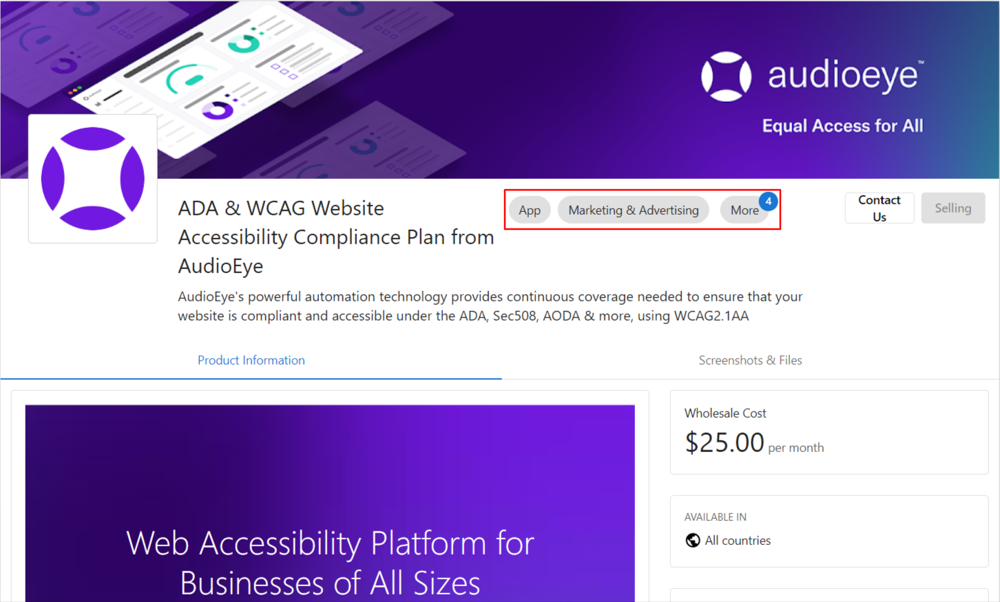
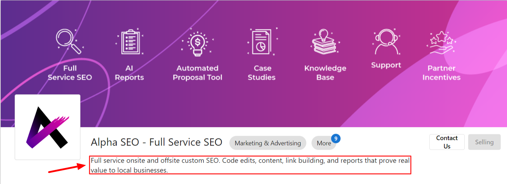
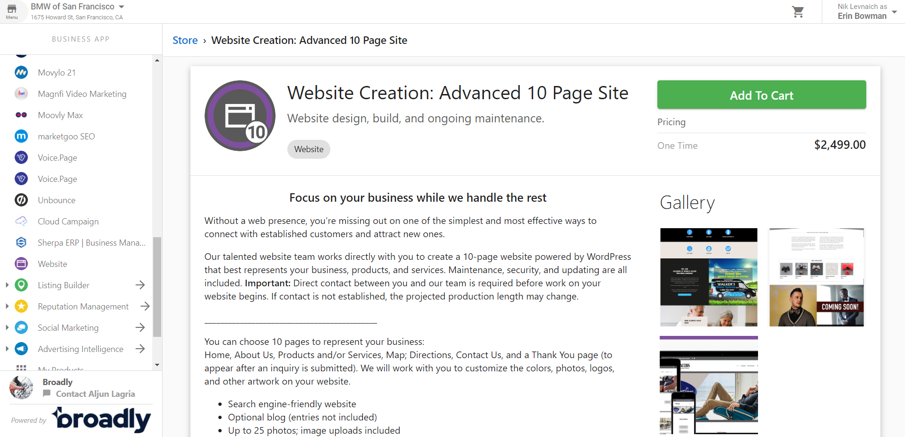
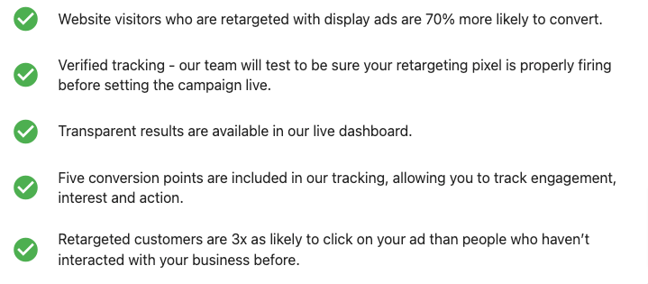
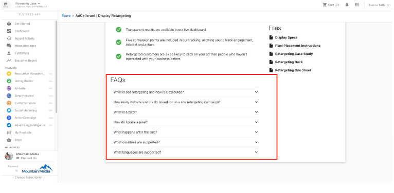
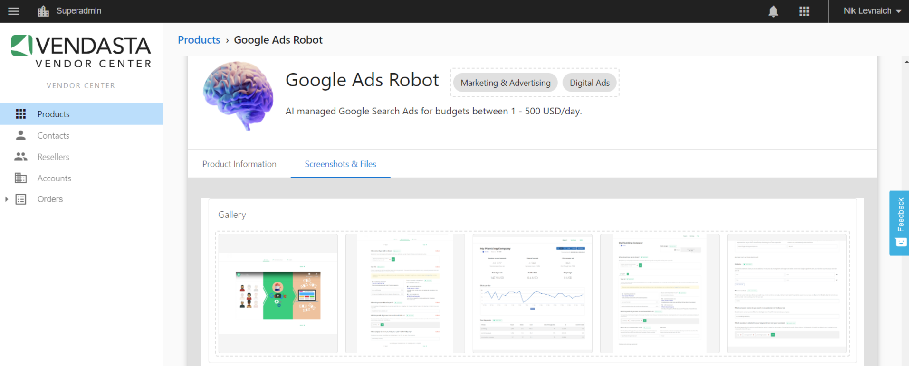

## Selección de categoría

Elige la categoría que mejor represente tu producto para los partners. La categoría ayudará a los partners a encontrar tu producto dentro de nuestro Marketplace. Piensa en qué categoría buscaría un partner para encontrar tu producto específico.

## Product Card

### Requisitos para las imágenes de la tarjeta de producto

La imagen de tu tarjeta de producto funciona como una vitrina digital dentro de nuestro Marketplace. Debe ser visualmente atractiva y ayudar a los partners a comprender tu producto de un vistazo.

#### Lineamientos para la imagen de la tarjeta
- Dimensiones: 370px x 200px
- Formato: JPG/PNG
- Tamaño de archivo: máximo 5 MB
- Texto: mínimo o sin texto
- Marca: incluye tu logo o elementos de marca
- Calidad: alta resolución, no borrosa ni pixelada

### Requisitos para el ícono del producto

El ícono de tu producto aparece en varios lugares de la plataforma, representando tu marca y producto.

#### Lineamientos para la imagen del ícono
- Dimensiones: formato cuadrado (proporción 1:1), se recomienda un mínimo de 192px x 192px
- Formato: JPG/PNG (se prefiere PNG transparente)
- Calidad: alta resolución, claramente visible en tamaños pequeños
- Diseño: ícono simple y reconocible que represente tu producto

## Requisitos de marketing

### Materiales de marketing para usuarios finales

Proporciona materiales de marketing que nuestros partners puedan usar para promocionar tu producto a sus clientes finales. Estos materiales deben explicar el valor de tu producto en términos sencillos que los usuarios finales puedan entender.

### Beneficios para el usuario

Articula claramente los beneficios de tu producto para los usuarios finales. ¿Cómo resuelve sus problemas? ¿Qué valor ofrece?

### Preguntas frecuentes

Proporciona una lista de preguntas frecuentes y sus respuestas para ayudar a los usuarios finales a comprender mejor tu producto.

## Imágenes de galería

Incluye capturas de pantalla o imágenes de alta calidad que muestren la interfaz y las funciones de tu producto. Estas imágenes ayudarán a los clientes potenciales a comprender cómo funciona tu producto y qué pueden esperar.

### Lineamientos para las imágenes de galería
- Dimensiones: 800px x 600px (proporción 4:3) o 1920px x 1080px (proporción 16:9)
- Formato: JPG/PNG
- Contenido: capturas de pantalla de la interfaz de tu producto, funciones en acción
- Calidad: alta resolución, texto y elementos claramente visibles
- Número: se recomiendan de 3 a 5 imágenes

## Buenas prácticas para el éxito de marketing

1. **Enfócate en los beneficios**: comunica claramente cómo tu producto resuelve problemas específicos para los usuarios finales.

2. **Usa un lenguaje sencillo**: evita la jerga técnica. Escribe descripciones fáciles de entender para todos los usuarios.

3. **Destaca los diferenciadores**: ¿qué hace que tu producto sea único en comparación con soluciones similares?

4. **Actualiza con regularidad**: mantén tus materiales de marketing e información de producto actualizados a medida que tu producto evoluciona.

5. **Imágenes de calidad**: invierte en imágenes de alta calidad que muestren tu producto de forma profesional.

6. **Marca consistente**: mantén una marca consistente en todos los materiales y puntos de contacto.

7. **Mensajes dirigidos**: adapta tus mensajes a la audiencia específica de nuestro Marketplace.

Seguir estos lineamientos ayudará a garantizar que tu producto se presente de forma efectiva en el Marketplace, aumentando la visibilidad y adopción entre nuestra red de partners.
