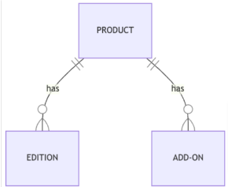
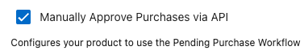
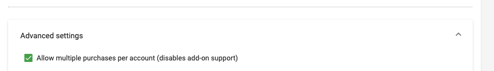
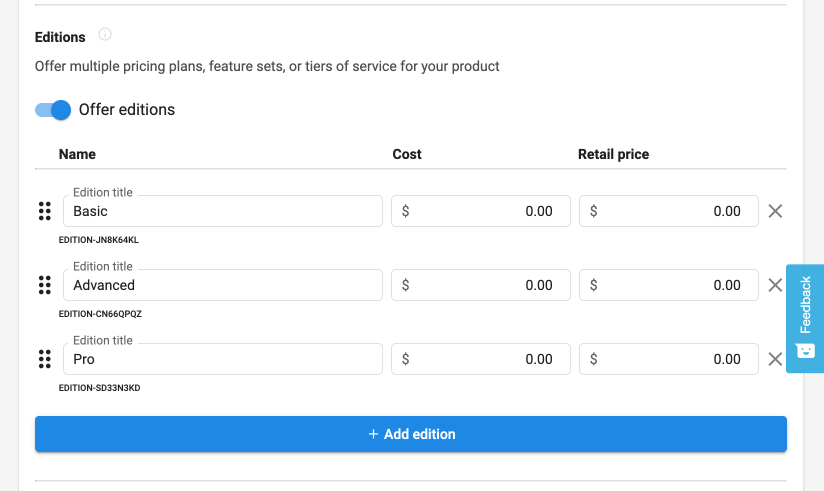

Debes cumplir o superar estos requisitos operativos antes de que tu producto o servicio alcance disponibilidad general.

## Estructura de producto y servicio

Cada producto debe tener al menos un nivel pago. 

Puedes ofrecer varios niveles pagos; cada nivel es una **Edition** en el Marketplace. 

- Los proveedores suelen usar tres **ediciones** (por ejemplo, Bronze, Silver, Gold) con diferentes precios y conjuntos de funciones.
- Los productos también pueden incluir **niveles gratuitos** (pruebas, freemium o premium) y **Add-ons** para ventas adicionales y funciones opcionales.

### Información requerida al crear un producto

1. `Basic info`: nombre, categoría, vertical, descripción, etc.
2. `Integration settings`: SSO, Fulfillment, etc.

3. `Editions`: lista de funciones, precio, mínimo, término, etc.
4. `Content`: logos, capturas de pantalla, documentos, videos, etc.
5. `Visibility`: estado de aprobación

### Compra múltiple

Puedes activar o desactivar la compra múltiple por edición. Cuando está activada, los clientes pueden comprar tu producto varias veces para las diferentes ubicaciones que gestionan. Por ejemplo, un reseller que gestiona 10 ubicaciones para un cliente puede comprar tu producto 10 veces, una por ubicación.

### Precios y pruebas

Tú estableces tus propios precios y períodos de prueba. Vendasta admite varias configuraciones, incluidas opciones de mayoreo y margen. Tu Vendor Success Manager puede orientarte sobre las mejores prácticas para tu categoría y tipo de producto.

### Ediciones de producto

Puedes configurar ediciones (niveles de precio) para controlar cómo se presenta tu producto a los partners y se vende a los clientes. La imagen anterior muestra un ejemplo de configuración.

### Compra múltiple de complementos

Cada complemento puede usar la misma configuración de compra múltiple que tu producto principal.

## Ejemplo de caso de uso

### Publicidad digital

Este ejemplo muestra una forma de estructurar un producto: tres ediciones (Bronze, Silver, Gold) con diferentes precios y conjuntos de funciones, más complementos opcionales para servicios mejorados.

## Ayuda y soporte

Contacta a tu Vendor Success Manager para obtener orientación sobre la estructura del producto, las estrategias de precios y la presentación en el Marketplace.
