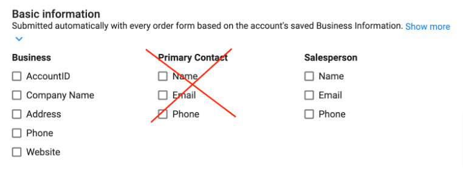
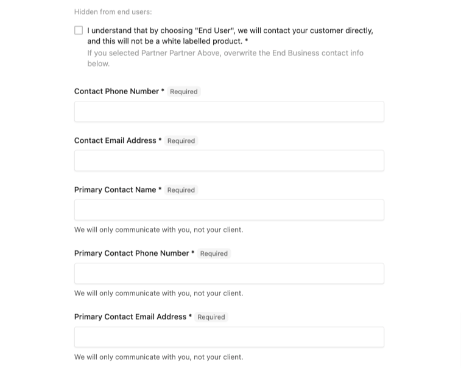
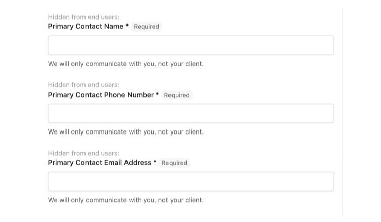

Este artículo guía a los proveedores del Marketplace en la creación de formularios de pedido personalizados para recopilar información esencial de los partners durante la activación del producto. Aunque es útil para crear productos personalizados para tus clientes, está diseñado específicamente para respaldar las integraciones oficiales de proveedores del Marketplace.

## Descripción general del formulario de pedido

**¿Cuál es el propósito de un formulario de pedido?**

Los formularios de pedido te permiten solicitar información de negocio específica a los partners al activar la aplicación. También existen los Fulfillment Forms, que permiten seguir recopilando información después de realizada la compra. Tanto el Order Form estándar como el Fulfillment Form usan el mismo generador de formularios.

**Cuándo usar un Order Form estándar**

Deberías usar un formulario de pedido si necesitas información adicional al activar el producto. Algunos ejemplos comunes son:

- Obtener información de contacto del reseller o del cliente para la comunicación de cumplimiento. Nota: las comunicaciones automatizadas deben gestionarse a través de la plataforma. Usa Inbox para la comunicación general con el reseller.
- Solicitar información de envío para productos físicos
- Recopilación de contenido para productos de publicidad digital, etc.
- Ajustes de configuración base que **requieres** para configurar un producto digital.

:::tip Buena práctica
Evita usar un formulario de pedido cuando sea posible, ya que agrega fricción a la compra. Si necesitas ciertos datos de antemano, mantén el formulario breve.
:::

## Crear un formulario de pedido

1. Ve a `Vendor Center` → `Product Name` → `Product Info` → `Product Activation` → `Order Form`, luego activa `Use a custom order form`.
2. Elige los campos de Basic Information necesarios. Se recomiendan `AccountID` y `Company Name`.
   - Estos son `optional` de forma predeterminada para evitar que los formularios de pedido completados contengan información irrelevante. Si requieres alguno de estos datos, marca la casilla correspondiente.

Seleccionar la opción `Primary Contact` no dará como resultado la obtención de la información de contacto requerida. El campo `Primary Contact` completará automáticamente cualquier usuario existente en la cuenta.

Seleccionar `Salesperson` solo te dará el vendedor asignado del reseller en la cuenta, lo cual no dará como resultado la obtención de la información de contacto requerida.

3. Los campos de `Additional Information` (opcionales) requerirán que el reseller complete la información necesaria en su cuenta o en la de su cliente.
4. Para agregar un campo personalizado, haz clic en `Add Form Field` y expande el elemento `New Form Field` que aparece.
5. El `Order Form Footer` debe usarse para incluir información sobre el pedido en sí, como acuerdos de nivel de servicio, y se muestra tanto al reseller como a su cliente.

### Tipos de campos de formulario

Hay varios tipos de campos de formulario disponibles. Debajo de cada uno hay un ejemplo de cómo se vería ese campo en Partner Center al activar un producto:

- `Files`: se usa para solicitar archivos específicos.
- `Drop Down`: un campo de múltiples opciones al que puedes agregar opciones seleccionando Add Option.
- `Check Box`: te permite presentarle al usuario una sola opción en forma de casilla de verificación.
- `Text Area`: una entrada abierta que permite a los usuarios escribir respuestas largas. Es especialmente útil al solicitar una descripción.
- `Text Box`: un cuadro de entrada que permite a los usuarios ingresar texto para respuestas simples. Puedes agregarle un prefijo y un sufijo, así como validación por expresión regular (las respuestas deben tener un formato específico).
  - Por ejemplo, si quieres que los usuarios ingresen su sitio web, puedes agregar un prefijo `www.` y un sufijo `.com`.
- `End User`: requiere que se seleccione un usuario de la cuenta como usuario designado del producto. Este campo se usa comúnmente junto con un modelo de facturación por asiento.
  - Puede ser útil si hay un usuario inicial que necesita configurarse con permisos diferentes a los del resto de los usuarios de la cuenta.
  - Si marcas este campo como requerido y no hay usuarios en la cuenta, se obligará al administrador a agregar un usuario a la cuenta antes de poder activar tu producto.

**Requisitos**

Los campos de formulario se pueden dejar como opcionales o marcarse como Required. Los requisitos suelen usarse para información de contacto, dominios, material de publicidad digital o información de envío, por ejemplo.

**¿Qué perfil verá el formulario de pedido?**

Cada campo de formulario requiere que elijas si está `Hidden from end users` u `Office editable only`.

`Hidden from end users` oculta tu pregunta al cliente del reseller, por lo que el reseller debe proporcionar una respuesta. Selecciona esta opción si necesitas información de contacto específica del reseller.

`Office editable only` permite que los usuarios finales vean el campo del formulario pero no puedan responder. Elegir esta opción significa que quizás quieras que el usuario final esté informado sobre ciertas configuraciones, pero sin poder modificarlas.

### Solicitar información de contacto

Es posible que necesites comunicarte con el reseller o con su cliente si ofreces una incorporación inicial o si el SKU es un servicio. 

:::warning Primary Contact no proporciona la información de contacto requerida
Seleccionar `Primary Contact` puede no darte la información de contacto que necesitas. El campo `Primary Contact` completa automáticamente un usuario de la cuenta. Usa campos de formulario de pedido personalizados para capturar la información de contacto requerida.
:::

*Crear campos personalizados te permitirá confirmar la preferencia de comunicación del reseller. Puede que prefiera gestionar todas las comunicaciones él mismo, así que le permites elegir proporcionando la información de contacto correcta.*

**Si te comunicarás con el reseller O con su cliente:**

Comienza con una pregunta para que el reseller identifique con quién puedes comunicarte. Esta pregunta debe ser `Required` y `Hidden from end users`, y funciona mejor en forma de campo de formulario `Drop Down`.

:::tip Buena práctica
Incluye una `Check Box` que sea `Required` y `Hidden from end users` para que el reseller reconozca que, al elegir `End User`, contactarás directamente a su cliente y esto no será un producto de marca blanca.
:::

Por último, asegúrate de solicitar el nombre y la información de contacto de la persona de contacto como campos de formulario `Required` y `Hidden from end users`. Aquí tienes un ejemplo del formulario de pedido completo solicitando información de contacto si no tienes preferencia sobre con qué perfil interactuar en el proyecto:

**Si te comunicarás únicamente con el reseller:**

Tus preguntas deben ser `Required` y `Hidden from end users`, e incluir un texto de ayuda que le indique al reseller que te comunicarás únicamente con él de forma directa. Aquí tienes un ejemplo del formulario de pedido completo cuando te comunicarás únicamente con el reseller:

### Solicitar contraseñas

:::warning Evita datos sensibles en los formularios de pedido
Los formularios de pedido de Sales y Fulfillment aparecen en texto plano en toda la plataforma. Evita usarlos para datos sensibles como contraseñas o información de cuentas. En su lugar, recopila esa información a través de una bandeja de correo cifrada o una llamada de incorporación.
:::
