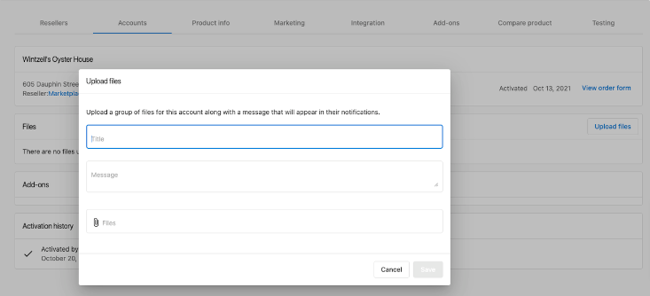
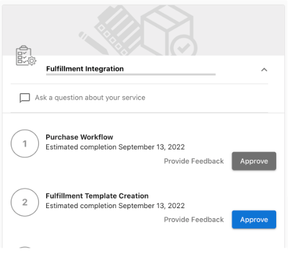

:::note
Este artículo respalda la fase de integración para proveedores del Marketplace. Si estás listo para comenzar como proveedor, nos encantaría saber de ti. [Postúlate para unirte al Marketplace](https://www.vendasta.com/marketplace/vendors/).
:::

### Dependencia de otro producto del Marketplace

1. Si tu servicio aprovecha un producto del Marketplace y requiere que ese producto esté activo antes de que puedas comenzar tu trabajo, asegúrate de que el producto requerido haya sido seleccionado.

[Vendor Center](https://vendors.vendasta.com/) → `Select Product` → `Product Info` → `Product activation` → `Required products`:

2. Si tu servicio depende de un producto de Vendasta e implica responder reseñas, reclamar y presentar listados, o revisar menciones, puedes optar por que se creen tareas generadas por el sistema al activar el producto. Estas son tareas activadas por eventos: Reviews, Mentions y Listings.

:::note
Si tu servicio no es de este tipo, ignora esta casilla.
:::

### Reporting

Proporciona a tus clientes cualquier informe de finalización de servicio o informe continuo a través de la plataforma de Vendasta.

### Requisitos

Consulta el tipo de informe que coincida con la forma en que entregas informes a los clientes:

| Método de entrega | Requisitos |
| --- | --- |
| **Panel alojado** (los usuarios inician sesión) | SSO en Dashboard, Executive Report Highlights |
| **Informe semiinteractivo** (compartido como URL firmada) | SSO en Dashboard, Executive Report Highlights o carga de archivo PDF |
| **Informes en PDF por correo electrónico** | Carga de archivo PDF, opcionalmente Executive Report highlights |

### Tipos de informes

**Single Sign-On:**

Si tienes un panel de informes alojado al que se accede mediante inicio de sesión, o que se comparte a través de una URL firmada, entonces debe accederse mediante [SSO](https://developers.vendasta.com/vendor/d191b96068b71-sso-o-auth2-3-legged-flow).

**The Executive Report (integración por API):**

Extrae aspectos destacados o recrea tus informes en el informe dinámico de Vendasta que se encuentra dentro del panel de usuario final de Business App. Consulta los tipos de tarjetas compatibles [aquí](https://developers.vendasta.com/vendor/ZG9jOjE2NTY5Mzk0-executive-report).

:::info
Se sugiere un máximo de 9 tarjetas.
:::

### Carga de archivos

Los grupos de archivos se pueden generar de dos maneras:

1. La página `Account Details` en Vendor Center. En este caso, Vendasta aloja el archivo.

2. Carga automatizada a través de la [File Group API](https://developers.vendasta.com/vendor/e8e7370a6bbc0-create-a-file-group) de la cuenta. En este caso, el proveedor aloja el archivo y proporciona un enlace.

En cualquiera de los dos métodos, la carga de archivos enviará automáticamente un mensaje al Activity Stream, alertando que ya hay un nuevo archivo disponible.

### Revisión final (Vendasta prueba tu integración)

Una vez que hayas terminado cada tarea, envíala para revisión y aprobación en tu rastreador de proyectos haciendo clic en `Approve`.

Un miembro del equipo de Vendasta Vendor Operations revisará tu implementación y te dará comentarios antes de marcar la tarea como completa.

### Fulfillment forms

Los formularios de cumplimiento recopilan información de los clientes después de que compran tu producto. Úsalos para detalles que necesites para cumplir el pedido, como direcciones de envío o preferencias de servicio. Puedes mover preguntas de tu formulario de pedido de compra al formulario de cumplimiento posterior a la compra, para que los clientes puedan completar los pedidos con menos fricción.

Activa los formularios de cumplimiento en tu producto en Vendor Center. Después de configurar el formulario y publicar tus cambios, puedes hacer seguimiento de todos los pedidos y el cumplimiento pendiente en la tabla de work orders.

**Estados de work order:**

- `Details needed`: falta información requerida. Consulta estos pedidos en la pestaña `In Review` y completa el formulario de cumplimiento para continuar.
- `Complete`: el formulario de cumplimiento está completo. Puedes ver los detalles de contacto, formularios de pedido y respuestas de cumplimiento de cada pedido.

<iframe 
  src="https://drive.google.com/file/d/1k8YNG1r2_ORiaxGf8LqKQMFh91RrJVD1/preview" 
  width="640" 
  height="480" 
  allow="autoplay">
</iframe>
