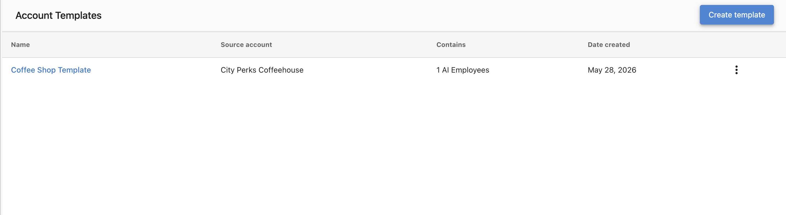

# Modèles de compte

Les modèles de compte vous permettent de configurer un compte une seule fois et de réutiliser cette configuration partout. Lorsqu'un modèle est appliqué, il déploie les employés IA, les paramètres de clavardage Web, les champs CRM, les campagnes, les automatisations, les formulaires et plus encore vers le compte cible en quelques secondes, sans aucune étape manuelle.

Les modèles sont particulièrement utiles pour intégrer des clients à grande échelle, standardiser la configuration au sein d'un secteur d'activité ou offrir l'auto-inscription aux PME.

## Ce que comprennent les modèles de compte

Un modèle capture la configuration complète d'un compte source, notamment :

- Les employés IA
- Les widgets et paramètres de clavardage Web
- Les formulaires
- Les champs CRM
- Les mises en page des champs CRM
- Les campagnes
- Les automatisations

## Comment y accéder

Pour consulter, créer, mettre à jour ou appliquer manuellement des modèles, allez dans Partner Center → `Accounts` → `Account Templates`.

## Appliquer manuellement un modèle

Pour appliquer un modèle directement à un compte, ouvrez le modèle depuis Partner Center → `Accounts` → `Account Templates`, sélectionnez un compte cible, choisissez les fonctionnalités à appliquer, puis cliquez sur **Apply**.

## Appliquer des modèles automatiquement

### Associer un modèle à une catégorie d'entreprise

Associez un modèle de compte à une catégorie d'entreprise, et tout nouveau compte créé dans cette catégorie, via API, manuellement ou par auto-inscription des PME, se voit automatiquement appliquer le modèle correspondant. Aucune configuration manuelle n'est requise.

### Utiliser l'action d'automatisation « Apply an account template »

Les modèles peuvent également être appliqués depuis une automatisation, ce qui vous donne un contrôle total sur le moment et la manière dont ils sont déclenchés.

Pour configurer cela :

1. Allez dans Partner Center → **Automations**.
2. Sélectionnez ou créez une automatisation.
3. Ajoutez l'action **Apply account template**.
4. Sélectionnez le modèle à appliquer.

Cela vous permet d'appliquer ou de réappliquer un modèle en fonction de toute condition qu'une automatisation peut évaluer.

## Inclure les mises en page des champs CRM

Une [mise en page de champs](/administration/data-management/crm-objects/field-layouts) — le regroupement et l'ordonnancement des champs sur les fiches de contact, d'entreprise, d'opportunité et d'objet personnalisé — peut être déployée avec un modèle afin que chaque compte présente ses fiches de la même manière.

- Seules les mises en page personnalisées sont capturées. Les types d'objet qui utilisent toujours la mise en page standard sont ignorés.
- Si une mise en page fait référence à des champs personnalisés ou à un type d'objet personnalisé que le compte cible ne possède pas, ceux-ci y sont d'abord créés, puis la mise en page est repointée vers eux.
- L'application d'un modèle remplace la mise en page du compte cible pour ce type d'objet. Toute personnalisation de mise en page déjà effectuée sur le compte cible est écrasée.

## Inclure les formulaires et les widgets de clavardage Web

Les formulaires et les widgets de clavardage Web configurés sur le compte source peuvent être inclus dans le modèle et déployés vers chaque compte auquel le modèle est appliqué. Cela est particulièrement utile lorsque :

- Un message initial de clavardage Web doit être dans une autre langue.
- Les déclarations de confidentialité diffèrent selon la région.

## Mettre à jour les comptes en masse

Après avoir amélioré le compte source à partir duquel un modèle a été créé, cliquez sur **Update template** pour actualiser le modèle avec les dernières modifications. Aucune reconstruction n'est nécessaire. Les mises à jour sont appliquées la prochaine fois que le modèle est utilisé.

## Utiliser l'application d'un modèle comme déclencheur d'automatisation

Lorsqu'un modèle termine son application, le compte cible reçoit une entrée dans le journal d'activité. Les automatisations peuvent surveiller cette entrée et enchaîner des tâches en aval à la suite d'une application de modèle terminée, comme l'attribution d'un représentant ou la configuration d'un formulaire de coupon.

## Limites des objets personnalisés

Chaque compte peut avoir jusqu'à 3 [objets personnalisés CRM](/crm/custom-objects). Si l'application d'un modèle devait faire dépasser cette limite à un compte cible, l'application échoue pour ce compte et Partner Center affiche une erreur identifiant la cause, plutôt que d'échouer silencieusement.

## À qui s'adresse cette fonctionnalité

- Aux partenaires qui intègrent des comptes à grande échelle (déploiements en entreprise, canaux de revendeurs, migrations)
- Aux partenaires qui standardisent la configuration sur plusieurs comptes d'un même secteur d'activité
- Aux partenaires qui offrent l'auto-inscription aux PME
