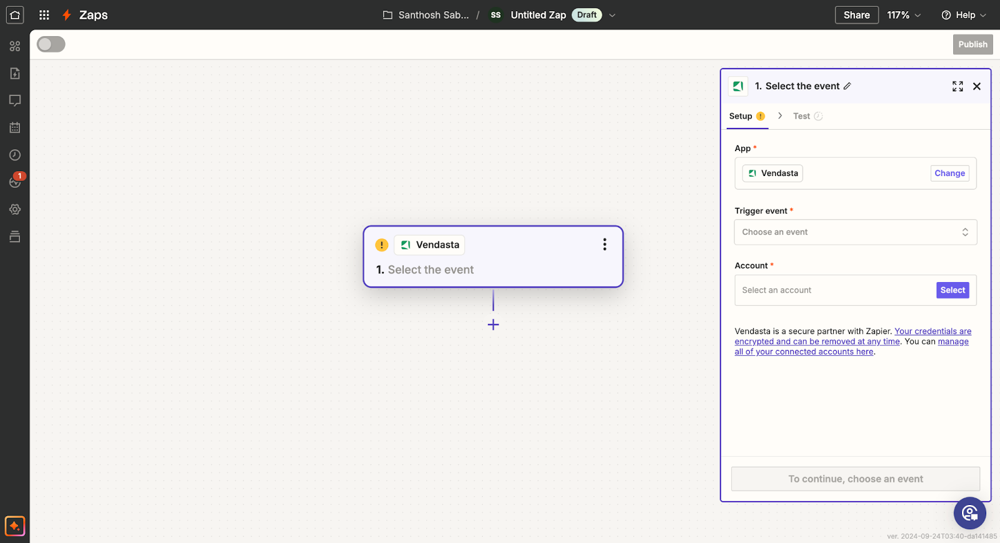
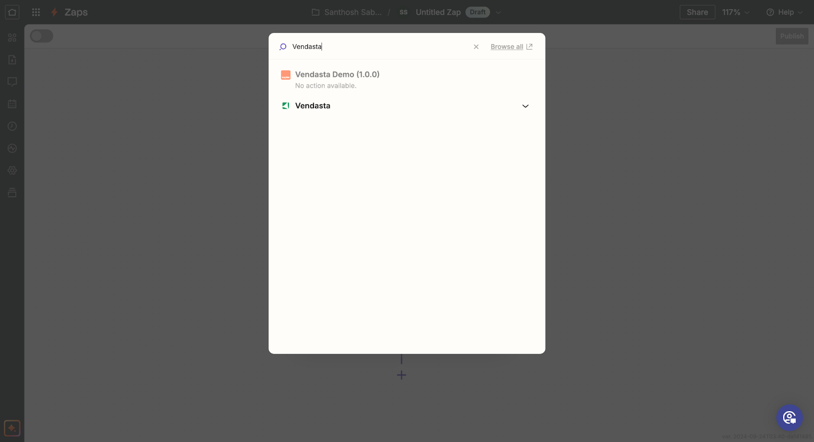

## Qu'est-ce que l'intégration Zapier?

L'intégration Zapier de Vendasta vous permet de connecter votre compte Vendasta à des milliers d'autres applications grâce à la plateforme d'automatisation de Zapier. Cette intégration vous permet d'automatiser les flux de travail entre Vendasta et les autres applications que vous utilisez quotidiennement, en étendant les capacités de votre plateforme.

## Pourquoi l'intégration Zapier est-elle importante?

L'intégration Zapier vous aide à :
- Automatiser les tâches répétitives entre les applications
- Synchroniser les données sur plusieurs plateformes
- Créer des flux de travail sans codage personnalisé
- Connecter Vendasta à plus de 6 000 applications prises en charge
- Réduire la saisie manuelle de données et les erreurs humaines
- Faire évoluer vos opérations grâce à des processus automatisés

## Ce que vous pouvez faire avec l'intégration Zapier

| Fonctionnalité | Description |
|---------|-------------|
| **Connectivité aux applications** | Connectez Vendasta à des milliers d'applications |
| **Intégration CRM** | Synchronisez les contacts et les entreprises avec des CRM externes |
| **Déclencheurs d'automatisation** | Utilisez les automatisations de Vendasta pour déclencher des flux de travail Zapier |
| **Journalisation des activités** | Consignez des activités comme les notes, les appels et les réunions dans le CRM Vendasta |
| **Automatisation des flux de travail** | Créez des processus automatisés complexes en plusieurs étapes |

## Comment configurer l'intégration Zapier

### Accéder à l'intégration

1. Connectez-vous à votre compte Vendasta
2. Accédez à `Administration` → `Integrations`
3. Repérez la vignette d'intégration Zapier

4. Cliquez sur `Connect` pour être redirigé vers Zapier

### Connecter Vendasta à Zapier

Une fois sur le site Web de Zapier, vous pouvez commencer à créer des automatisations (Zaps) entre Vendasta et d'autres applications.

### Créer votre premier Zap

#### Étape 1 : configurez votre déclencheur

Tout d'abord, sélectionnez l'application et l'événement qui déclencheront votre automatisation.

Si vous souhaitez que votre Zap démarre à partir des données de Vendasta, sélectionnez `Business App` comme application de déclenchement dans Zapier, choisissez l'événement de déclenchement disponible, connectez votre compte, puis suivez les `Setup instructions` affichées dans Zapier avant de tester le déclencheur.

#### Étape 2 : connectez-vous à Vendasta

1. Sélectionnez Vendasta comme application d'action

2. Choisissez l'action Vendasta que vous souhaitez effectuer

3. Connectez votre compte Vendasta si ce n'est pas déjà fait

4. Terminez la configuration en définissant les détails de l'action

## Déclencheurs et actions disponibles

### Déclencheurs (événements dans Vendasta pouvant démarrer un Zap)

- **New Business Created** - Lorsqu'une nouvelle entreprise est ajoutée à Vendasta
- **Business Updated** - Lorsque les informations d'une entreprise sont modifiées
- **New Order Placed** - Lorsqu'une nouvelle commande est créée
- **Order Status Changed** - Lorsque le statut d'une commande est mis à jour

### Actions (ce que Zapier peut faire dans Vendasta)

- **Create a Business** - Ajouter de nouvelles entreprises au CRM Vendasta
- **Update a Business** - Modifier les informations d'une entreprise existante
- **Create a Task** - Ajouter des tâches à la gestion des tâches de Vendasta
- **Add a Note to Business** - Consigner des notes sur les fiches d'entreprise
- **Create or Update CRM Contact** - Gérer les fiches de contact dans le CRM Vendasta
- **Create or Update CRM Companies** - Gérer les fiches d'entreprise dans le CRM Vendasta
- **Log CRM Activity** - Enregistrer des notes, des courriels, des appels, des réunions et des tâches

## Comment déclencher des Zaps Zapier à l'aide des automatisations Vendasta

### Prérequis

- Un compte Partenaire Vendasta avec accès aux Automations
- Un compte Zapier
- Une compréhension de base des webhooks

### Configurer le Zap pour les déclencheurs d'automatisation

1. Allez sur [Zapier](https://zapier.com/) et connectez-vous à votre compte
2. Cliquez sur `Create Zap`

3. Recherchez et sélectionnez `Webhooks by Zapier` comme application de déclenchement

4. Sélectionnez `Catch Hook` comme événement de déclenchement, puis cliquez sur `Continue`

5. Copiez l'URL du webhook. Vous en aurez besoin pour configurer l'Automation dans Vendasta

6. Cliquez sur `Continue`, puis sur `Test trigger`. Ne vous inquiétez pas si le test échoue à ce stade

### Configurer l'automatisation dans Vendasta

1. Connectez-vous à votre Partner Center Vendasta
2. Accédez à `Administration` → `Automations`
3. Créez une nouvelle Automation ou modifiez-en une existante
4. Ajoutez une action `Webhook` à votre Automation
5. Dans la configuration du webhook, collez l'URL que vous avez copiée depuis Zapier

6. Configurez toutes les données supplémentaires que vous souhaitez envoyer à Zapier dans le champ `Body`
7. Enregistrez votre Automation

### Tester l'intégration

1. Déclenchez votre Automation dans Vendasta
2. Retournez sur Zapier, vous devriez voir que le test a réussi

3. Continuez à configurer le reste de votre Zap, en ajoutant les actions qui doivent se produire lorsque le webhook est déclenché

4. Nommez votre Zap, testez-le et activez-le

## Informations sur l'application Zapier et FAQ

### Qu'est-ce que le mode Bêta?

Nous savons que nos partenaires ont hâte de commencer à utiliser cette fonctionnalité! Bien que notre équipe de développement continue d'apporter de nouvelles fonctionnalités intéressantes à l'intégration Zapier, l'étiquette Bêta sera utilisée pour le signaler.

:::note Exigence d'abonnement
Cette fonctionnalité est actuellement disponible uniquement pour les partenaires ayant un niveau d'abonnement incluant les intégrations.
:::

### Qui peut utiliser l'application?

L'application peut être utilisée par les partenaires, les vendeurs et leurs clients, car elle utilise les permissions de l'utilisateur qui a configuré le Zap. Il convient de noter que l'application porte la marque Vendasta. Si vous souhaitez marque blanche votre plateforme, vous ne pourrez pas offrir cette fonctionnalité actuellement. Vous pouvez toutefois choisir de créer les zaps pour le compte de vos clients.

### Comment les entreprises sont liées aux comptes

Un compte sera créé comme copie des données de l'entreprise la première fois qu'un compte est nécessaire sur la plateforme. Une fois créé, la mise à jour de la fiche d'entreprise ne mettra à jour que le vendeur assigné et tous les champs personnalisés du compte. Lorsqu'un client met à jour son compte, la plupart des champs mettront à jour la fiche d'entreprise.

## Bonnes pratiques

### Planifier vos intégrations

- **Commencez simplement** - Débutez avec des intégrations de base avant de créer des flux de travail complexes
- **Cartographiez vos données** - Comprenez comment les données circulent entre les applications
- **Testez minutieusement** - Testez vos Zaps minutieusement avant de vous y fier pour des processus d'affaires critiques
- **Surveillez régulièrement** - Surveillez vos Zaps régulièrement pour vous assurer qu'ils continuent de fonctionner comme prévu

### Conseils d'optimisation

- **Utilisez les notifications d'erreur** - Configurez des notifications d'erreur dans Zapier pour être alerté en cas d'échec d'un Zap
- **Vérifiez les limites d'utilisation** - Consultez les limites d'utilisation de Zapier pour vous assurer que vos besoins d'automatisation respectent les contraintes de votre forfait
- **Opérations groupées** - Dans la mesure du possible, utilisez des opérations groupées pour réduire les appels d'API
- **Validation des données** - Mettez en œuvre une validation des données pour assurer un transfert de données propre

### Considérations de sécurité

- **Permissions** - Assurez-vous que votre compte Vendasta dispose des permissions nécessaires
- **Sécurité du compte** - Assurez la sécurité de vos comptes Zapier et Vendasta
- **Confidentialité des données** - Tenez compte des implications de confidentialité des données lorsque vous connectez des systèmes
- **Contrôle d'accès** - Limitez l'accès aux Zaps aux membres de l'équipe qui en ont besoin

## Dépannage

### Problèmes courants

**Le Zap ne se déclenche pas**
1. Vérifiez que votre compte Vendasta dispose des permissions nécessaires
2. Assurez-vous que votre compte Zapier est actif et bénéficie d'un forfait approprié
3. Vérifiez que les conditions de déclenchement sont remplies dans Vendasta

**Problèmes de transfert de données**
1. Vérifiez que les données transmises entre les applications sont correctement formatées
2. Vérifiez les correspondances de champs dans la configuration de votre Zap
3. Consultez l'historique du Zap dans Zapier pour identifier où les échecs peuvent se produire

**Application grisée**
Utilisez la bonne application pour votre flux de travail :

- Application `Vendasta` : utilisez-la comme application d'action
- Application `Business App` : utilisez-la comme application de déclenchement, puis suivez les `Setup instructions` affichées dans Zapier
- `Webhooks by Zapier` : utilisez cette option lorsque vous souhaitez déclencher à partir des événements webhook des Automations Vendasta

### Obtenir du support

Pour obtenir de l'aide supplémentaire concernant l'intégration Zapier :
1. Consultez la documentation de Zapier pour les problèmes généraux liés à Zapier
2. Consultez la documentation de l'API de Vendasta pour les exigences de format de données
3. Contactez le service client de Vendasta pour les problèmes spécifiques à la plateforme
4. Utilisez les ressources d'assistance de Zapier pour les problèmes spécifiques à Zapier

## Cas d'utilisation et exemples

### Synchronisation CRM

**Exemple** : Créez automatiquement des contacts CRM Vendasta lorsque de nouveaux prospects sont ajoutés à votre CRM externe
- **Déclencheur** : Nouveau contact dans un CRM externe (p. ex., HubSpot, Salesforce)
- **Action** : Créer ou mettre à jour un contact CRM dans Vendasta

### Flux de travail de gestion des tâches

**Exemple** : Créez des tâches Vendasta lorsque des événements spécifiques se produisent dans d'autres systèmes
- **Déclencheur** : Nouveau ticket de support dans le système d'assistance
- **Action** : Créer une tâche dans Vendasta pour le suivi

### Sauvegarde de données et rapports

**Exemple** : Exportez automatiquement les données de Vendasta vers des feuilles de calcul pour les rapports
- **Déclencheur** : Déclencheur planifié dans Zapier
- **Action** : Exporter les données de Vendasta vers Google Sheets

## Foire aux questions

Que fait l'application Zapier?

L'application Zapier vous permet de :
1. Créer ou mettre à jour des contacts CRM dans Vendasta
2. Créer ou mettre à jour des entreprises CRM dans Vendasta
3. Consigner des activités CRM (notes, courriels, appels, réunions, tâches)
4. Exécuter des automatisations Vendasta à l'aide de déclencheurs d'API
5. Connecter Vendasta à plus de 6 000 applications prises en charge par Zapier

Qui peut utiliser l'application Zapier?

L'application peut être utilisée par les partenaires, les vendeurs et leurs clients. Elle utilise les permissions de l'utilisateur qui a configuré le Zap. Notez que l'application porte actuellement la marque Vendasta, ce qui limite les options de marque blanche.

Pourquoi l'application est-elle grisée lorsque j'essaie de l'ajouter?

Vous utilisez probablement le mauvais type d'application pour cette étape :

- Utilisez `Vendasta` lors de la configuration des actions du Zap
- Utilisez `Business App` lors de la configuration des déclencheurs du Zap et suivez les `Setup instructions` intégrées à l'application
- Utilisez `Webhooks by Zapier` lorsque vous déclenchez à partir des webhooks des Automations Vendasta

Quelles sont les limites d'utilisation de l'intégration Zapier?

Les Automations Vendasta et Zapier ont chacune leurs propres limites d'utilisation et tarifications. Consultez la documentation des deux plateformes pour connaître les détails spécifiques concernant les limites et les coûts.

Puis-je utiliser des webhooks pour déclencher des Zaps à partir des automatisations Vendasta?

Oui! Vous pouvez utiliser les automatisations Vendasta avec des actions webhook pour déclencher des flux de travail Zapier. Utilisez « Webhooks by Zapier » comme application de déclenchement et configurez l'URL du webhook dans votre automatisation Vendasta.

De quel niveau d'abonnement ai-je besoin pour l'intégration Zapier?

L'intégration Zapier est disponible uniquement pour les partenaires ayant un niveau d'abonnement incluant les intégrations. Consultez les détails de votre abonnement ou contactez le support pour plus d'informations.

