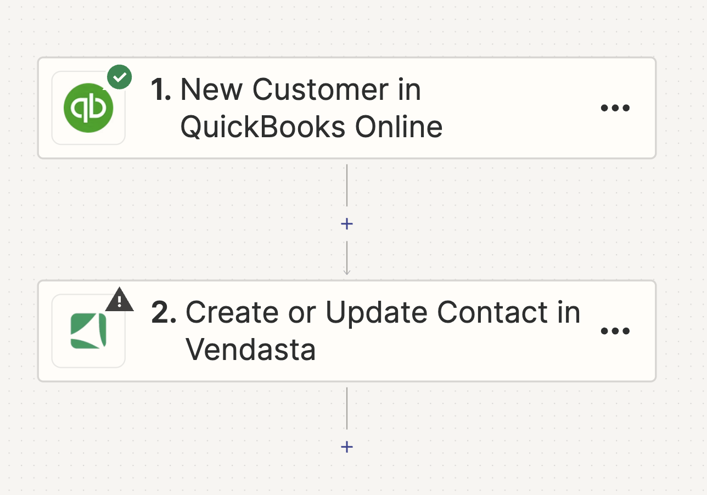
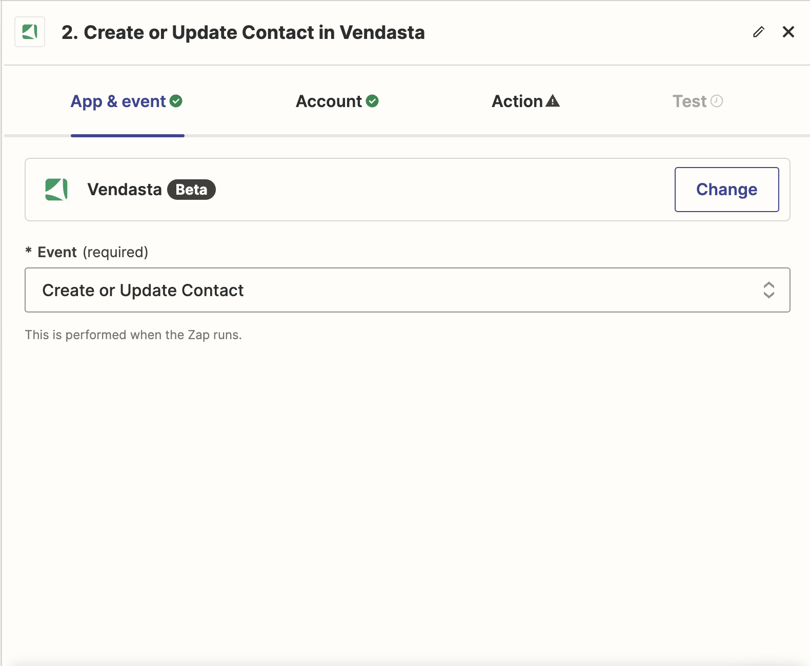
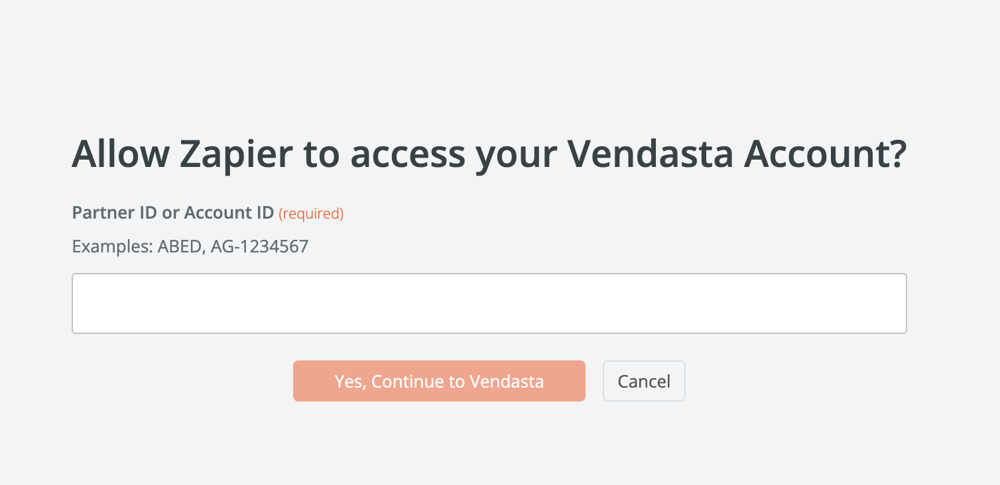

<iframe 
  src="//www.youtube-nocookie.com/embed/cnIpC7vSHFE" 
  width="560" 
  height="315" 
  frameBorder="0" 
  allowFullScreen=""
></iframe>

L'application Vendasta dans Zapier vous permet de connecter votre CRM Vendasta à plusieurs systèmes tiers via Zapier. Vous pouvez sélectionner n'importe quel système tiers disponible dans Zapier comme déclencheur, ce qui lance une action dans le CRM Vendasta.

## Étape 1 : Sélectionner le déclencheur

À cette étape, vous pouvez sélectionner le déclencheur qui lance une action dans votre flux de travail. Par exemple, un nouveau client dans Quickbooks Online peut servir de déclencheur, mais vous pouvez choisir parmi divers autres déclencheurs disponibles dans Zapier.

## Étape 2 : Choisir l'action

Après avoir sélectionné le déclencheur, vous devrez choisir l'application qui exécutera l'action souhaitée. Dans ce scénario, cette application serait l'application Vendasta. Cela signifie que chaque fois qu'un nouveau client est ajouté dans Quickbooks Online, une action sera exécutée dans le CRM Vendasta. Diverses actions sont possibles dans le cadre de l'application Vendasta dans Zapier.

## Étape 3 : Sélectionner l'action de création ou de mise à jour

À cette étape, vous définirez l'action à effectuer lorsque l'événement déclencheur se produit. Dans ce scénario, l'action consiste à créer ou mettre à jour un contact dans le CRM Vendasta.

N'oubliez pas que vous pouvez modifier l'action à tout moment en cliquant sur le menu déroulant et en choisissant une autre option. Après avoir sélectionné l'action, cliquez sur `Continue` pour passer à l'étape suivante.

## Étape 4 : Se connecter

À cette étape, vous connecterez votre compte Vendasta. Cliquez sur `Sign in` pour être redirigé vers la page de connexion. Vous y saisirez votre ID de partenaire ou l'ID de compte du client PME pour lequel vous configurez Zapier, puis accorderez les permissions nécessaires. Vous serez ensuite automatiquement redirigé vers Zapier.

:::note
Vous n'avez besoin d'effectuer cette procédure qu'une seule fois. À l'avenir, vous serez automatiquement connecté à votre compte lors de l'utilisation de l'application Vendasta.
:::

## Étape 5 : Saisir l'ID de l'organisation

À cette étape, vous devrez saisir l'ID de l'organisation, qui est un champ obligatoire. Cet ID est automatiquement rempli en fonction de l'ID de compte que vous avez utilisé lors de la connexion.

## Étape 6 : Champs à créer ou mettre à jour : champs de recherche

Dans la section `Fields to Create or Update`, vous pouvez saisir des valeurs pour les champs que vous souhaitez créer ou mettre à jour. Ces valeurs peuvent provenir des étapes précédentes dans Zapier.

Pour éviter de créer des entrées en double, assurez-vous de fournir des valeurs pour au moins un champ de recherche. Il peut s'agir des champs Email ou Numéro de téléphone, fournis par défaut, ou de tout autre champ de recherche que vous pouvez configurer dans la section Avancé.

## Étape 7 : Champs à créer ou mettre à jour : champs standards

Cette section comprend un ensemble de champs standards que vous pouvez utiliser lors de la création ou de la mise à jour d'un contact. Vous pouvez remplir ces champs avec des valeurs provenant des étapes précédentes dans Zapier.

Vous trouverez également un menu déroulant `Additional Fields`. Utilisez-le pour ajouter d'autres champs à la section `Fields to Create or Update`. Une fois ajoutés, vous pouvez fournir des valeurs pour ces champs.

## Étape 8 : Section avancée : champs de recherche supplémentaires

Dans la section `Advanced`, vous avez la possibilité d'affiner votre recherche de contact. Par défaut, le système recherche les contacts par email en premier, puis par numéro de téléphone. Cependant, vous pouvez spécifier des champs uniques supplémentaires pour identifier les contacts lors de la recherche.

Pour ce faire, utilisez le menu déroulant `Additional Search Fields`. Cela vous permet de sélectionner des champs supplémentaires afin d'effectuer l'opération de recherche. Vous pouvez classer ces champs par ordre de priorité pour une expérience de recherche plus adaptée.

:::note
Vous ne pouvez sélectionner des champs de recherche supplémentaires que parmi ceux présents dans la section `Fields to Create or Update`. Si vous souhaitez utiliser un nouveau champ, ajoutez-le d'abord à l'aide de l'option `Additional Fields` dans la section `Fields to Create or Update`. Vous pourrez ensuite le sélectionner dans le menu déroulant `Additional Search Fields`.
:::

## Étape 9 : Section avancée : écraser les données existantes

Par défaut, seuls les champs sans valeur actuelle dans la section `Fields to Create or Update` sont mis à jour. Si vous souhaitez modifier ce comportement et écraser les données existantes, utilisez l'option `Overwrite Existing Data`.

Cliquez sur le menu déroulant `Overwrite Existing Data` pour sélectionner des champs spécifiques que vous souhaitez toujours écraser, qu'ils soient vides ou qu'ils contiennent déjà des données.

:::note
Écraser les données existantes peut être utile dans certains scénarios, mais cette option doit être utilisée avec prudence pour éviter une perte de données involontaire.
:::

## Étape 10 : Associer une entreprise

À cette étape, vous avez la possibilité d'associer une entreprise au contact que vous créez ou mettez à jour. Si vous souhaitez le faire, saisissez l'ID de l'entreprise dans la zone de texte prévue à cet effet, intitulée `Company ID for Association (Optional)`.

:::note
Cette étape est facultative. Si vous n'avez pas l'ID de l'entreprise sous la main, vous pouvez laisser le champ vide et passer à l'étape suivante.
:::

## Étape 11 : Sélectionner les champs de retour du CRM

Une fois qu'un contact a été créé ou mis à jour dans le CRM, vous pouvez choisir les champs que vous souhaitez voir retournés. Ces champs peuvent être utilisés dans les étapes ultérieures de ce Zap.

Pour sélectionner les champs de retour, cliquez sur le menu déroulant sous `Return Fields` et sélectionnez les champs spécifiques que vous souhaitez voir retournés par le CRM.

:::note
L'ID de contact est toujours inclus par défaut comme champ de retour.
:::

