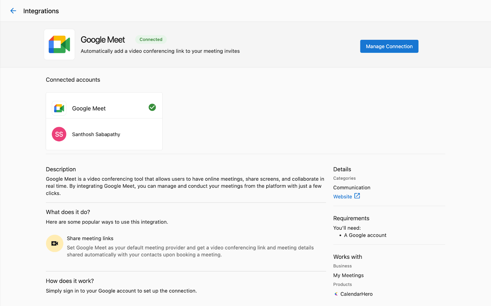

Les intégrations Google Meet et Zoom de Vendasta permettent aux partenaires d'intégrer leurs comptes Google Meet ou Zoom à Partner Center.

Une fois que vous activez l'intégration Google Meet ou Zoom, vous remarquerez quelques changements dans Partner Center lors de vos communications avec un client :

- Lorsque vous consultez une fiche de contact, vous verrez une nouvelle option à côté des boutons `Call` et `Email` pour démarrer ou planifier une réunion.
- Lorsque vous rédigez un courriel à un contact, vous verrez de nouvelles options pour inclure un lien de réunion et suggérer des créneaux horaires de réunion.

## Points à considérer pour Google Meet

- Pour utiliser l'intégration Google Meet, vous devez disposer d'un compte Google Workspace avec Google Meet activé.
- Tous les utilisateurs de Partner Center partagent la même connexion Google Meet. Lorsqu'un utilisateur configure l'intégration Google Meet, elle devient disponible pour tous les utilisateurs de ce compte partenaire.
- Vous n'aurez pas besoin de vous connecter séparément à votre compte Google pour utiliser cette intégration.

## Points à considérer pour Zoom

- Contrairement à Google Meet, chaque utilisateur de Partner Center doit connecter son propre compte Zoom.
- Les comptes Zoom gratuits et payants sont tous deux pris en charge, mais les comptes gratuits ont certaines limitations de réunion (par exemple, une limite de 40 minutes pour les réunions de groupe).

## Configurer l'intégration Google Meet

Pour activer l'intégration Google Meet pour votre compte Partner Center :

1. Accédez à la page `Integrations` depuis le menu de navigation gauche de Partner Center.
2. Trouvez la vignette `Google Meet` et cliquez sur `Connect`.
3. Suivez le flux d'authentification Google pour accorder à Partner Center l'accès à votre compte Google.

Une fois terminé, vous devriez voir un message `Connection Completed` :

## Configurer l'intégration Zoom

Chaque utilisateur de Partner Center doit configurer sa propre intégration Zoom :

1. Accédez à l'onglet `Manage` dans votre profil utilisateur (cliquez sur votre icône d'utilisateur en haut à droite).

2. Sélectionnez `Connected Apps` dans le menu de gauche.
3. Trouvez la vignette Zoom et cliquez sur `Connect`.
4. Suivez le flux d'authentification Zoom pour accorder à Partner Center l'accès à votre compte Zoom.

## Gérer les paramètres d'intégration

Les administrateurs peuvent gérer les paramètres d'intégration et les connexions à partir de la page Integrations :

1. Accédez à la page `Integrations` depuis le menu de navigation gauche.
2. Trouvez la vignette d'intégration (Google Meet ou Zoom).
3. Cliquez sur `Manage` pour afficher et ajuster les paramètres de connexion.

## Planifier des réunions

Une fois l'intégration effectuée, planifier des réunions avec vos clients est simple :

1. Accédez à la fiche de contact d'un client.
2. Cliquez sur le bouton de réunion à côté de « Call » et « Email ».
3. Choisissez de démarrer une réunion immédiate ou d'en planifier une pour plus tard.
4. Lors de la planification, sélectionnez les heures disponibles et ajoutez les détails de la réunion.
5. Envoyez l'invitation au contact.

Autrement, lors de la rédaction d'un courriel :

1. Cliquez sur le bouton de réunion dans l'éditeur de courriel.
2. Choisissez d'ajouter un lien de réunion ou de suggérer des créneaux horaires.
3. Terminez la configuration de la réunion et envoyez le courriel.

## Dépannage

Si vous rencontrez des problèmes avec les intégrations Google Meet ou Zoom :

- Assurez-vous que votre compte Google Workspace ou Zoom est actif et correctement configuré.
- Vérifiez que vous avez accordé toutes les permissions nécessaires lors du processus de connexion.
- Pour les problèmes liés à Google Meet, demandez à votre administrateur de vérifier la connexion sur la page Integrations.
- Pour les problèmes liés à Zoom, essayez de déconnecter puis de reconnecter votre compte.

Pour obtenir de l'aide supplémentaire, contactez le soutien Vendasta.
