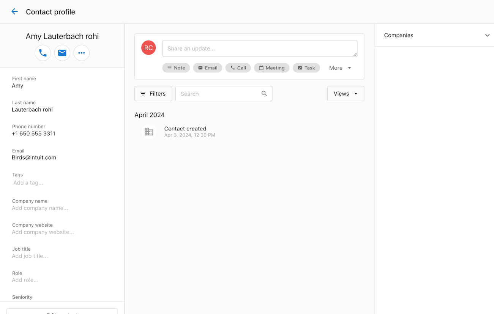

L'intégration QuickBooks dans Partner Center vous permet de synchroniser des données entre QuickBooks et Vendasta. L'intégration est une synchronisation à sens unique des contacts de QuickBooks vers le CRM de Vendasta et 3 déclencheurs d'automatisation.

## Configurer l'intégration QuickBooks

Vous pouvez configurer une connexion avec QuickBooks en accédant à la page Integrations de Partner Center.

- Cliquez sur `Administration` → `Integrations` pour accéder à la page Integrations.
- Cliquez sur la carte d'intégration QuickBooks.

- Vous serez dirigé vers la page de présentation QuickBooks, qui fournit des informations sur ce qu'est QuickBooks et les possibilités qu'offre une intégration avec QuickBooks. Cliquez sur `Add Connection`.

- Cela vous présente une fenêtre contextuelle de formulaire de pré-connexion où vous pouvez définir les données que vous souhaitez synchroniser entre QuickBooks et le CRM de Partner Center. Les options de synchronisation disponibles sont :
  - Données clients
  - Données de facture
  - Données de reçu de vente
  - Données de paiement

Cliquez sur `Continue` après avoir choisi les options qui s'appliquent.

- Cela mène à une page d'authentification unique où vous pouvez vous connecter à votre compte QuickBooks et accorder les permissions nécessaires pour établir la connexion.
- Une fois la connexion réussie, vous serez automatiquement redirigé vers l'onglet `Manage` de la page Integrations, où vous pourrez confirmer la connexion avec QuickBooks.
- La connexion établie s'affiche sur l'onglet `Manage` et sur la page de présentation, comme indiqué ci-dessous :

- Cliquer sur l'une ou l'autre carte vous amène à la page `Connection Settings`, où vous pouvez préciser les données à synchroniser ou choisir de déconnecter l'intégration.

:::info
Après la connexion initiale avec QuickBooks, tous les contacts de QuickBooks sont synchronisés avec le CRM de Partner Center. Vous pouvez refuser cela en désélectionnant l'option Sync Customer Data sur le formulaire lors de la connexion initiale.
:::

## Gérer les données synchronisées

Vous pouvez choisir les données que vous souhaitez synchroniser entre QuickBooks et le CRM de Partner Center :

1. Données de contact
2. Données de facture
3. Données de reçu de vente
4. Données de paiement

Assurez-vous qu'il existe une connexion active avec QuickBooks en cliquant sur l'onglet `Manage` de la page Integrations et en vérifiant la présence de la carte de connexion QuickBooks.

- Cliquer sur la carte de connexion vous amène à la page Connection Settings. Vous pouvez y préciser les données à synchroniser.

## Exemple d'intégration

Prenons par exemple un contact dans Partner Center nommé Amy. Le profil de contact d'Amy dans Partner Center n'affiche aucune activité récente enregistrée.

L'entreprise crée une facture pour Amy dans QuickBooks.

Une note est créée sur le profil de contact d'Amy dans Partner Center avec des détails provenant de QuickBooks, y compris le numéro de facture, le nom du contact et le montant de la facture.

