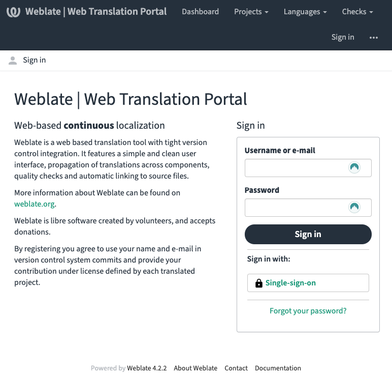

Utilisez Weblate pour traduire et personnaliser le texte sur l'ensemble de la plateforme Vendasta. Accédez-y depuis `Partner Center` → `Administration` → `Translate and customize` ou sur [weblate.apigateway.co](https://weblate.apigateway.co/). Connectez-vous avec `Single-sign-on` en utilisant vos identifiants Vendasta.

## Qu'est-ce que Weblate ?

Weblate est une base de données centralisée pour tout le contenu textuel de Vendasta. En tant que partenaire, vous pouvez contribuer des traductions à l'écosystème Vendasta. Pour en savoir plus sur le logiciel, consultez [weblate.org](https://weblate.org/en/).

## Pourquoi utiliser Weblate ?

La traduction est souvent manuelle, lente et sujette aux erreurs. Weblate automatise la synchronisation afin que le texte source et les traductions restent alignés entre les applications et Weblate.

## Langues prises en charge

Les langues prises en charge incluent le tchèque, le néerlandais, le français, l'allemand et l'espagnol. Consultez l'état et la couverture sur [Weblate Languages](https://weblate.apigateway.co/languages/).

## Ce que vous pouvez traduire

- Business App
- Produits O&O
- Partner Center
- Task Manager

## Traduire du texte

1. Allez dans [Partner Center](http://partners.vendasta.com/) → `Administration` → `Translate and customize`, ou ouvrez [weblate.apigateway.co](https://weblate.apigateway.co/).
2. Connectez-vous avec `Single-sign-on` et vos identifiants Vendasta.
3. Dans Weblate : `Languages` → `Browse all languages` et cliquez sur la langue souhaitée.
4. Cliquez sur le **projet** que vous souhaitez traduire (par exemple Business App), puis sur le **composant** (par exemple Executive Report), puis sur `Translate` à droite.
5. Dans la vue de traduction, vous voyez l'original (en anglais) et une zone de texte pour votre traduction. Après chaque entrée, cliquez sur `Save` ou `Suggest` (selon vos permissions) ; vous passez automatiquement à l'unité suivante.

Pour en savoir plus sur les flux de travail : [Documentation Weblate – Traduction](https://docs.weblate.org/en/weblate-4.2.2/user/translating.html).

## Personnaliser le texte (traduction en marque blanche)

Pour personnaliser le texte destiné à vos clients :

1. Dans Weblate, ouvrez le **projet** que vous souhaitez personnaliser (par exemple Business App) et le **composant** (par exemple Executive Report).
2. Au bas de la liste des langues, cliquez sur `Create white-labeled translation`.
3. Sélectionnez une langue dans la liste et cliquez sur `Create`.
4. La nouvelle traduction est créée peu après ; ouvrez-la depuis la page du composant.

## Niveaux de permission

Il existe deux niveaux de permission dans Weblate :

| Rôle | Ce que vous pouvez faire |
|------|----------------|
| **Viewer** | Consulter toutes les traductions globales, faire des suggestions et créer des traductions en marque blanche visibles uniquement par vos clients |
| **Trusted Translator** | Tous les privilèges de Viewer, plus la possibilité d'examiner les suggestions des Viewer et de contribuer directement aux traductions globales |

Pour devenir Trusted Translator, contactez votre représentant Vendasta.

## Foire aux questions

Quelles langues sont prises en charge ?

Dans Weblate, cliquez sur `Browse All Languages` pour des statistiques à jour. Les langues prises en charge incluent le tchèque, le néerlandais, le français, l'allemand et l'espagnol.

Comment puis-je ajouter une langue ?

Contactez votre représentant Vendasta pour les besoins de traduction non satisfaits.

Quelles parties de la plateforme prennent en charge les traductions ?

Dans Weblate, cliquez sur `Browse All Projects` pour voir les projets disponibles.

Comment puis-je contribuer à une traduction ?

Suivez la visite vidéo de démarrage rapide dans Weblate pour votre première contribution ; consultez les Quick Links qui s'y trouvent pour plus de documentation.

Quand les suggestions de traduction sont-elles examinées ?

Généralement dans un délai de 30 jours.

Que se passe-t-il si seule une partie du site est traduite ?

Une langue peut ne pas avoir une couverture de 100 %. Le contenu non traduit revient à l'anglais par défaut.

Comment les traductions incorrectes ou inappropriées sont-elles évitées ?

Seuls les Trusted Translators peuvent mettre à jour les traductions globales (le contenu visible par tous les utilisateurs).

Puis-je limiter mes utilisateurs à des langues spécifiques uniquement ?

Pas pour le moment.

Pourquoi y a-t-il du HTML dans le texte ?

Certains éléments HTML sont conservés en ligne afin que les traducteurs voient des phrases et une structure complètes ; cela aide à comprendre le contexte.

Pourquoi y a-t-il des accolades dans le texte ?

Les accolades marquent l'endroit où du contenu dynamique ou paramétré est substitué. Ne modifiez pas le texte à l'intérieur des accolades.

Comment traduire les e-mails ?

Les modèles d'e-mails traduisibles se trouvent dans le projet Email Templates sur Weblate.

Comment traduire les vidéos ?

Les fichiers de sous-titres vidéo traduisibles se trouvent dans le projet Video Captions sur Weblate.

Comment Weblate gère-t-il les pluriels, les genres et les déclinaisons ?

La technologie d'internationalisation actuelle ne prend pas entièrement en charge les déclinaisons.

Weblate est-il disponible pour tous les niveaux d'abonnement ?

Les traductions et contributions Weblate sont disponibles uniquement à partir de l'abonnement Premium et au-dessus.

