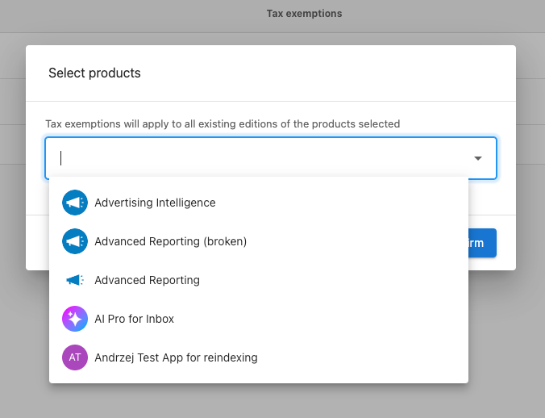
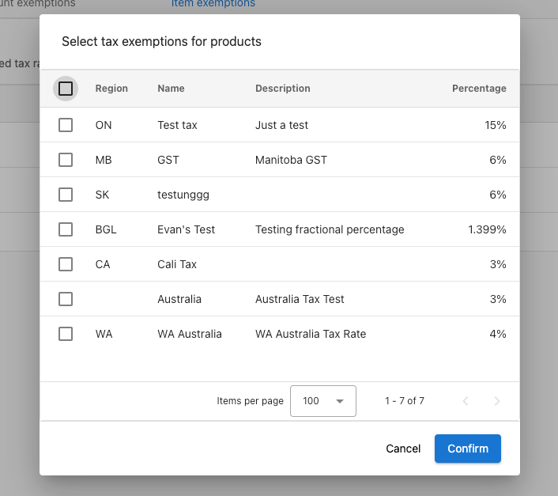

Configurez les taux de taxe, appliquez des exonérations et assurez des calculs de taxe précis sur les factures, les commandes, la facturation d'abonnement et les achats dans le panier. Le système applique automatiquement les règles de taxe en fonction des adresses des clients et de leur statut d'exonération.

## Ce que vous pouvez configurer

- **Taux de taxe** – Définissez et modifiez les taux par région ; le système les applique à partir des adresses des clients
- **Exonérations d'articles** – Excluez des produits ou forfaits spécifiques de certains taux de taxe
- **Exonérations de comptes** – Exonérez des comptes entiers (par ex. gouvernement, tribal, ONG, éducation, religieux)
- **Logique basée sur l'adresse** – La taxe est déterminée par le code postal ; l'absence d'adresse ou de code postal signifie qu'aucune taxe n'apparaît dans les opportunités

## Créer un taux de taxe

1. Allez dans `Partner Center` → `Administration` → `Tax Rates`
2. Cliquez sur `Create Tax Rate`
3. Saisissez le pays, l'état ou la province, le nom et le taux, ainsi qu'une description facultative
4. Cliquez sur `Save`

## Modifier les taux de taxe

1. Allez dans `Partner Center` → `Administration` → `Tax Rates`
2. Trouvez le taux de taxe à modifier et ouvrez le `kebab menu` (trois points)
3. Choisissez `Edit`, mettez à jour les champs, puis cliquez sur `Save`

Les modifications ne s'appliquent qu'aux nouvelles transactions ; les factures existantes conservent leur taxe d'origine.

## Exigences d'adresse pour la taxe

Les calculs de taxe nécessitent une adresse client complète avec un code postal. Si un compte n'a pas d'adresse avec code postal, le système n'affichera aucun taux de taxe dans les opportunités. Gardez les adresses complètes et à jour afin que la juridiction et les taux appropriés s'appliquent.

## Exonérations d'articles

Excluez des produits ou forfaits spécifiques de certains taux de taxe :

1. Allez dans `Partner Center` → `Administration` → `Tax Rates`
2. Ouvrez `Item Exemptions` et cliquez sur `Add Items`
3. Sélectionnez les produits ou forfaits à exonérer et choisissez de quels taux de taxe ils sont exonérés
4. Cliquez sur `Save`

Les articles exonérés ignorent automatiquement ces taxes sur les commandes et la facturation d'abonnement.

## Exonérations de comptes

Pour les clients exonérés de taxe (par ex. organismes gouvernementaux, conseils tribaux, ONG) :

1. Allez dans `Partner Center` → `Administration` → `Tax Rates`
2. Ouvrez `Account Exemptions` et cliquez sur `Add Account`
3. Sélectionnez le compte et choisissez les taux de taxe à exonérer (seuls les taux applicables à l'emplacement du compte sont affichés)
4. Cliquez sur `Save`

Le compte est alors exonéré des taxes sélectionnées sur tous les produits et services.

## Scénarios complexes

- **Produits numériques** – Les règles peuvent varier selon le type de produit, la méthode de livraison et la juridiction ; configurez les taux et les exonérations en fonction de vos règles.
- **Juridictions multiples** – Utilisez des taux et des règles d'exonération différents par région ; conservez les certificats d'exonération lorsque requis.
- **Organisations exonérées de taxe** – Utilisez les exonérations de comptes pour les entités gouvernementales, tribales, les ONG, l'éducation et le domaine religieux, selon le cas.

## Questions fréquentes

Que se passe-t-il si le compte d'un client n'a pas d'adresse ?

Sans adresse incluant un code postal, le système n'affiche aucun taux de taxe dans les opportunités, donc aucune taxe n'est appliquée tant que l'adresse n'est pas complète.

Puis-je exonérer des produits spécifiques de toutes les taxes ?

Oui. Utilisez **Item Exemptions** pour sélectionner des produits ou forfaits et choisir de quels taux de taxe ils sont exonérés.

Comment gérer les clients exonérés de taxe comme les organismes gouvernementaux ?

Utilisez **Account Exemptions** sous **Tax Rates**. Ajoutez le compte et sélectionnez les taux de taxe à exonérer en fonction de son statut et de son emplacement.

Les exonérations s'appliquent-elles à la facturation récurrente ?

Oui. Les exonérations d'articles et de comptes s'appliquent automatiquement aux commandes et à la facturation d'abonnement une fois configurées.

Puis-je modifier les taux de taxe après l'existence de factures ?

Oui. Les modifications ne s'appliquent qu'aux nouvelles transactions ; les factures existantes conservent leurs calculs de taxe d'origine.

Que faire si les taux de taxe changent dans ma juridiction ?

Modifiez le taux sous `Administration` → `Tax Rates` (menu kebab → `Edit`). Les nouveaux taux ne s'appliquent qu'aux transactions futures.

## Vidéo : Appliquer des exonérations de taxe

<iframe src="https://www.youtube-nocookie.com/embed/zEUKJFFfh1k" width="560" height="315" frameBorder="0" allow="accelerometer; autoplay; clipboard-write; encrypted-media; gyroscope; picture-in-picture" allowFullScreen></iframe>
