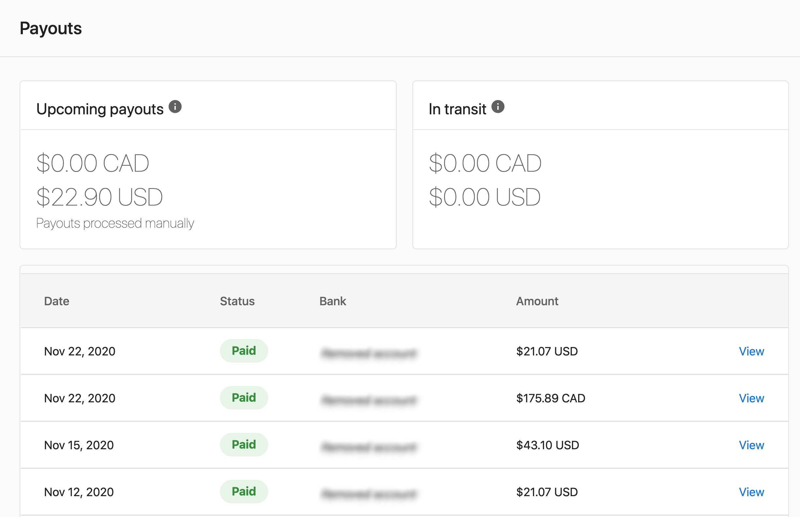
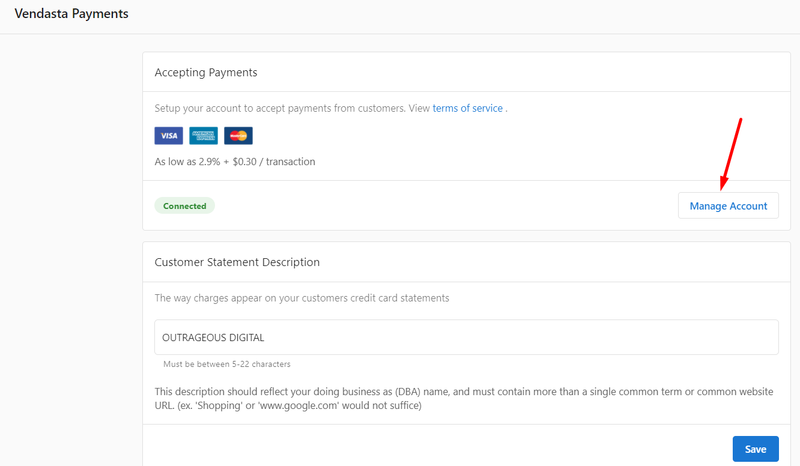
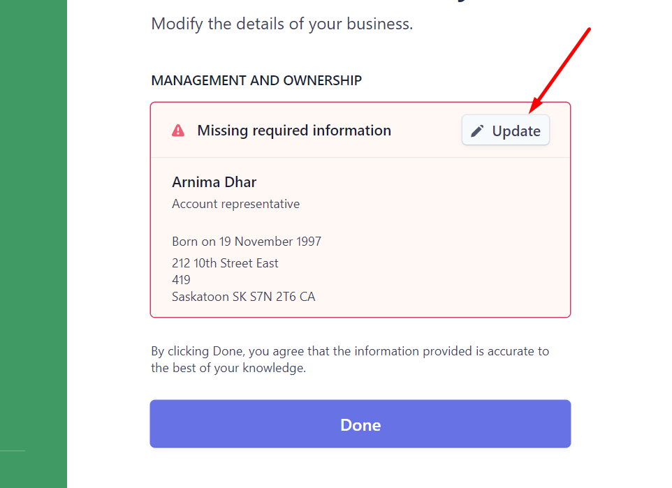

## Qu'est-ce que Vendasta Payments ?

Facturez et percevez le paiement de tous vos services via une plateforme unique et intégrée. Offrez à vos clients locaux une expérience d'achat fluide, le tout au même endroit et sous votre marque.

:::info Sécurité des paiements
Vendasta maintient un rapport SOC 2® Type 2 à jour couvrant ses contrôles de sécurité, et les paiements sont traités via Stripe. Pour plus de détails sur la sécurisation des données de paiement et de la plateforme, consultez [Sécurité et confidentialité](/getting-started/security-and-privacy) ou visitez le [Vendasta Trust Center](https://trust.vendasta.com/).
:::

  

    <iframe
      src="https://fast.wistia.net/embed/iframe/ayjibivt6o?web_component=true&seo=true"
      title="Vendasta Payments and Billing Setup Walkthrough"
      allow="autoplay; fullscreen"
      allowTransparency
      frameBorder="0"
      scrolling="no"
      className="wistia_embed"
      name="wistia_embed"
      width="100%"
      height="100%"
    ></iframe>
  

## Que comprend la configuration de Vendasta Payments ?

### Options de configuration de compte
- **Nouveau compte Vendasta Payments** : Créez un nouveau compte de traitement Vendasta Payments
- **Connexion d'un compte Stripe** : Connectez votre compte Stripe Standard existant
- **Vérification du compte** : Complétez les exigences de vérification d'identité
- **Configuration bancaire** : Configurez les destinations de versement et les informations financières

### Moyens de paiement pris en charge
- Cartes de crédit et de débit (Visa, Mastercard, American Express, Discover)
- Virements ACH
- Débits préautorisés (PAD)

### Disponibilité régionale
Vendasta Payments est disponible dans les pays suivants :
- États-Unis, Canada, Nouvelle-Zélande, Australie, Royaume-Uni, République tchèque
- Pays supplémentaires avec assistance commerciale : Allemagne, Belgique, Pays-Bas, Pologne, Suisse

## Comment configurer Vendasta Payments

### Prérequis : Ma facturation

Avant de configurer Vendasta Payments, assurez-vous que vos informations de facturation sont correctement configurées dans `Partner Center` → `Administration` → `My billing`. Les paramètres suivants doivent être complets :

- **Contact de facturation** : Les coordonnées de votre entreprise
- **Moyen de paiement** : Carte de crédit enregistrée (non requis si vous êtes actuellement facturé par Vendasta via facture)

Ces paramètres sont nécessaires pour être facturé des coûts de gros associés à l'activation des produits et services.

### Configuration standard d'un compte Vendasta Payments

<iframe src="https://www.loom.com/embed/df6a770f5aef4db2935b81683559f7e9" frameborder="0" width="100%" height="400px" allowfullscreen></iframe>

Avant de commencer le processus de configuration, vous devez consulter et accepter les [conditions d'utilisation](https://www.vendasta.com/terms/terms-of-service/) supplémentaires associées à l'utilisation de Vendasta Payments.

Pour créer un nouveau compte Vendasta Payments :

1. Accédez à `Administration` → `Commerce Settings` → `Vendasta Payments`
2. Cliquez sur **Set up Vendasta Payments** pour créer votre compte Stripe
3. Fournissez les informations requises suivantes :
   - **Raison sociale** (doit correspondre exactement au nom associé à votre numéro d'identification fiscale)
   - **Numéro d'entreprise**
     - Pour les entreprises américaines : Employer Identification Number (EIN)
     - Pour les entreprises canadiennes : numéro d'entreprise de l'Agence du revenu du Canada (ARC)
     - [En savoir plus sur la vérification d'identité](https://stripe.com/docs/connect/identity-verification)
   - **Nom commercial** de votre entreprise (votre nom « faisant affaire sous », si différent de la raison sociale)
   - **Adresse commerciale enregistrée** ou adresse personnelle (si vous n'avez pas d'adresse commerciale)
   - **Informations sur le représentant du compte** :
     - Nom légal
     - Adresse personnelle
     - Vérification d'identité (numéro de sécurité sociale complet pour les États-Unis, et pièce d'identité émise par le gouvernement via webcam, téléphone ou téléversement de fichier)
4. Complétez la demande de compte avec toute la documentation requise
5. Configurez les détails bancaires pour les versements
6. Attendez l'approbation du compte (généralement 1 à 2 jours ouvrables)

:::warning
Vendasta Payments n'est pas disponible pour les niveaux d'abonnement Gratuit ou d'Essai. Cette restriction s'applique aux nouveaux utilisateurs et aux non-utilisateurs actuels sur ces niveaux en raison de mesures de prévention de la fraude.
:::

#### Accepter les paiements en ligne

Par défaut, la devise que vous acceptez pour les paiements en ligne est celle que vous utilisez dans votre relation de facturation avec Vendasta (votre devise contractuelle).

Vendasta Payments peut actuellement accepter les paiements des cartes de crédit Visa, Mastercard, American Express et Discover.

Les paiements que vous avez reçus s'affichent sous l'onglet `Partner Center` → `Commerce` → `Payments`.

Après réception de votre premier paiement, Stripe conservera les paiements que vous recevez pendant une semaine maximum. À la fin de cette période, Stripe commencera à verser une partie du solde accumulé, sur une base continue de 7 jours, dans le compte bancaire que vous ajoutez dans les paramètres de versement.

En cas d'échec du paiement, vous pouvez survoler l'icône ⓘ **Information** à côté du statut pour plus d'informations.

#### Description sur le relevé du client

La description du relevé client que vous définissez lors de la configuration de Vendasta Payments apparaît sur les relevés de carte de crédit de vos clients et sert à clarifier un paiement effectué pour vos produits ou services.

L'utilisation d'un descripteur de relevé clair, précis et reconnaissable réduit le risque de rétrofacturations et de litiges, car il aide vos clients à se souvenir de l'origine d'un débit ou d'un paiement.

Par défaut, « Vendasta » apparaît sur les relevés de carte de crédit des clients lorsqu'ils effectuent un paiement. Vous pouvez remplacer ce descripteur de relevé par le nom de votre propre entreprise en saisissant cette information lors de la configuration de Vendasta Payments. Vous pouvez utiliser jusqu'à 22 caractères pour votre description de relevé.

### Connecter votre compte Stripe existant

Si vous disposez déjà d'un compte Stripe Standard, vous pouvez le connecter à Vendasta Payments pour profiter de fonctionnalités de facturation complètes, incluant la facturation, les abonnements et les paiements.

#### Exigences pour la connexion Stripe
- Vous utilisez déjà Stripe pour percevoir les paiements de vos clients
- Vous facturez dans une devise prise en charge par Vendasta Payments
- Vous n'avez pas effectué de transaction à l'aide d'un compte connect personnalisé de Vendasta
- Votre compte Stripe connecté est enregistré dans un pays pris en charge par Vendasta Payments

#### Moyens de paiement pris en charge avec la connexion Stripe
- Cartes de crédit et de débit
- Virements ACH
- Débits préautorisés (PAD)

#### Frais de traitement avec un compte Stripe connecté
- **Crédit/Débit/Débit bancaire** : Vos frais Stripe existants restent inchangés
- **Frais de plateforme** : 0,75 % du montant de la transaction

#### Processus de connexion
1. Accédez à `Administration` → `Commerce Settings` → `Vendasta Payments`
2. Sélectionnez l'option `Connect Stripe Account`

3. Choisissez le compte Stripe que vous souhaitez connecter à Vendasta Payments. Si vous avez plusieurs comptes Stripe, il vous sera demandé de sélectionner celui à connecter.

4. Consultez et acceptez les conditions de connexion
5. Terminez le processus d'intégration

:::info
Cette fonctionnalité n'est actuellement disponible que pour les nouveaux utilisateurs qui n'ont pas encore effectué de transactions avec des comptes générés par la plateforme.
:::

## Comment configurer les versements

Pour accéder à vos paramètres de versement, accédez à `Partner Center` → `Commerce` → `Payouts` ou à `Administration` → `Commerce Settings` → `Vendasta Payments`.

### Comment configurer les comptes bancaires

Vous pouvez recevoir des versements provenant des paiements en ligne par carte de crédit dans un ou plusieurs comptes bancaires en saisissant les détails de votre compte dans Stripe.

Si vous n'avez pas de relation bancaire dans chaque pays où vous exercez vos activités, mais souhaitez ajouter un compte bancaire dans un autre pays, contactez [support@vendasta.com](mailto:support@vendasta.com) pour plus d'informations.

Lors de la configuration de votre premier compte bancaire pour les versements :

1. Accédez à l'onglet `Administration`
2. Accédez à `Commerce Settings` → `Vendasta Payments`
3. Cliquez sur `Add Bank Account` sous Receiving Payout
4. Saisissez les détails de votre compte bancaire :
   - Type de titulaire du compte (Particulier ou Entreprise)
   - Nom du particulier (si Particulier est sélectionné) ou nom de l'entreprise (si Entreprise est sélectionné)
   - Numéro de compte bancaire
   - Numéro d'acheminement bancaire
5. Définissez ce compte comme compte par défaut pour les versements

:::tip
Si vous avez déjà un compte bancaire connecté et souhaitez le remplacer, vous devez d'abord ajouter un nouveau compte bancaire. Une fois le nouveau compte ajouté, vous pouvez le définir comme compte par défaut, puis supprimer l'ancien compte bancaire.
:::

### Définir un compte bancaire par défaut

Si vous ajoutez plusieurs comptes bancaires pour recevoir des versements, vous devez sélectionner un compte par défaut pour spécifier lequel reçoit vos versements. Vous pouvez modifier votre compte bancaire par défaut à tout moment depuis le tableau de bord Stripe.

### Comment configurer des comptes bancaires en plusieurs devises

Dans les pays pris en charge, vous pouvez ajouter plusieurs comptes bancaires pour recevoir des versements dans différentes devises sans frais de conversion :

1. Ajoutez un compte bancaire par devise de règlement prise en charge
2. Sélectionnez une devise de règlement par défaut (que vous pouvez modifier à tout moment)
3. Les paiements reçus dans les devises configurées sont réglés sans conversion
4. Les paiements dans des devises non configurées sont automatiquement convertis dans votre devise par défaut

**Exemple :** Un compte basé au Royaume-Uni avec des comptes bancaires en GBP et en USD (GBP comme devise par défaut) :
- Les paiements en USD vont vers le compte USD sans conversion
- Les paiements en GBP vont vers le compte GBP
- Toutes les autres devises sont converties en GBP et vont vers le compte GBP

### Modifier votre devise de versement

Par défaut, les versements sont effectués vers votre compte bancaire dans votre devise par défaut. Cependant, vous pouvez ajouter une nouvelle destination de versement et choisir de convertir vos fonds dans une devise différente avant leur dépôt dans un compte bancaire. Stripe peut facturer des frais pour la conversion de devise ; consultez la [documentation Stripe](https://stripe.com/docs/payouts) pour en savoir plus.

## Comprendre votre compte Stripe Vendasta Payments

Lorsque vous configurez Vendasta Payments, un compte Stripe est créé et lié à votre compte Vendasta. Ce compte est distinct de tout compte Stripe personnel que vous pourriez déjà avoir.

### Compte Stripe Vendasta Payments et compte Stripe personnel

- Votre **compte Stripe Vendasta Payments** ne peut être utilisé qu'au sein de Vendasta. Il ne peut pas être utilisé avec d'autres plateformes.
- Si vous avez un **compte Stripe personnel**, ce compte peut être utilisé aussi bien à l'intérieur qu'à l'extérieur de Vendasta.

### Accès au tableau de bord Stripe

Vous n'avez pas d'accès direct au tableau de bord Stripe. Les rapports de paiements et de versements sont disponibles dans Partner Center sous `Commerce` → `Payments` et `Commerce` → `Payouts`.

### Modifier votre type d'entreprise

Si vous avez sélectionné le mauvais type d'entreprise lors de la configuration de Vendasta Payments (par exemple, Entreprise plutôt que Particulier), contactez [billingsupport@vendasta.com](mailto:billingsupport@vendasta.com) pour faire corriger cette information.

## Gérer les informations du compte

### Mettre à jour le nom de votre entreprise

Il existe deux paramètres de nom d'entreprise distincts pour Vendasta Payments, et ils contrôlent des éléments différents :

| Paramètre | Ce qu'il contrôle | Où le modifier |
|---|---|---|
| **Raison sociale Stripe** | Votre nom légal pour les versements, la conformité et les déclarations fiscales | Tableau de bord Stripe → `Settings` → `Account details` |
| **Nom d'affichage Partner Center** | Le nom affiché aux clients sur les écrans de paiement de facture et les relevés de carte de crédit | `Partner Center` → `Administration` → `Business Profile` |

Garder ces deux paramètres alignés évite toute confusion où les clients verraient un nom différent de celui attendu lors du paiement d'une facture.

**Pour mettre à jour votre raison sociale dans Stripe :**

1. Connectez-vous à votre compte Stripe via le lien dans `Administration` → `Commerce Settings` → `Vendasta Payments` → `Manage Account`
2. Accédez à `Settings` → `Account details`
3. Mettez à jour le champ **Legal business name**
4. Enregistrez vos modifications

:::warning
La modification de votre raison sociale dans Stripe peut déclencher une nouvelle vérification d'identité. Les versements peuvent être brièvement suspendus pendant que Stripe examine la modification.
:::

**Pour mettre à jour le nom affiché sur les écrans de paiement de facture des clients :**

1. Accédez à `Partner Center` → `Administration` → `Business Profile`
2. Mettez à jour le champ **Business name**
3. Enregistrez vos modifications

### Mettre à jour les informations de propriété
Pour remplacer les détails de propriété de votre compte de paiement :

1. Accédez à `Administration` → `Commerce Settings` → `Vendasta Payments`
2. Dans la section `Accepting Payments`, cliquez sur `Manage Account`
3. Sur la page Identity Verification, cliquez sur `Update` à côté du propriétaire actuel
4. Complétez le formulaire d'informations du nouveau propriétaire
5. Retirez l'ancien propriétaire en cliquant sur `Remove Person` → `Done`

### Mettre à jour l'adresse de facturation
Pour modifier l'adresse apparaissant sur les factures des clients :

1. Allez dans `Administration` → `My billing`
2. Cliquez sur `Billing Contact`
3. Mettez à jour les informations d'adresse selon vos besoins
4. Enregistrez les modifications

Les adresses mises à jour apparaîtront sur toutes les futures factures des clients.

## Conditions d'utilisation destinées aux clients pour le traitement des paiements

Vos clients doivent accepter les conditions d'utilisation qui s'appliquent au traitement des paiements lorsqu'ils règlent une commande de service. Ces conditions expliquent que Vendasta facilite la collecte des paiements en votre nom, et fournissent des informations sur la façon dont les remboursements, les litiges et d'autres détails spécifiques aux paiements sont gérés.

Cela permet de limiter votre responsabilité en cas de litige de paiement avec vos clients. Dans la plupart des juridictions, vous êtes légalement tenu d'avoir des conditions qui s'appliquent spécifiquement au traitement des paiements lors de l'acceptation de paiements.

Ces conditions ont été rédigées dans un souci de protection du partenaire et de minimisation de votre responsabilité. Tous les partenaires utilisant Vendasta Payments devraient laisser ce paramètre activé afin que ces conditions s'affichent lorsque le client effectue un paiement. Il est déconseillé de désactiver ces conditions, car cela peut augmenter votre responsabilité.

## Dépannage des problèmes de configuration

### Erreur « Unsupported in Your Area »
Si vous voyez ce message alors que vous vous trouvez dans une région prise en charge :

1. Accédez à `Administration` → `My billing`
2. Vérifiez que les informations de votre contact de facturation sont complètes
3. Assurez-vous que votre adresse de facturation est entièrement renseignée, code postal inclus
4. Enregistrez toute information manquante et réessayez la configuration

L'absence d'informations d'adresse de facturation empêche l'activation de Vendasta Payments, même dans les régions prises en charge.

### Aucune option de configuration disponible
Si vous ne voyez pas les options de configuration de Vendasta Payments, cela indique généralement que :
- Votre compte est sur un niveau Gratuit ou d'Essai (une mise à niveau est requise)
- Vous vous trouvez dans une région géographique non prise en charge
- Votre compte comporte des restrictions empêchant l'utilisation de Vendasta Payments

### Pays du compte Stripe non pris en charge
Si la connexion de votre compte Stripe est indisponible ou échoue pendant la configuration :

1. Confirmez que votre compte Stripe connecté est enregistré dans un pays pris en charge par Vendasta Payments
2. Si nécessaire, connectez un compte Stripe enregistré dans un pays pris en charge
3. Si vous n'êtes pas certain des pays pris en charge pour votre configuration, contactez [support@vendasta.com](mailto:support@vendasta.com)

## Guides vidéo pas à pas

Cette section contient deux séries de vidéos pour vous aider à configurer Vendasta Payments et à comprendre le fonctionnement des différents composants.

### Vidéos de configuration pas à pas

Regardez les vidéos suivantes pour un guide pas à pas de la configuration de tous les composants de Vendasta Payments :

#### 1. Configurer les paiements

<iframe src="//fast.wistia.com/embed/iframe/6ar0gt02w5" width="560" height="315" frameBorder="0" allowFullScreen></iframe>

#### 2. Définir la devise et le prix de détail

<iframe src="//fast.wistia.com/embed/iframe/1v9ge9w7cy" width="560" height="315" frameBorder="0" allowFullScreen></iframe>

#### 3. Mettre à jour les forfaits existants

<iframe src="//fast.wistia.com/embed/iframe/sbzyunnepn" width="560" height="315" frameBorder="0" allowFullScreen></iframe>

#### 4. Configurer les forfaits pour Buy-It-Yourself

<iframe src="//fast.wistia.com/embed/iframe/zz1xdea7bj" width="560" height="315" frameBorder="0" allowFullScreen></iframe>

#### 5. Appliquer les taxes

<iframe src="//fast.wistia.com/embed/iframe/57z3ynyeba" width="560" height="315" frameBOrder="0" allowFullScreen></iframe>

### Comprendre les composants de Vendasta Payments

Ces vidéos aident à expliquer le fonctionnement des différents éléments au sein de Vendasta Payments :

#### Comment BIY fonctionne-t-il avec Business App ?

<iframe src="//fast.wistia.com/embed/iframe/7fh8sbaf2e" width="560" height="315" frameBorder="0" allowFullScreen></iframe>

#### Comment BIY fonctionne-t-il avec le Store ?

<iframe src="//fast.wistia.com/embed/iframe/7nyr2st4i0" width="560" height="315" frameBorder="0" allowFullScreen></iframe>

#### Comment fonctionne la facturation ?

<iframe src="//fast.wistia.com/embed/iframe/dpkqrtbr41" width="560" height="315" frameBorder="0" allowFullScreen></iframe>

#### Comment fonctionnent les paiements et les versements ?

<iframe src="//fast.wistia.com/embed/iframe/23ixlvylkr" width="560" height="315" frameBorder="0" allowFullScreen></iframe>

## Questions courantes sur la configuration de Vendasta Payments

Quels sont les frais pour connecter mon propre compte Stripe ?

Vous paierez des frais de plateforme de 0,75 % en plus de vos frais Stripe négociés existants. Vos taux Stripe actuels restent inchangés.

Puis-je transférer les détails de paiement des clients depuis mon compte Stripe existant ?

Actuellement, le transfert automatique des informations de paiement des clients n'est pas disponible. Vous devrez saisir manuellement les détails de paiement dans la plateforme.

Pourrai-je voir les paiements après avoir connecté mon compte Stripe ?

Oui, vous pouvez consulter les détails des paiements traités via la plateforme. Cependant, les informations de versement doivent être consultées directement dans votre compte Stripe.

Puis-je ajouter mon propre compte Stripe si j'utilise déjà un compte de la plateforme ?

Cette fonctionnalité n'est actuellement disponible que pour les nouveaux utilisateurs qui n'ont pas encore effectué de transactions avec des comptes générés par la plateforme.

Vendasta facture-t-il des frais Stripe supplémentaires lorsque je connecte mon propre compte Stripe ?

Non, vous conservez vos frais Stripe négociés. Vendasta facture uniquement des frais de plateforme de 0,75 % sur le montant de la transaction.

Si j'ai besoin d'assistance pour mon compte Stripe personnel, puis-je contacter Vendasta ?

En raison d'un accès limité au compte, toute assistance concernant les comptes Stripe personnels doit être traitée directement avec Stripe.

Pourquoi Vendasta Payments n'est-il pas disponible sur les niveaux Gratuit et Essai ?

En raison de l'augmentation des transactions frauduleuses, Vendasta Payments est restreint sur les niveaux Gratuit et Essai. Les utilisateurs existants sur ces niveaux qui utilisent déjà le service conservent leur accès.

Si je crée une connexion Stripe via Vendasta Payments, puis-je accéder à mon compte Stripe ?

Non, l'accès Stripe est réservé au Billing Support. Si vous avez besoin d'aide avec votre compte Vendasta Payments, veuillez soumettre un ticket à billingsupport@vendasta.com.

