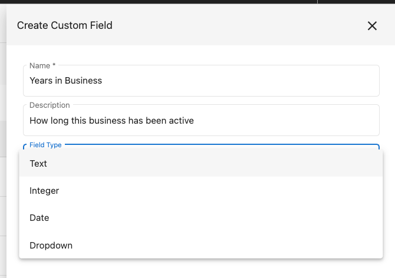

# Objets CRM

Les objets CRM et les champs personnalisés vous permettent de stocker et d'utiliser des données propres à votre activité sur les comptes, les utilisateurs, les commandes et les produits. Définissez les champs une seule fois, puis utilisez-les pour segmenter le marketing, automatiser les ventes et gérer les données via des imports ou l'API.

## Que sont les champs personnalisés ?

<iframe src="//fast.wistia.com/embed/iframe/3vkidhas6i" width="560" height="315" frameborder="0" allowfullscreen=""></iframe>

Les champs personnalisés vous permettent de créer des champs uniques pour les informations qui comptent pour vous sur les comptes, les utilisateurs, les commandes et les produits. Vous pouvez ensuite segmenter et personnaliser le marketing, automatiser les processus de vente et réaliser le travail avec moins d'effort.

## Pourquoi les champs personnalisés sont importants

Chaque activité a besoin de données différentes. Les champs personnalisés vous permettent de définir uniquement ce que vous utilisez au quotidien. Par exemple :

- Envoyer une campagne « débutant » aux cabinets dentaires comptant moins de 100 patients et une campagne « établi » à ceux qui en ont plus
- Stocker l'équipe de football préférée d'un utilisateur pour amorcer la conversation lors des ventes
- Attribuer automatiquement un vendeur ou une équipe à un compte en fonction du revenu estimé

## Comment fonctionnent les champs personnalisés

**Définir d'abord les champs**

Avant de pouvoir stocker des données, définissez le champ dans `Partner Center` → `Administration` → `Custom Fields`. Choisissez le type d'objet auquel les données appartiennent (compte, utilisateur, commande ou produit). Par exemple, « nombre de chambres d'hôtel » convient à un compte, pas à des utilisateurs individuels.

Après avoir cliqué sur **Create Custom Field**, saisissez un **Name** et un **Field Type**. Le type de champ détermine quelles valeurs peuvent être stockées et comment le champ peut être filtré et trié dans les automatisations.

## Types de champs

| Type de champ | Exemples de noms | Exemples de valeurs | Types de filtres d'automatisation |
| --- | --- | --- | --- |
| Texte | race de chien préférée, dernier type d'événement, premier contenu téléchargé | golden retriever, basketball, livre de règles | Is any value, Is missing, Contains, Does not contain, Is one of, Is not one of |
| Entier | nombre d'employés, score de contact client, nombre d'emplacements | 4, -2, 100 | Less than or equal to, Equals, Greater than |
| Date | date de naissance, meilleure journée de vente, date de suppression manuelle | 13 août 1991, 14 févr. 2022, 22 mars 2233 | After, Before |
| Liste déroulante | niveau de service, forfait initialement acheté, priorité d'appel | Silver, Gold, Platinum | Is, Is not |
| Devise | budget mensuel préféré, revenu moyen par client, dépense externe | USD 1000, CAD 10,50, THB 50000 | Less than or equal to, Greater than |

## Saisir des données personnalisées

Vous pouvez remplir les champs personnalisés :

- En bloc en important une liste de comptes
- Via l'API publique de Vendasta
- En modifiant les enregistrements manuellement là où les champs apparaissent

## Champs de compte et champs d'entreprise : comportement de synchronisation

Des champs personnalisés peuvent être créés pour différents types d'objets. Lorsque vous travaillez avec des **comptes** et des **entreprises**, le comportement de synchronisation diffère d'une manière importante :

- **Les champs de compte** se synchronisent de manière bidirectionnelle avec les fiches d'entreprise liées : les mises à jour sur le compte apparaissent sur l'entreprise, et inversement.
- **Les champs d'entreprise** ne se synchronisent pas vers les comptes : les données saisies dans les champs personnalisés d'une entreprise n'apparaîtront pas sur les fiches de compte liées.

Si vous avez besoin que les données circulent entre les comptes et les entreprises, définissez le champ comme un champ **account**.

### Archiver un champ en double

Si vous avez créé des champs personnalisés en double, archivez les doublons pour garder votre liste de champs claire :

1. Allez dans `Partner Center` → `Administration` → `Custom Fields`
2. Sélectionnez **Account** dans les onglets en haut
3. Recherchez le champ en double
4. Cliquez sur **⋮** à côté du nom du champ
5. Sélectionnez **Archive**

Les champs archivés sont masqués des nouveaux enregistrements, mais leurs données sont conservées.

## Organiser l'affichage des champs sur les fiches

Créer un champ contrôle ce que vous pouvez stocker. Une **disposition de champs** contrôle où il apparaît. Regroupez les champs liés dans des sections nommées, réorganisez-les, choisissez comment les champs non groupés sont triés et masquez les champs que vous n'utilisez pas sans supprimer leurs données.

Pour modifier une disposition, allez dans `Partner Center` → `Administration` → `Custom Fields`, sélectionnez un objet, puis cliquez sur **Organize layout**.

Consultez [Dispositions de champs](./field-layouts.mdx) pour le guide complet.

## Questions fréquentes

Les champs personnalisés créés dans Partner Center peuvent-ils être utilisés dans Business App ?

Non. Les champs personnalisés créés dans Partner Center sont réservés à une utilisation dans Partner Center uniquement. Pour avoir des champs personnalisés sur les comptes dans Business App, créez-les dans `Business App` → `Administration` → `CRM Objects` pour chaque compte.

Y a-t-il une limite de caractères pour la description du champ ?

Oui. La limite est de 4000 caractères.

Pourquoi mes champs personnalisés au niveau de l'entreprise n'apparaissent-ils pas sur les comptes ?

Les champs d'entreprise et les champs de compte se synchronisent différemment. Les champs d'entreprise ne se synchronisent pas vers les fiches de compte. Si vous avez besoin que les données apparaissent à la fois sur le compte et sur l'entreprise, créez le champ comme un champ **account** : les champs de compte se synchronisent de manière bidirectionnelle avec les entreprises liées.

