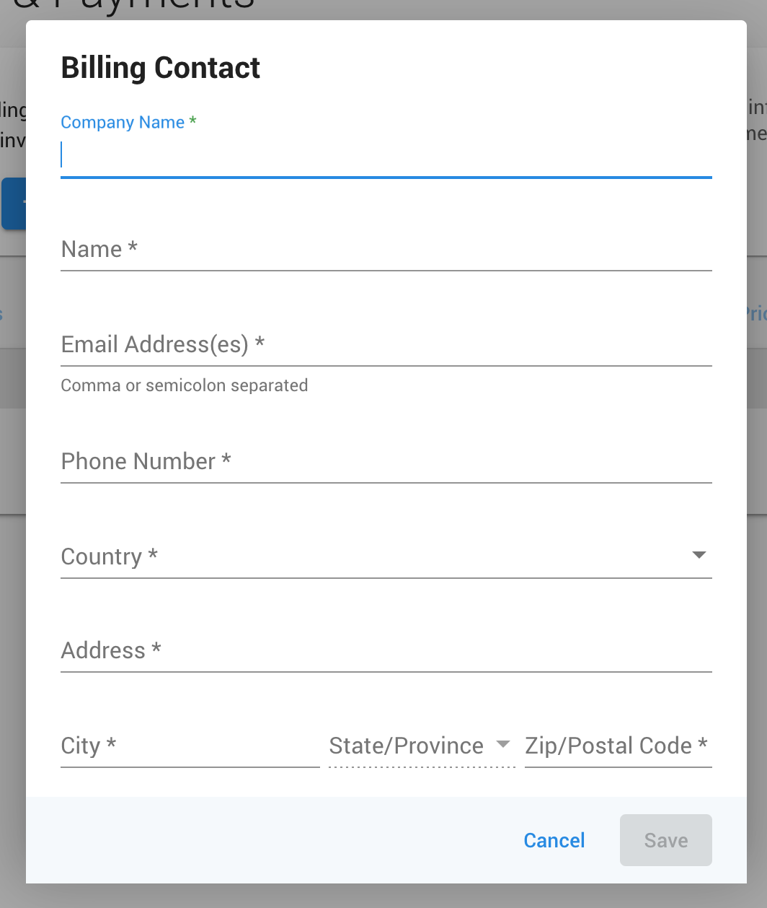

## Que sont les moyens de paiement et la configuration de la facturation ?

Les moyens de paiement et la configuration de la facturation dans Partner Center vous permettent de gérer tous les aspects de vos informations de paiement et de vos contacts de facturation. Cela inclut l'ajout de cartes de crédit, la mise à jour des informations de facturation, la modification des adresses e-mail de facturation et la nouvelle tentative de paiements échoués.

## Pourquoi la gestion des moyens de paiement est-elle importante ?

Des moyens de paiement et des informations de facturation correctement configurés garantissent :
- Un service ininterrompu pour vos produits et abonnements
- Une facturation précise
- Une communication adéquate concernant les questions de facturation
- Une résolution rapide des problèmes de paiement

## Ce que vous pouvez faire avec les moyens de paiement

| Action | Description |
|--------|-------------|
| **Ajouter un moyen de paiement** | Ajoutez les informations de votre carte de crédit pour effectuer des achats |
| **Mettre à jour les informations de facturation** | Modifiez les coordonnées de votre contact de facturation et les informations de votre entreprise |
| **Modifier l'e-mail de facture** | Mettez à jour l'adresse d'envoi des factures |
| **Réessayer les paiements échoués** | Relancez manuellement les paiements ayant échoué |
| **Gérer les problèmes de paiement** | Résolvez les problèmes de carte refusée et de paiement |

## Comment configurer les moyens de paiement

### Ajouter votre première carte de crédit

Pour effectuer des achats sur la plateforme Vendasta, vous devez ajouter vos informations de paiement à la plateforme.

Pour ajouter votre carte de crédit à Partner Center :

1. Accédez à `Administration` → `My billing` → `Add Payment Method`

### Ajouter des informations de facturation complètes

Si vous n'avez pas encore ajouté vos informations de facturation, vous pouvez le faire sous `Partner Center` → `Administration` → `My billing`.

#### Étape 1 : ajouter un contact de facturation

1. Depuis la page My billing, sélectionnez `Add Billing Contact`

2. Remplissez le formulaire en veillant à compléter tous les champs marqués d'un astérisque (*)
3. Une fois terminé, cliquez sur `Save`

#### Étape 2 : ajouter un moyen de paiement

1. Après avoir ajouté les informations de contact de facturation, sélectionnez `Add Payment Method`
2. Le formulaire de moyen de paiement s'affiche :

3. Complétez le formulaire et sélectionnez `Save`

:::note Problèmes de carte refusée
Si vous recevez un message indiquant que la carte a été refusée, la cause probable est que votre établissement bancaire bloque la transaction car il s'agit d'un paiement international. Veuillez contacter votre établissement bancaire et lui demander d'autoriser toutes les transactions de Vendasta Technologies Inc.

:::

## Comment mettre à jour des informations existantes

### Mettre à jour les informations de facturation

Si vous devez mettre à jour vos informations de facturation après leur saisie :

1. Accédez à `Partner Center` → `Administration` → `My billing`
2. Cliquez sur `Edit` dans la section que vous souhaitez modifier

:::tip
Si vous mettez à jour votre carte lors de la confirmation d'une commande dans Partner Center, cela mettra également à jour les informations de facturation dans `My billing`.
:::

### Modifier l'adresse e-mail de facture

Mettre à jour l'adresse e-mail à laquelle nous envoyons les factures est aussi simple que de mettre à jour les informations du contact de facturation :

1. Allez dans `Partner Center` → `Administration` → `My billing` → `Edit Billing contact`

:::tip Plusieurs adresses e-mail de contact de facturation
Vous pouvez ajouter plusieurs adresses e-mail pour recevoir les factures et les notifications de facturation. Dans le formulaire de contact de facturation, saisissez plusieurs adresses séparées par une **virgule** ou un **point-virgule** (par exemple, `billing@yourcompany.com, finance@yourcompany.com`).
:::

## Comment gérer les problèmes de paiement

### Plusieurs cartes de crédit

**Puis-je ajouter plusieurs cartes de crédit à Partner Center ?**

Non, une seule carte de crédit peut être ajoutée à Partner Center. Vous pouvez ajouter ou modifier votre moyen de paiement en allant dans `Administration` → `My billing` → `Add Payment Method`.

Toute tentative d'ajout d'une deuxième carte remplacera la précédente.

### Réessayer les paiements échoués

**Puis-je réessayer un paiement ?**

Oui, vous pouvez réessayer un paiement échoué :

1. Allez dans `Partner Center` → `Administration` → `My billing`
2. Cliquez sur les trois points à côté de l'achat que vous souhaitez payer
3. Sélectionnez `retry`

:::note
Le système met un certain temps à mettre à jour le statut sur `Succeeded` une fois le paiement réussi.
:::

## Que se passe-t-il en cas d'échec d'un paiement

### Calendrier des nouvelles tentatives

Lorsqu'un débit de carte de crédit échoue, la plateforme réessaie automatiquement le paiement jusqu'à **5 fois sur environ 14 jours**. Vous recevrez une notification par e-mail pour chaque tentative échouée.

### Suspension de compte

Si toutes les tentatives échouent :

- **Partenaires facturés instantanément** : après le 14e jour, l'accès à Partner Center et à Business App est bloqué pour les partenaires sous contrat. Les partenaires des formules Starter/Startup sont basculés vers le niveau gratuit.
- **Partenaires facturés sur facture** : votre compte est suspendu 30 jours après l'émission de la facture si aucun paiement n'est reçu.

### Ce qu'il advient des produits actifs

Les produits restent actifs jusqu'à 30 jours après un échec de paiement, mais **ne se renouvellent pas automatiquement** si le paiement n'est pas effectué. Vous devrez réactiver les produits manuellement après avoir résolu le paiement échoué.

### Comment résoudre un paiement échoué

1. Allez dans `Partner Center` → `Administration` → `My billing`
2. Cliquez sur `View Failed Payments`
3. Mettez à jour votre carte de crédit si nécessaire (voir [Mettre à jour les informations de facturation](#mettre-à-jour-les-informations-de-facturation))
4. Réessayez l'achat échoué en utilisant les trois points à côté de l'achat et en sélectionnant `Retry`

Un paiement réussi restaure automatiquement l'accès à votre compte.

## Exigences relatives aux moyens de paiement

### Moyens de paiement acceptés

- Une carte de crédit est requise pour tous les partenaires
- Nous acceptons actuellement Visa, Mastercard et Amex
- Pour toute autre question, contactez billingsupport@vendasta.com

### Paiements internationaux

Si votre établissement bancaire bloque les transactions internationales :
- Contactez votre établissement bancaire
- Demandez-lui d'autoriser toutes les transactions de Vendasta Technologies Inc.
- Cela résoudra la plupart des problèmes de carte refusée

## FAQ

Puis-je utiliser plusieurs cartes de crédit pour différents achats ?

Non, Partner Center ne prend en charge qu'une seule carte de crédit à la fois. Toute nouvelle carte que vous ajoutez remplacera la précédente. Cependant, vous pouvez mettre à jour votre moyen de paiement avant d'effectuer des achats spécifiques si nécessaire.

Que se passe-t-il si mon paiement échoue ?

Si un paiement échoue, vous recevrez une notification. Vous pouvez réessayer manuellement le paiement en allant dans `Partner Center` → `Administration` → `My billing`, en cliquant sur les trois points à côté de l'achat échoué, puis en sélectionnant `retry`.

Comment savoir si mes informations de facturation sont complètes ?

Des informations de facturation complètes incluent à la fois un contact de facturation (informations sur l'entreprise) et un moyen de paiement (carte de crédit). Les deux sections doivent être remplies pour effectuer des achats et recevoir des factures correctes.

Puis-je modifier mes informations de facturation après leur configuration ?

Oui, vous pouvez mettre à jour vos informations de facturation à tout moment en allant dans `Partner Center` → `Administration` → `My billing` et en cliquant sur `Edit` sur la section que vous souhaitez modifier.

Pourquoi ma carte a-t-elle été refusée ?

La raison la plus courante des refus de carte est que votre établissement bancaire bloque les transactions internationales. Contactez votre établissement bancaire et demandez-lui d'autoriser les transactions de Vendasta Technologies Inc.

Comment modifier l'adresse d'envoi de mes factures ?

Pour modifier votre adresse e-mail de facture, mettez à jour les informations de votre contact de facturation en allant dans `Partner Center` → `Administration` → `My billing` → `Edit Billing contact`.

Puis-je envoyer des factures à plusieurs adresses e-mail ?

Oui. Dans vos informations de contact de facturation, vous pouvez saisir plusieurs adresses e-mail séparées par une virgule ou un point-virgule. Toutes les adresses indiquées recevront les factures et les notifications de facturation.

Que se passe-t-il si mon paiement échoue et que je ne le résous pas ?

La plateforme réessaie votre paiement jusqu'à 5 fois sur environ 14 jours. Si toutes les tentatives échouent, l'accès à votre compte est suspendu. Les partenaires sous contrat perdent l'accès à Partner Center et à Business App, tandis que les partenaires Starter/Startup sont basculés vers le niveau gratuit. Les partenaires facturés sur facture sont suspendus 30 jours après la date de facture en l'absence de paiement.

Les produits actifs restent disponibles jusqu'à 30 jours, mais ne se renouvelleront pas. Pour restaurer l'accès, mettez à jour votre moyen de paiement et réessayez les paiements échoués depuis `Partner Center` → `Administration` → `My billing` → `View Failed Payments`.

