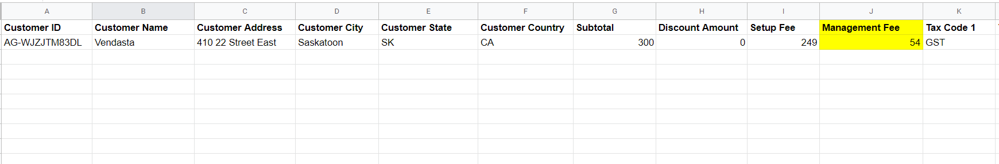

## Que sont les fonctionnalités spéciales et les crédits ?

Les fonctionnalités spéciales et les crédits dans Partner Center incluent la visibilité des frais de gestion, les avoirs pour les services annulés et les crédits virtuels vCash qui peuvent être appliqués à tout achat Vendasta. Ces fonctionnalités offrent une transparence en matière de facturation et des options de paiement flexibles.

## Pourquoi ces fonctionnalités sont-elles importantes ?

Comprendre les fonctionnalités de facturation spéciales vous aide à :
- Suivre les frais supplémentaires associés aux produits
- Gérer les crédits provenant de services annulés
- Appliquer des crédits virtuels pour réduire les coûts
- Maintenir des dossiers financiers précis
- Optimiser vos dépenses grâce aux crédits disponibles

## Ce que vous pouvez faire avec les fonctionnalités spéciales

| Fonctionnalité | Description |
|---------|-------------|
| **Frais de gestion** | Consultez les frais supplémentaires associés à certains produits |
| **Avoirs** | Accédez aux crédits provenant de produits ou services annulés |
| **Crédits vCash** | Utilisez des crédits virtuels pour tout achat Vendasta |
| **Historique des crédits** | Suivez tous les crédits et frais au fil du temps |

## Frais de gestion

### Que sont les frais de gestion ?

Les frais de gestion sont des charges qui s'appliquent à certains produits Vendasta. Ces frais apparaissent comme des lignes distinctes sur votre facture, ce qui facilite l'identification des coûts supplémentaires associés à des produits spécifiques.

### Comment consulter les frais de gestion

#### Sur votre reçu

Les frais de gestion apparaîtront comme des lignes distinctes sur votre reçu :

#### Dans l'onglet `By purchase`

Vous pouvez consulter les frais de gestion dans l'onglet `By purchase` de votre section de facturation :

#### Dans l'onglet `By account`

Vous pouvez également consulter les frais de gestion dans l'onglet `By account`, qui organise les frais par compte d'entreprise :

### Télécharger les rapports de frais de gestion

Pour télécharger un rapport CSV détaillé incluant les frais de gestion :

1. Allez dans l'onglet `By purchase`
2. Cliquez sur l'option `CSV download`

#### Comprendre le format du rapport CSV

Le rapport CSV affichera vos frais de gestion selon le format suivant :

### Factures PDF

Votre facture PDF mensuelle affichera également les frais de gestion sous forme de lignes distinctes :

## Avoirs partenaire

### Que sont les avoirs ?

Un avoir est un reçu émis par Vendasta à un partenaire ayant annulé un produit ou un ou plusieurs services, et auquel des « crédits » sont offerts pour compenser de futurs achats.

### Comment accéder aux avoirs

L'historique de vos avoirs se trouve dans `Partner Center` → `Administration` → `Financial Documents` → `Credit notes`.

### Utiliser les avoirs

Les avoirs représentent :
- Des remboursements pour des produits ou services annulés
- Des crédits pouvant être appliqués à de futurs achats
- Des ajustements au solde de votre compte
- Une documentation pour la tenue de dossiers financiers

## vCash : crédits virtuels

### Qu'est-ce que vCash ?

**vCash** est un crédit virtuel que vous pouvez utiliser pour des achats dans l'écosystème Vendasta. Vous pouvez utiliser vCash pour *tout* achat.

**Exemples d'utilisation possible de vCash :**
- Achat de Reputation AI
- Vos frais d'abonnement
- Achats sur la Marketplace
- Tout achat au sein du système Vendasta

[Cliquez ici pour consulter les conditions générales complètes](http://vendasta.com/vcash-terms-and-conditions/).

### Comment consulter votre solde vCash

Si vous disposez de vCash, vous pouvez consulter votre solde en accédant à [`Partner Center` → `Administration` → `My billing` → `Billing & Payments`](https://partners.vendasta.com/billing/by-purchase).

### Comment utiliser vCash

Lors de la finalisation d'un achat, l'avis suivant s'affichera si vous disposez d'un solde vCash :

Votre solde vCash sera automatiquement appliqué à l'achat. Si le solde est insuffisant pour couvrir l'achat en totalité, le crédit vCash disponible sera appliqué, et seul le montant restant vous sera facturé.

### Règles d'application de vCash

- vCash est automatiquement appliqué aux achats éligibles
- Si votre solde vCash est inférieur au montant de l'achat, le solde restant sera facturé sur votre moyen de paiement
- vCash peut être utilisé pour tout produit ou service au sein de l'écosystème Vendasta
- Les crédits sont appliqués dans l'ordre où ils ont été émis

## Remises et engagements de volume

### Qu'est-ce qu'un engagement de volume ?

Un engagement de volume est un accord contractuel visant à activer un nombre minimum de produits par mois. Si vous n'atteignez pas ce minimum d'ici la fin du mois, la différence vous est facturée, que les produits aient été activement utilisés ou non. Les engagements de volume sont une obligation contractuelle, et non une facturation basée sur l'utilisation.

### Pourquoi vous pourriez voir des frais même si vous n'avez pas utilisé un produit

Si vous avez un engagement de volume pour un produit et que vos activations sont inférieures au minimum requis, la plateforme facture la différence en fin de mois. Ces frais ne sont pas une erreur de facturation. Ils reflètent le volume engagé que vous avez accepté.

### Comment fonctionnent les remises (logique basée sur les places)

Les remises sur les produits Vendasta sont réparties sous forme d'un nombre fixe de places par période de facturation. Ces places sont attribuées selon le principe du **premier arrivé, premier servi** aux comptes qui activent ou renouvellent le produit soldé le plus tôt dans le mois.

- Si toutes les places de remise sont pourvues en début de mois, les activations ultérieures sont facturées au tarif standard.
- Les remises ne sont pas spécifiques à un compte par défaut. Elles s'appliquent au compte qui utilise le produit en premier.

### Règle de temporisation des remises

La plateforme Vendasta fonctionne en **UTC**. L'expiration des remises intervient à **18h00 heure CST le dernier jour de la période de facturation**. Les activations traitées après cette échéance ne seront pas éligibles à la remise expirante, même si elles semblent se situer dans la même journée calendaire selon votre fuseau horaire local.

### Comment consulter vos remises

Pour voir les remises actuellement appliquées à votre compte :

1. Accédez à `Partner Center` → `Administration` → `My billing`
2. Cliquez sur l'onglet `Discounts`

Cela affiche vos accords de remise actifs, y compris le nombre de places engagées et le taux de remise.

## Gérer les crédits et les frais

### Suivi des crédits

Tous les crédits et frais sont suivis dans votre Partner Center :
- Les frais de gestion apparaissent comme des lignes distinctes
- Les avoirs sont accessibles via Financial Documents
- Les soldes vCash sont affichés dans votre section de facturation
- Les données historiques sont conservées pour la tenue de dossiers

### Tenue de dossiers financiers

Utilisez ces fonctionnalités pour :
- Suivre tous les coûts et crédits supplémentaires
- Maintenir des dossiers financiers précis
- Appliquer les crédits disponibles pour réduire les coûts
- Surveiller les structures de frais pour différents produits

## FAQ

Que sont les frais de gestion et pourquoi les vois-je ?

Les frais de gestion sont des charges supplémentaires qui s'appliquent à certains produits Vendasta. Ils apparaissent comme des lignes distinctes sur votre facture afin d'offrir une transparence sur les coûts supplémentaires associés à des produits spécifiques.

Comment puis-je accéder à mes avoirs ?

L'historique de vos avoirs se trouve dans `Partner Center` → `Administration` → `Financial Documents` → `Credit notes`. Les avoirs sont émis lorsque vous annulez des produits ou services et recevez des crédits pour une utilisation future.

Qu'est-ce que vCash et comment l'utiliser ?

vCash est un crédit virtuel qui peut être utilisé pour tout achat au sein de l'écosystème Vendasta. Il est automatiquement appliqué aux achats éligibles, et vous pouvez consulter votre solde dans `Partner Center` → `Administration` → `My billing` → `Billing & Payments`.

Puis-je contrôler quand vCash est appliqué aux achats ?

vCash est automatiquement appliqué aux achats éligibles. Si vous disposez d'un solde vCash, il sera utilisé en premier, et tout montant restant sera facturé sur votre moyen de paiement.

Comment télécharger des rapports incluant les frais de gestion ?

Allez dans l'onglet `By purchase` de votre section de facturation et cliquez sur l'option `CSV download`. Le rapport obtenu inclura les frais de gestion sous forme de lignes distinctes.

Puis-je utiliser vCash pour des renouvellements d'abonnement ?

Oui, vCash peut être utilisé pour tout achat au sein de l'écosystème Vendasta, y compris les renouvellements d'abonnement, les nouveaux achats de produits et les achats sur la Marketplace.

Les avoirs expirent-ils ?

Les conditions des avoirs peuvent varier. Consultez les détails spécifiques de votre avoir ou contactez le support pour connaître les dates d'expiration et les conditions d'utilisation.

Pourquoi suis-je facturé pour un engagement de volume alors que je n'ai pas activé le produit ?

Les engagements de volume sont facturés en fin de mois en fonction du nombre d'activations que vous avez contractées, et non du nombre que vous avez utilisé. Si vos activations sont inférieures au minimum engagé, la différence vous est facturée. Il s'agit d'une obligation contractuelle. Consultez les détails de votre engagement dans l'onglet `Discounts` sous `Administration` → `My billing`.

Pourquoi ai-je été facturé au plein tarif pour un produit qui aurait dû être soldé ?

Les remises sont basées sur les places disponibles et attribuées selon le principe du premier arrivé, premier servi. Si toutes les places de remise disponibles ont été pourvues par d'autres activations plus tôt dans la période de facturation, votre activation n'a bénéficié d'aucune remise. De plus, les activations traitées après 18h00 heure CST le dernier jour de la période de facturation ne seront pas éligibles à une remise expirant cette période, même si elles se situent dans la même journée calendaire selon votre fuseau horaire local.

