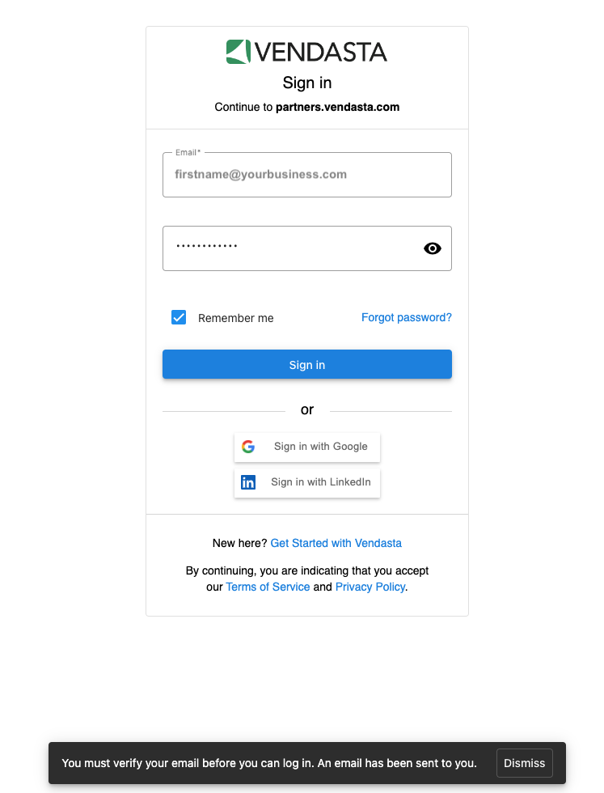

 ---
title: Vérification de l'adresse courriel
sidebar_label: Vérification de l'adresse courriel
description: Découvrez les exigences et les procédures de vérification d'adresse courriel pour les utilisateurs de la plateforme Vendasta.
sidebar_position: 10
---

Chez Vendasta, nous nous engageons à stocker en toute sécurité l'ensemble des données commerciales de nos partenaires et de leurs clients, à réduire les risques d'exploitation malveillante et à améliorer la sécurité. Pour appuyer cet engagement, tous les utilisateurs, c'est-à-dire les utilisateurs de Partner Center, les vendeurs, les agents numériques et les utilisateurs de Business App, doivent vérifier leur adresse courriel. Cela garantit que tous les utilisateurs sont authentiques et ont bien accès à l'adresse courriel qu'ils ont fournie. Tout utilisateur ajouté est automatiquement vérifié lorsqu'il définit son propre mot de passe à partir du lien contenu dans son courriel d'intégration ou de bienvenue. **Si vous ou vos utilisateurs ne voyez pas de page vous demandant de vérifier votre adresse courriel, aucune action n'est nécessaire : votre adresse courriel est vérifiée.**

:::note
Soyez assuré que nous avons conservé l'ensemble des marques blanches en place, de sorte que les utilisateurs de Business App ne verront pas « Vendasta » pendant le processus de vérification de l'adresse courriel. On leur demandera de vérifier leur adresse courriel sous votre marque.
:::

Afin de préserver la marque blanche, nous n'envoyons aucun courriel à vos clients concernant la vérification de l'adresse courriel, à l'exception d'une page à votre marque, qu'ils verront lors de leur connexion à Business App si leur adresse courriel n'est pas vérifiée. C'est donc à vous qu'il revient d'inciter vos clients à vérifier leur adresse courriel.

**Il existe plusieurs façons pour les utilisateurs de vérifier leur adresse courriel :**

- Changer leur mot de passe vérifie l'adresse courriel, car le code de réinitialisation du mot de passe est envoyé à l'adresse courriel du titulaire.
- Définir un mot de passe via le courriel d'intégration ou de bienvenue d'un nouvel utilisateur vérifie l'adresse courriel, puisque ce courriel est envoyé à l'adresse du titulaire.
- Se connecter avec n'importe quel fournisseur d'identité fédérée (Google, LinkedIn, Facebook, etc.) vérifie l'adresse courriel, car cela prouve qu'ils en sont bien propriétaires.
- En envoyant un courriel de vérification depuis la page affichée après la connexion et en cliquant sur le lien de vérification envoyé à votre adresse courriel.

Si vous êtes un partenaire existant (ou un utilisateur de Partner Center, un vendeur, un agent numérique ou un utilisateur de Business App) et que vous n'avez jamais vérifié votre adresse courriel, voici quelques étapes simples pour terminer le processus :

1. Connectez-vous à la plateforme Vendasta.
2. Une page vous demandant de vérifier votre adresse courriel s'affichera.

3. Cliquez sur le bouton `Send verification email` et vous recevrez un courriel contenant un lien de vérification.
4. Cliquez sur ce lien, terminez le processus de vérification, puis continuez à utiliser la plateforme.
5. Félicitations ! Votre adresse courriel est maintenant vérifiée.

Si vous n'avez pas reçu le courriel de vérification, veuillez vérifier que l'adresse courriel enregistrée est correcte et active. Si ce n'est pas le cas, mettez à jour votre adresse courriel et vous recevrez alors un courriel de vérification.

Si vous n'avez plus accès à l'adresse courriel que vous utilisez pour vous connecter, veuillez contacter le support pour faire mettre à jour votre adresse courriel.

Une fois ces étapes terminées, aucune autre action n'est requise. Nous vous remercions de votre soutien continu !

**Si vous êtes bloqué hors de la plateforme,** essayez l'une des solutions suivantes :

- Vérifiez votre boîte de réception pour le courriel de vérification et cliquez sur le lien qu'il contient.
- Réinitialisez votre mot de passe à l'aide de l'option de mot de passe oublié disponible sur la page de connexion.

- Contactez votre administrateur pour réinitialiser votre mot de passe.

Une fois que vous avez cliqué sur le lien de vérification ou réinitialisé votre mot de passe, vous pourrez vous connecter normalement et votre adresse courriel sera vérifiée. Pour plus d'aide concernant les problèmes de connexion, consultez [Que faire lorsqu'un membre de votre équipe ou un client ne peut pas se connecter](/administration/my-account/my-team#what-to-do-when-your-team-member-or-clients-cannot-log-in).

:::note
Votre administrateur ou l'équipe de support Vendasta ne peut pas définir un mot de passe à votre place, mais peut vous envoyer un courriel pour réinitialiser votre mot de passe.
:::

**Si vous avez une intégration SSO avec Vendasta, voici quelques renseignements supplémentaires :**

- Vos utilisateurs de Business App qui se connectent à votre plateforme à l'aide de leur adresse courriel et de leur mot de passe, et qui utilisent le SSO pour accéder à la plateforme Vendasta, ne voient rien et n'ont pas besoin de suivre le processus de vérification de l'adresse courriel. Ils sont considérés comme vérifiés.
- Les membres de votre équipe, c'est-à-dire les utilisateurs de Partner Center, les vendeurs et les agents numériques, qui se connectent à la plateforme Vendasta à l'aide de leur adresse courriel et de leur mot de passe, doivent, s'ils ne sont pas vérifiés et voient l'invite de vérification, terminer le processus de vérification.
